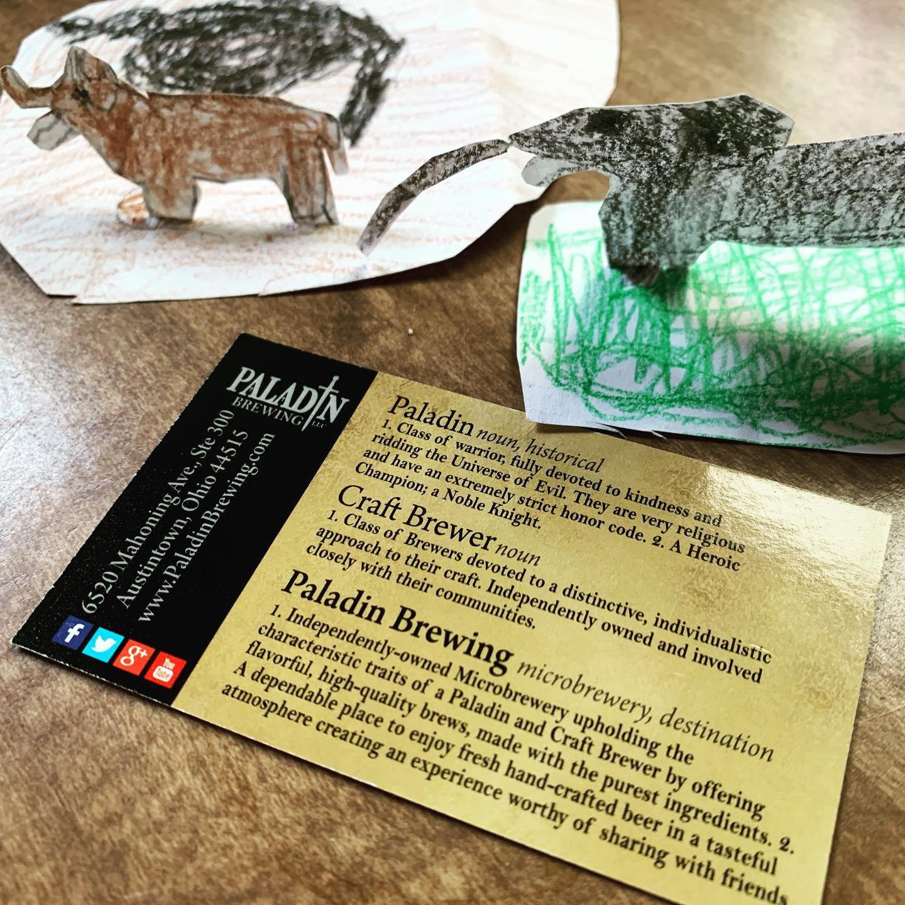
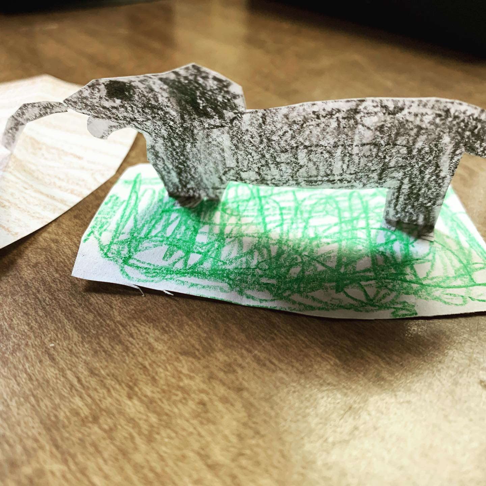
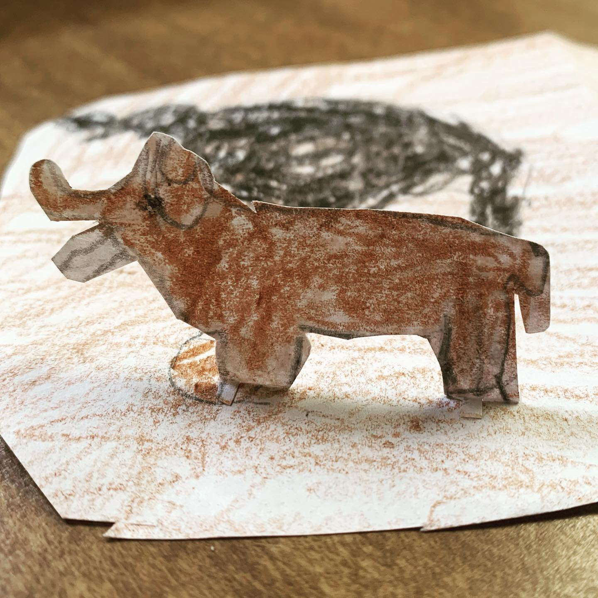

# Correspondence Part 1

> **Relationship:** Explicit satellite of [Paladin Brewing](/breweries/paladin-brewing.html)
> **Source platform:** INSTAGRAM Export
> **Match Confidence:** 0.85 (via csv_hashtag)

### Caption / Correspondence Log:
```
@paladinbrew called in some talent to #drawmeanelephant that didn’t benefit from a scanner, as my @epsonamerica scanner puked and @allstate #squaretrade only squared me 2/3 a scanner. This is a no scanner situation with a bonus #corgi it looks like, maybe my dog @lordsquinkton ? Who knows? #paladinbrewing is on the Ohio side of #youngstown but still what I would consider in the middle of Pennsylvania. #ohiobrewery
```

### Artifact Scans & Drawings:







### Provenance & Audit:
* **Source Path:** `Unknown`
* **Original entity ID:** `instagram/post-368579077050385148`
