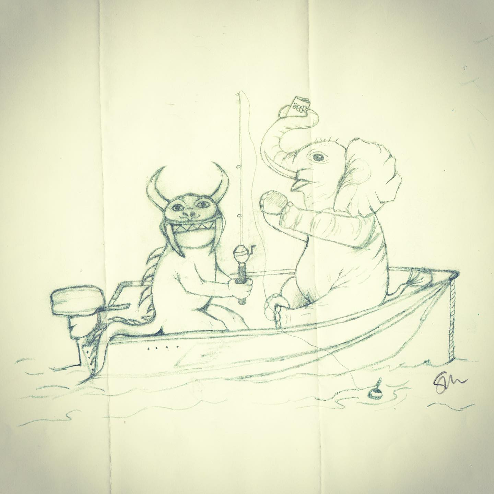
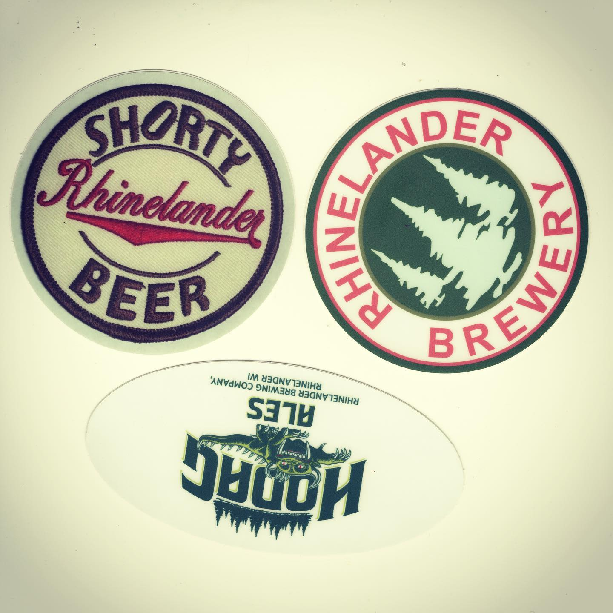

# Correspondence Part 1

> **Relationship:** Explicit satellite of [Rhinelander Brewing Co](breweries/rhinelander-brewing-co.html)
> **Source platform:** INSTAGRAM Export
> **Match Confidence:** 0.8 (via csv_name_inference)

### Caption / Correspondence Log:
```
Okay so @rhinelanderbrewery obviously has #beermoochingelephants like all breweries and instead of making them do tricks they just send them out to fish with the #hodags who are everywhere around there. Hodags and elephants are natural born fishing buddies and it works out okay other than takes quite a few beers. This drawing almost was disqualified as I don't take photocopies. It did have a signature done in pencil rather than a photocopy of the signature, so I think that makes this like an art print that I can accept. Hopefully they send the original too as I'll probably need that if this elephant wants to become part of the actual collection. I threw away probably in the top 3 nicest elephants I've received for a photocopy the other day and the place said the guy doesn't give out originals. Maybe when finding an elephant artist make sure they will give you the elephant and not just send you a picture of it it. I want whole elephants and not elephant copies. Thanks #rhinelanderbrewing or #rhinelanderbeer or whatever hashtag you use. Send me original maybe. #drawmeanelephant
```

### Artifact Scans & Drawings:





### Provenance & Audit:
* **Source Path:** `Unknown`
* **Original entity ID:** `instagram/post-1621346488947152262`
