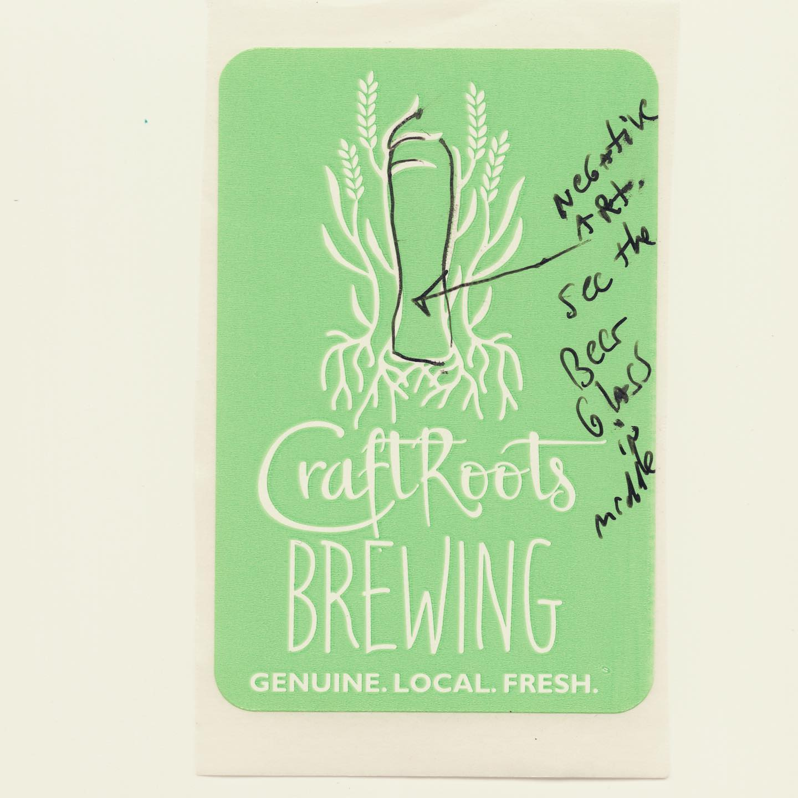
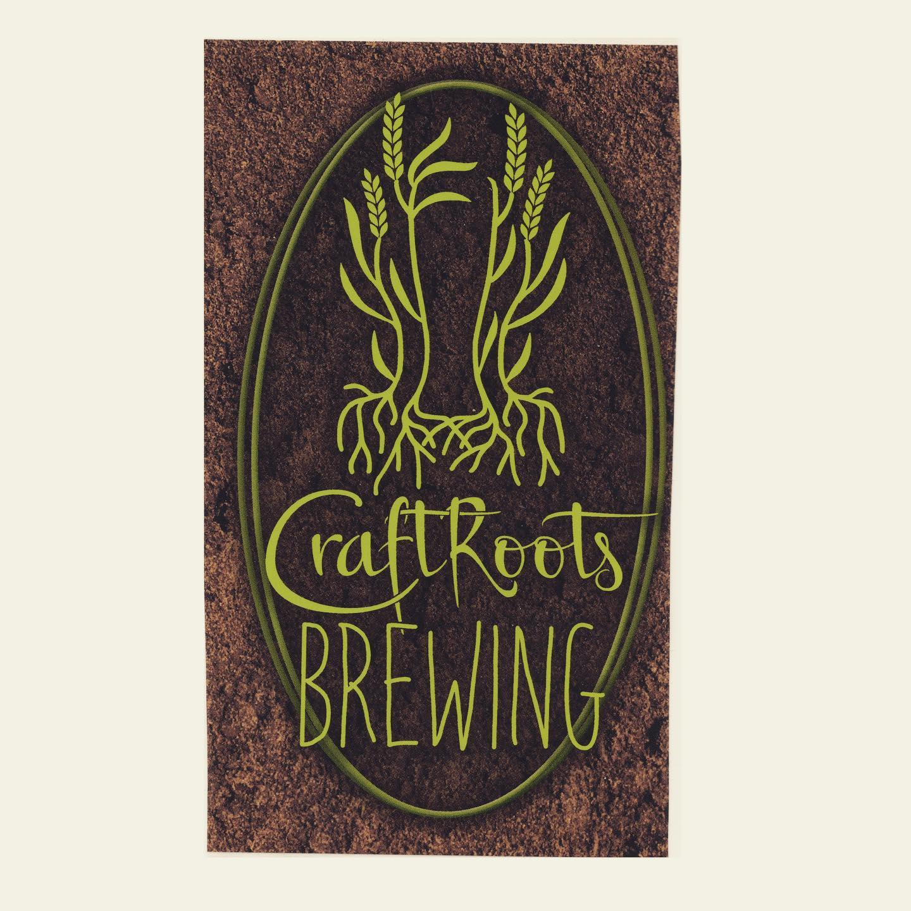
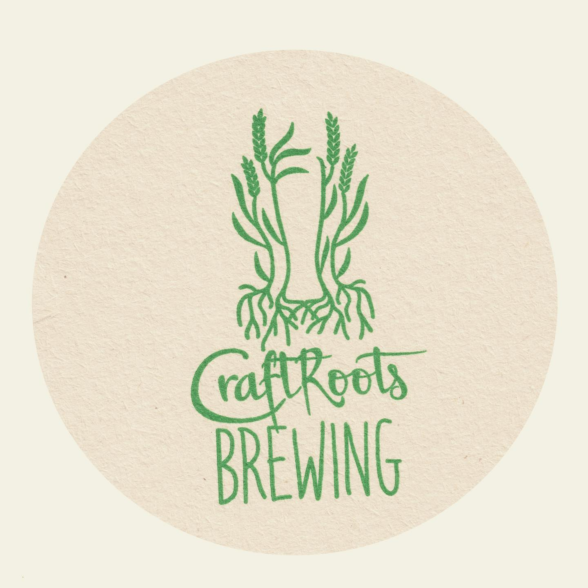

# Correspondence Part 1

> **Relationship:** Explicit satellite of [Roots Brewing Company](breweries/roots-brewing-company.html)
> **Source platform:** INSTAGRAM Export
> **Match Confidence:** 0.8 (via csv_name_inference)

### Caption / Correspondence Log:
```
@craftroots_brewing drew me an elephant and I’ll get to that in a bit as it’s awesome but they also pointed out that the negative space in the logo is a beer glass and not that two center pieces of two row that like a trunk and the two outer make a solid silhouette of an elephant from shoulders to feet. It was good that they clarified that because I would have slapped two ears and two eyes on this coaster and then said “Mary! I’m done drawing this #bolognabitch an elephant, how about another beer?”. They weren’t that lazy but I totally need a sleeve of those coaster to mail if the price is right, cause they have 75% of an elephant in there. #drawmeanelephant #negativespace #craftrootsbrewing
```

### Artifact Scans & Drawings:







### Provenance & Audit:
* **Source Path:** `Unknown`
* **Original entity ID:** `instagram/post-5658376333611074962`
