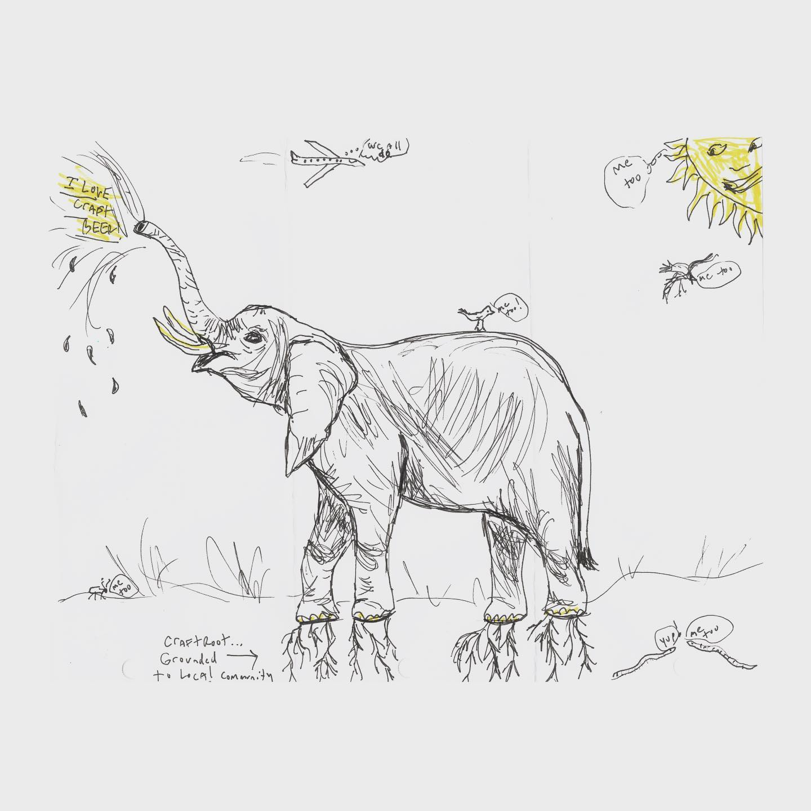
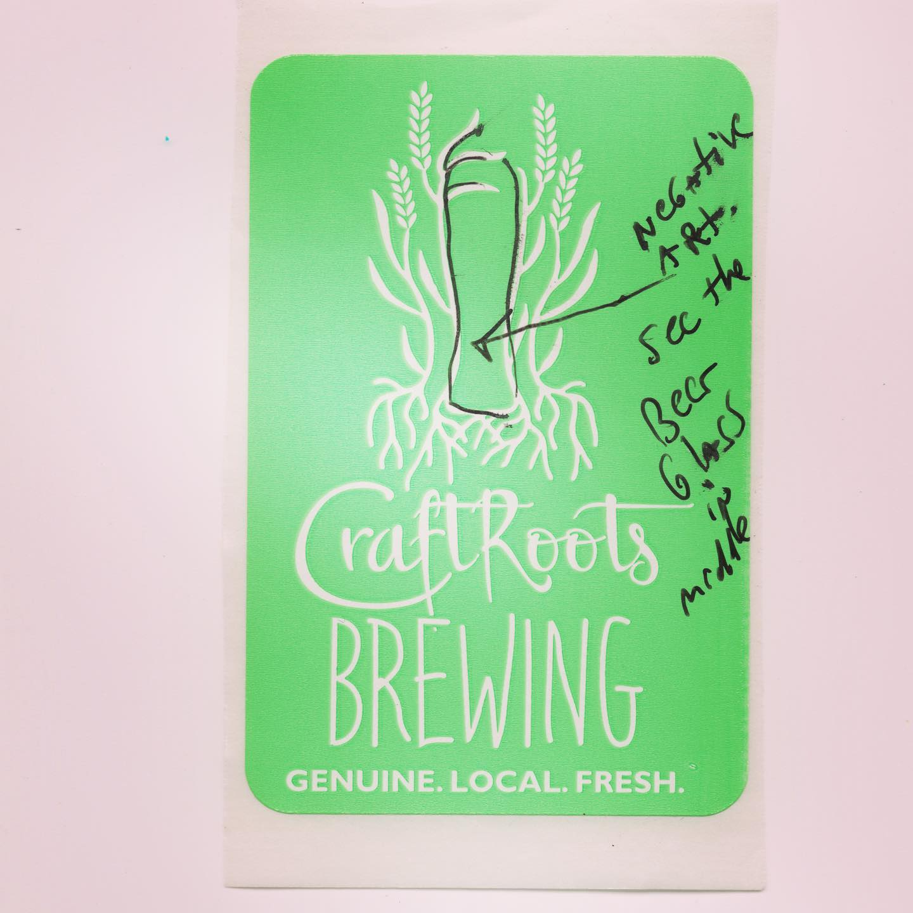
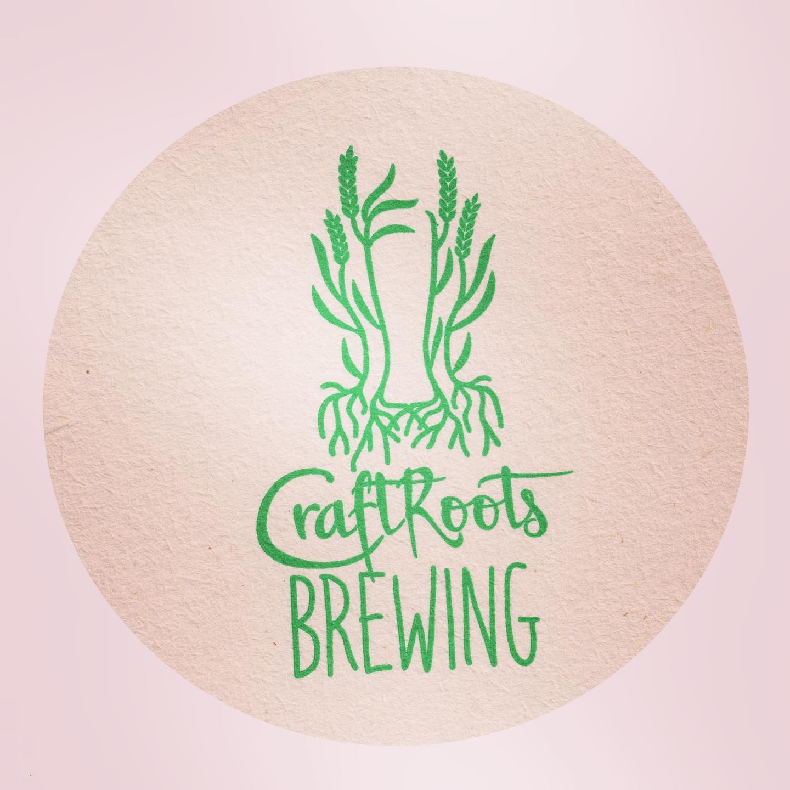
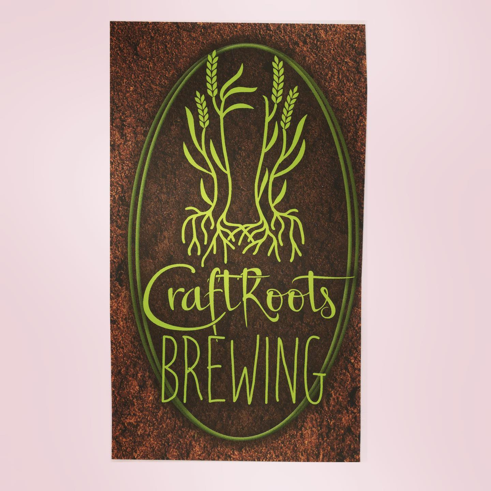

# Correspondence Part 3

> **Relationship:** Explicit satellite of [Roots Brewing Company](/breweries/roots-brewing-company.html)
> **Source platform:** INSTAGRAM Export
> **Match Confidence:** 0.8 (via csv_name_inference)

### Caption / Correspondence Log:
```
@craftroots_brewing drew this and it’s just super fun. There’s a lot going on and it’s all fantastic. Reposting the stickers because again, put some ears and eyes on em and that’s an elephant. #iwantasleeofthosecoasters #drawmeanelephant #craftrootsbrewing
```

### Artifact Scans & Drawings:









### Provenance & Audit:
* **Source Path:** `Unknown`
* **Original entity ID:** `instagram/post-9046998840876855450`
