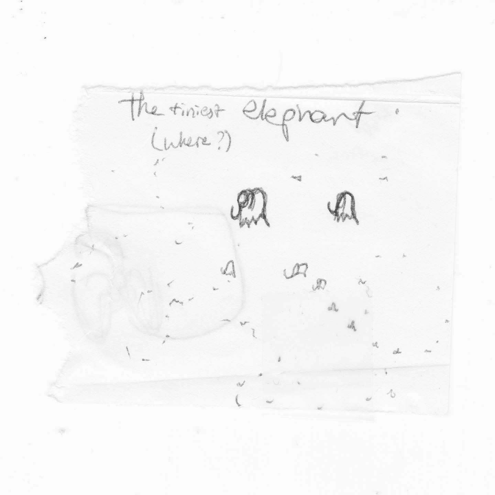
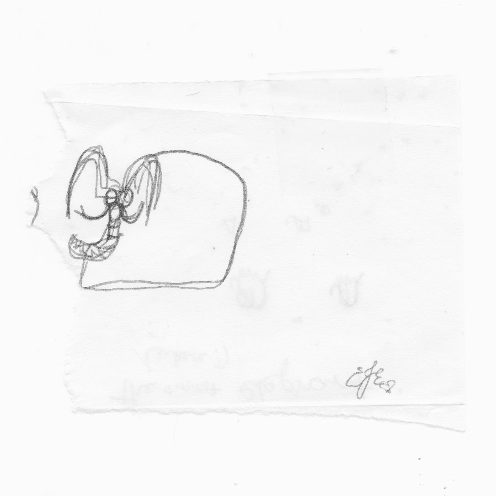

# Correspondence Part 1

> **Relationship:** Explicit satellite of [Strange Brewery](/breweries/strange-brewery.html)
> **Source platform:** INSTAGRAM Export
> **Match Confidence:** 0.8 (via csv_name_inference)

### Caption / Correspondence Log:
```
88-89 are front and back for #TheWayStationDayStation and by an author I need to make a tag for, as they have done a lot of them. This had a bunch of elephants going small, which we are down to the smols already. The other elephant takes a concept I think someone else could flesh out better. Either way, really like all of this person's elephants and seems really like the most interesting of the bunch, not to detract from people like @galusaurus or any of the other strange strange people who go to @thewaystation as they all seem like madmen. I had several people in the booze business know them and other people who know the the area describe the place as weird. I supposed I'll never find out. #hundredreposts #drawmeanelephant
```

### Artifact Scans & Drawings:





### Provenance & Audit:
* **Source Path:** `Unknown`
* **Original entity ID:** `instagram/post-634215020589283296`
