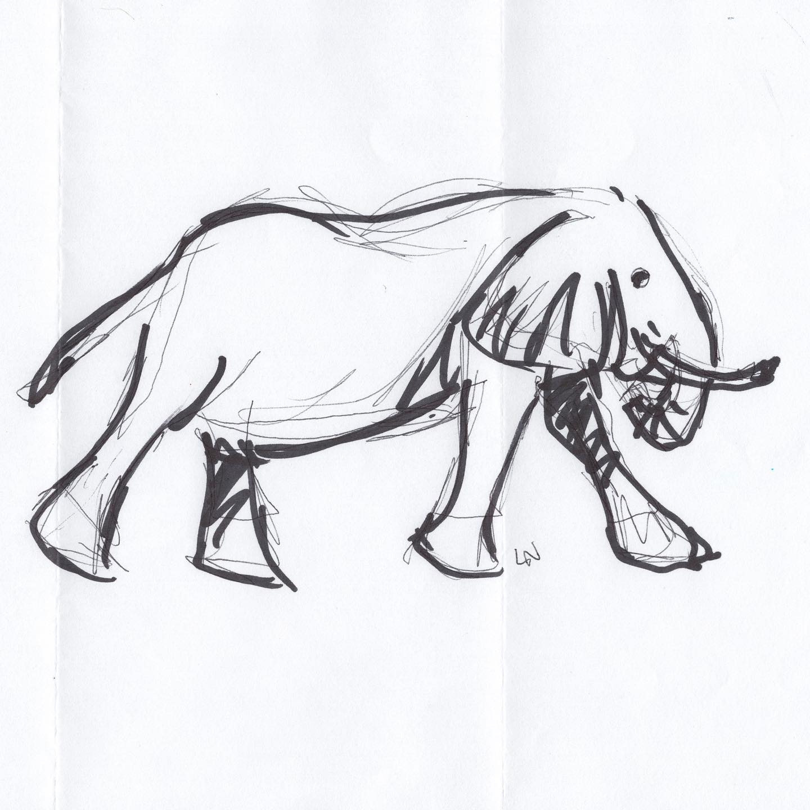
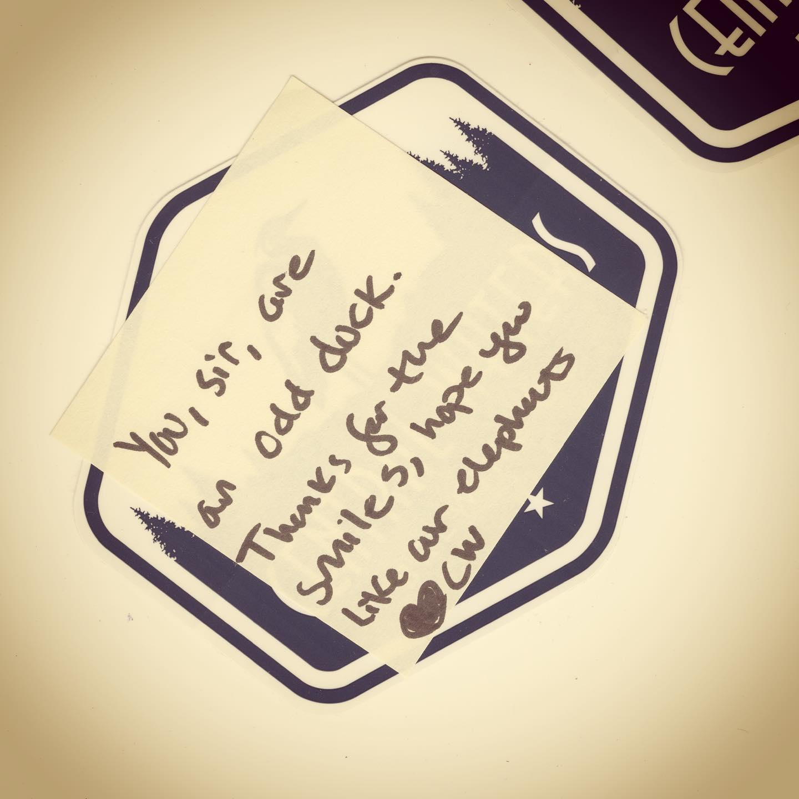

# Correspondence Part 2

> **Relationship:** Explicit satellite of [Strange Brewery](/breweries/strange-brewery.html)
> **Source platform:** INSTAGRAM Export
> **Match Confidence:** 0.8 (via csv_name_inference)

### Caption / Correspondence Log:
```
@centralwaters also did a drawing with the thinner lines that showed it was planned out. I assume those are done before the marker but think it's funnier to imagine them drawn in after. They also called me an odd duck, which is much better to be called than a strange duck. Having been referred to as many types of ducks it is important to know the differences. #drawmeanelephant #oddduck #strangeduck #nocluehowhashtagsworkandatthispointimtoaffraidtoask
```

### Artifact Scans & Drawings:





### Provenance & Audit:
* **Source Path:** `Unknown`
* **Original entity ID:** `instagram/post-8930788493909915608`
