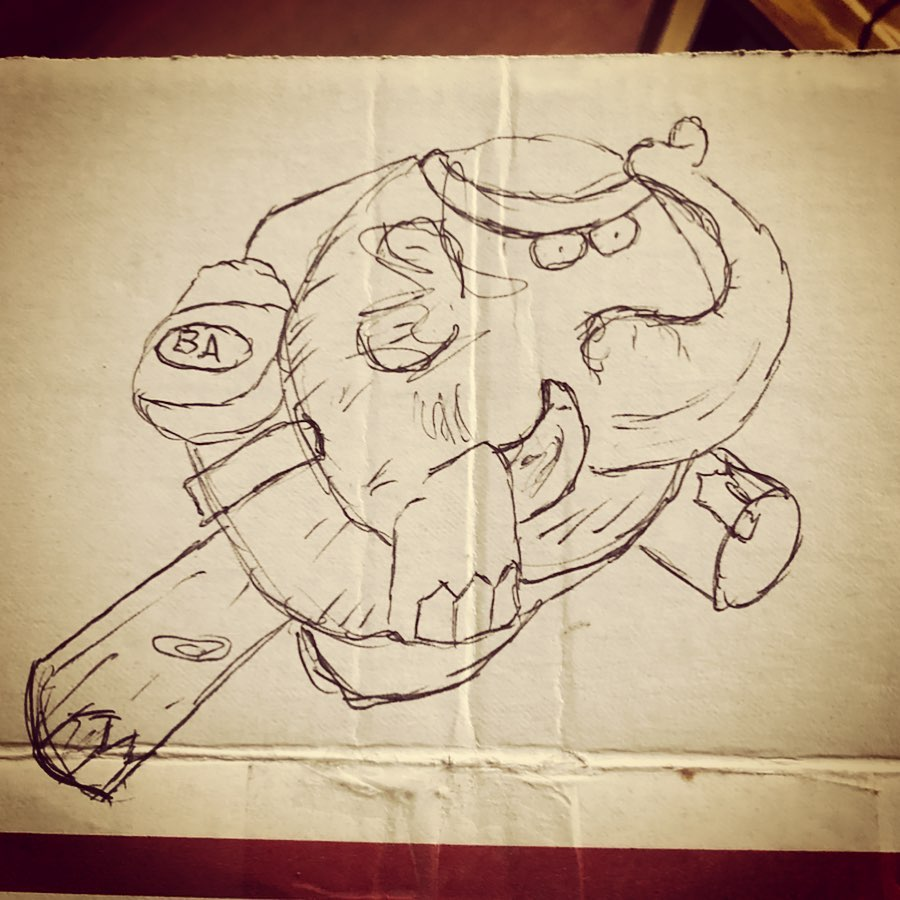
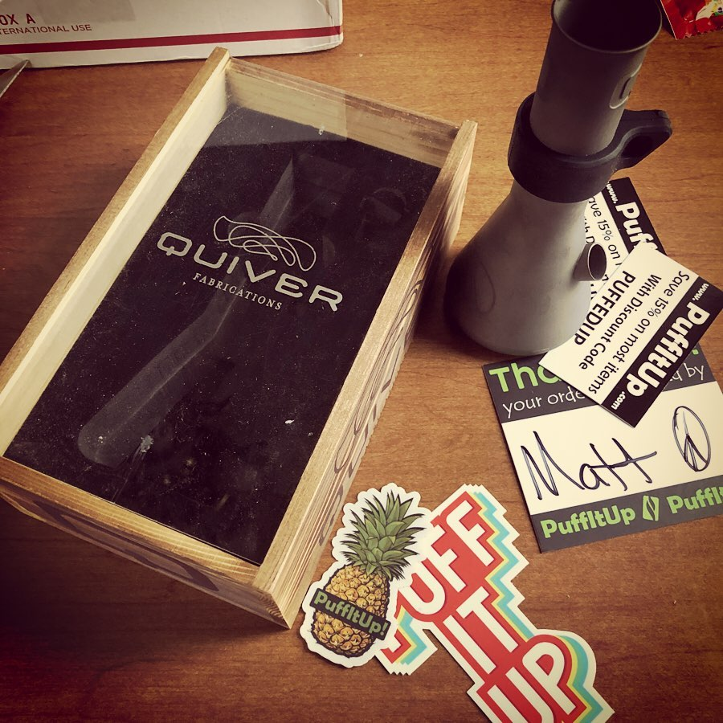

# Correspondence Part 1

> **Relationship:** Explicit satellite of [Summit Brewing Co](/breweries/summit-brewing-co.html)
> **Source platform:** INSTAGRAM Export
> **Match Confidence:** 0.8 (via csv_name_inference)

### Caption / Correspondence Log:
```
@puffitup has drawn an elephant every time I asked and this was a new one from Matt there. I'm not entirely sure what's going on with it, but it's certainly more epic than some of the more colorful work done on bags.
The @quiverfabrications Summit seemed marketed at the on the go types being crafted out of titanium and popular with mountain bikers. I traded my mountain bike years back back for a @storz.bickel Mighty, so I think that means the two complement each other with my 2020 fitness plan. Fittin' dis bong rip in my mouf. Gonna most definitely see if I can also get Quiver to draw me an elephant also. #drawmeanelephant
```

### Artifact Scans & Drawings:





### Provenance & Audit:
* **Source Path:** `Unknown`
* **Original entity ID:** `instagram/post-1535694914220999965`
