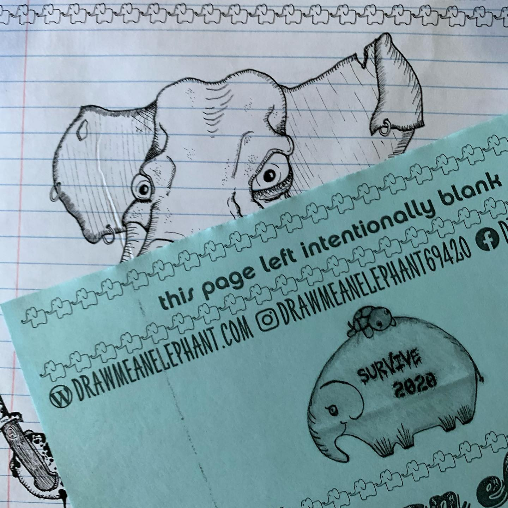
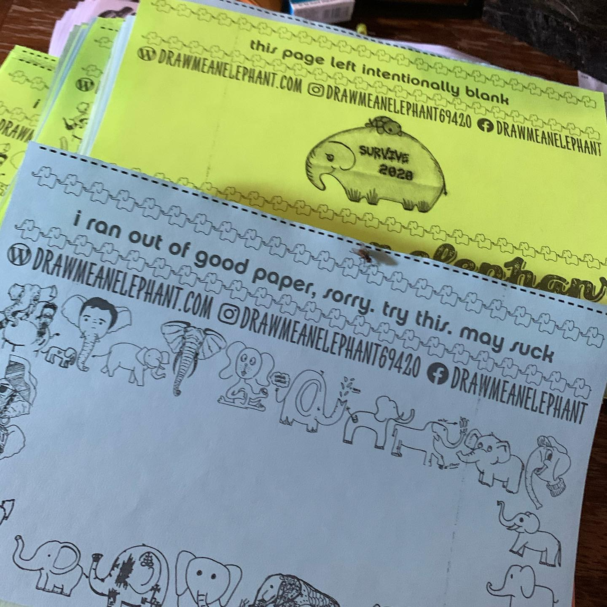
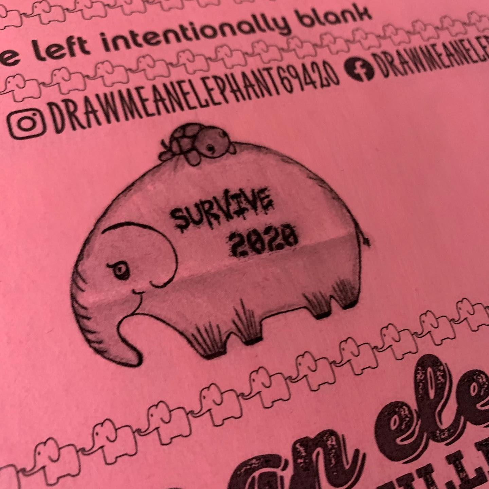
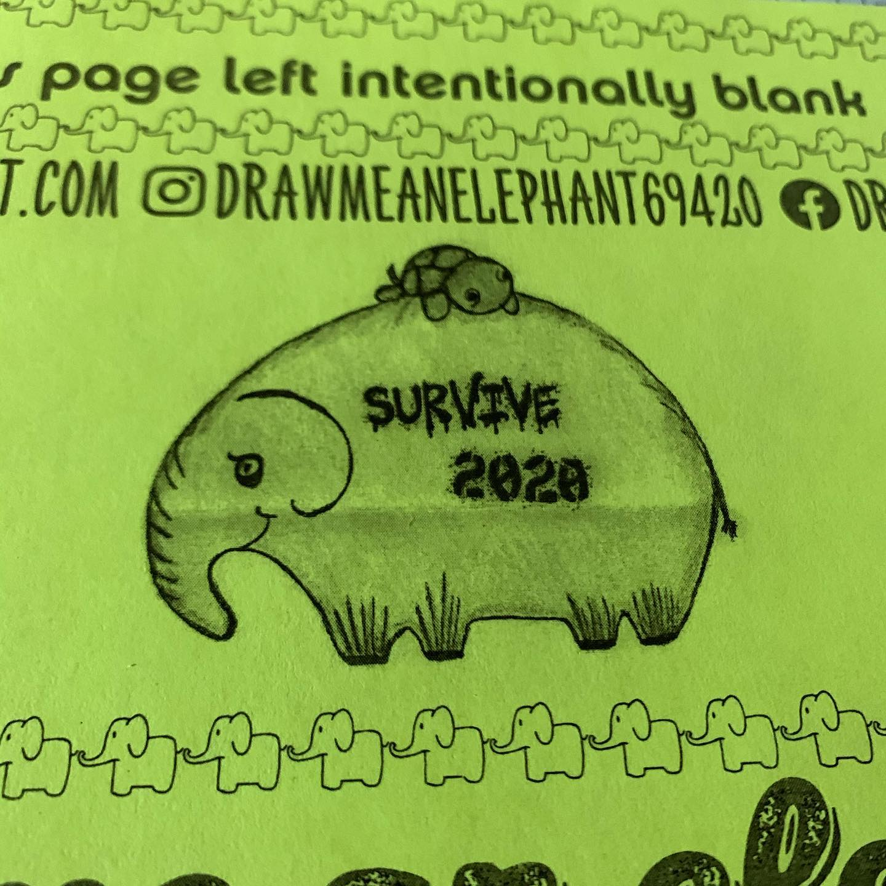
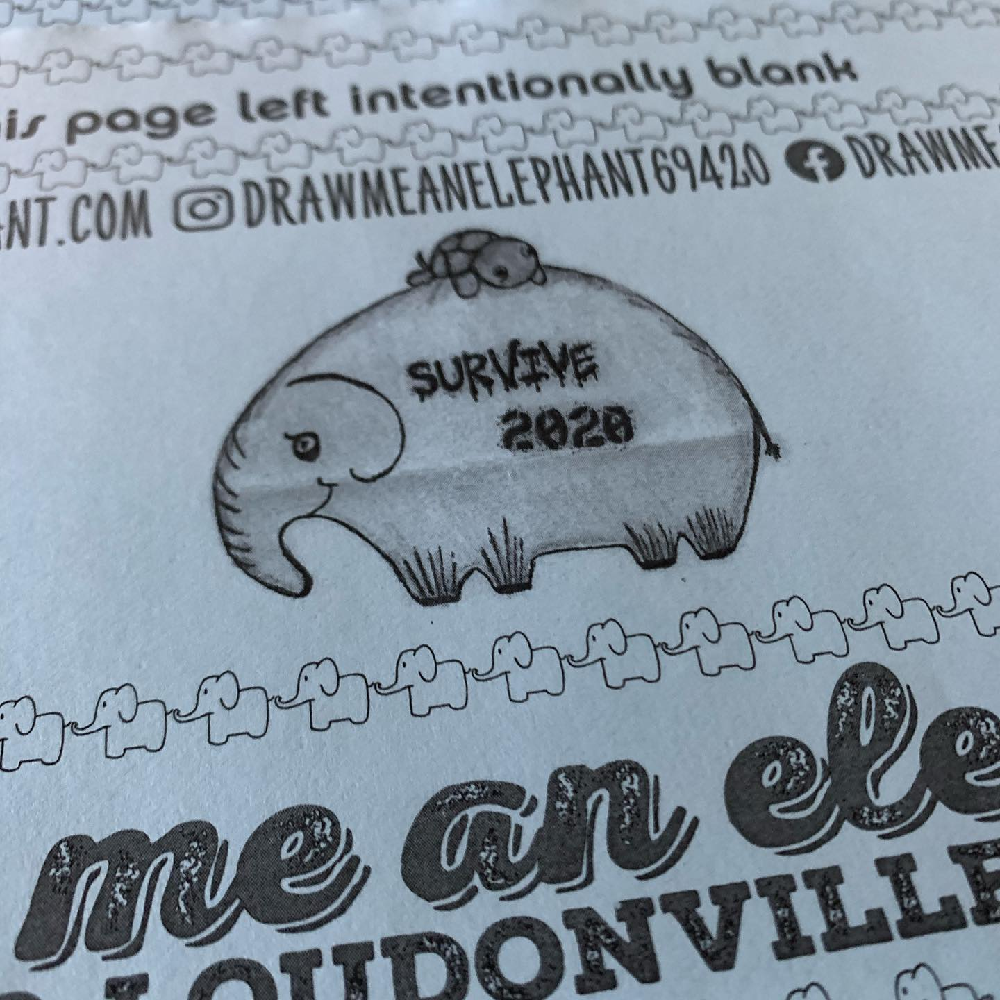

# Correspondence Part 1

> **Relationship:** Explicit satellite of [Terrapin Beer Co](breweries/terrapin-beer-co.html)
> **Source platform:** INSTAGRAM Export
> **Match Confidence:** 0.85 (via csv_hashtag)

### Caption / Correspondence Log:
```
Ran out of paper for the drawing part and had to use half sheets. Went with the @terrapinbeerco elephant that Shawna knocked over the fences awhile back. Turned out better than I hoped and the actual area to draw an elephant is less than a #postitnote in usable area. #metashitposting #survive2020 #terrapinbeerco
```

### Artifact Scans & Drawings:











### Provenance & Audit:
* **Source Path:** `Unknown`
* **Original entity ID:** `instagram/post-3319470716399064405`
