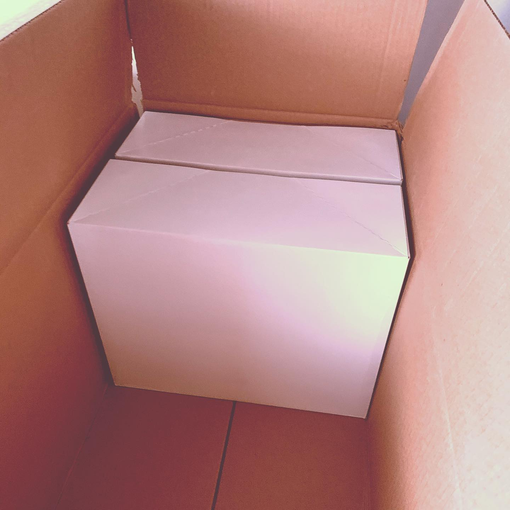
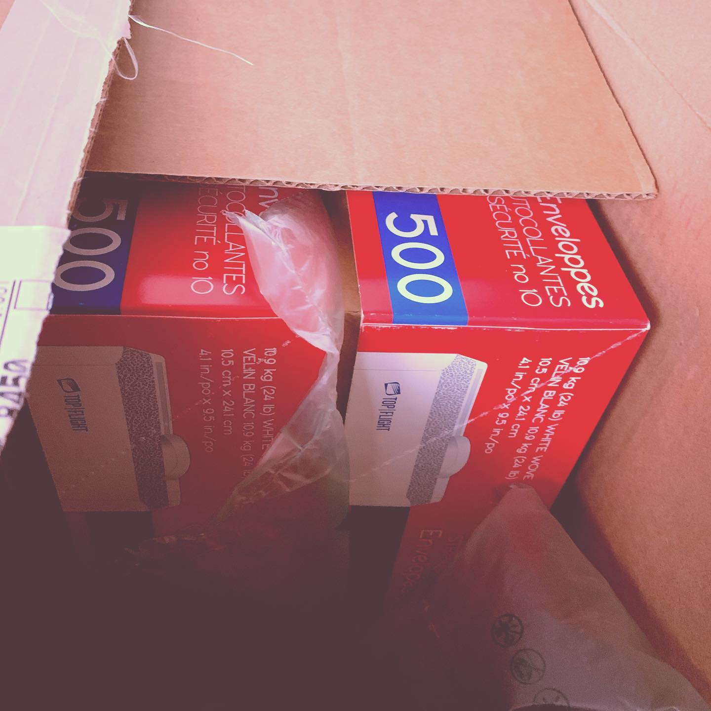
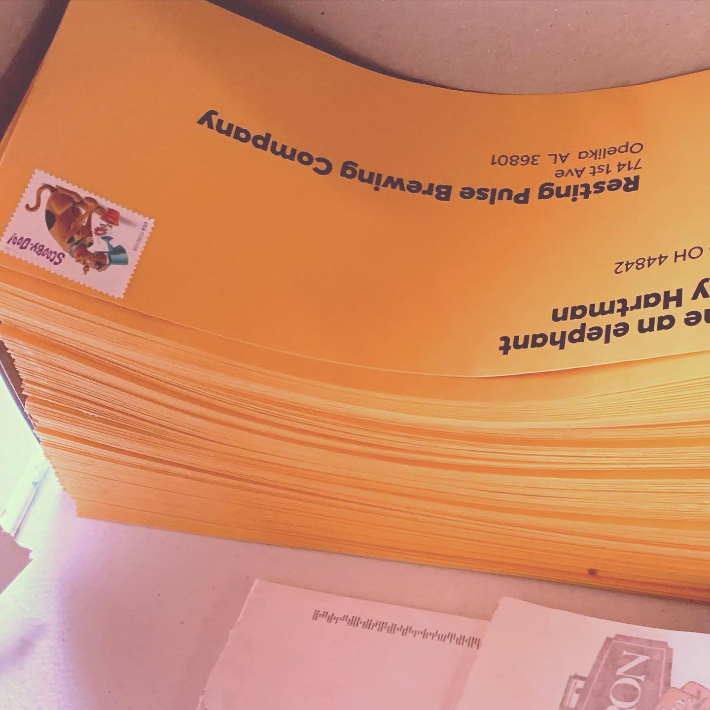

# Correspondence Part 2

> **Relationship:** Explicit satellite of [The Post Brewing Co](/breweries/the-post-brewing-co.html)
> **Source platform:** INSTAGRAM Export
> **Match Confidence:** 0.8 (via csv_name_inference)

### Caption / Correspondence Log:
```
Alright #dogtax since this isn't a new elephant so much as another meta #shitpost that @r.randomactsofcards and a few people may enjoy. I've got about 100–120 to send out and a small stack pictured behind @lordsquinkton here to stuff and send out. 
I got instructions that the military packages I send out would be held 21 days to allow any potential bad to die in them due to corrugated cardboard holding the virus longer than standard paper or paperboard. I think that's overly cautious but it does put a wrench in my care packages as well as give me a bit of insight on it as it pertains to my hobby.

Probably going to continue with the letters to crush boredom. May send during as it appears pretty safe in terms of health risk per the postal service, who probably knows less about it than whatever internet commenter will probably bitch me out.
```

### Artifact Scans & Drawings:









### Provenance & Audit:
* **Source Path:** `Unknown`
* **Original entity ID:** `instagram/post-4169972637158047734`
