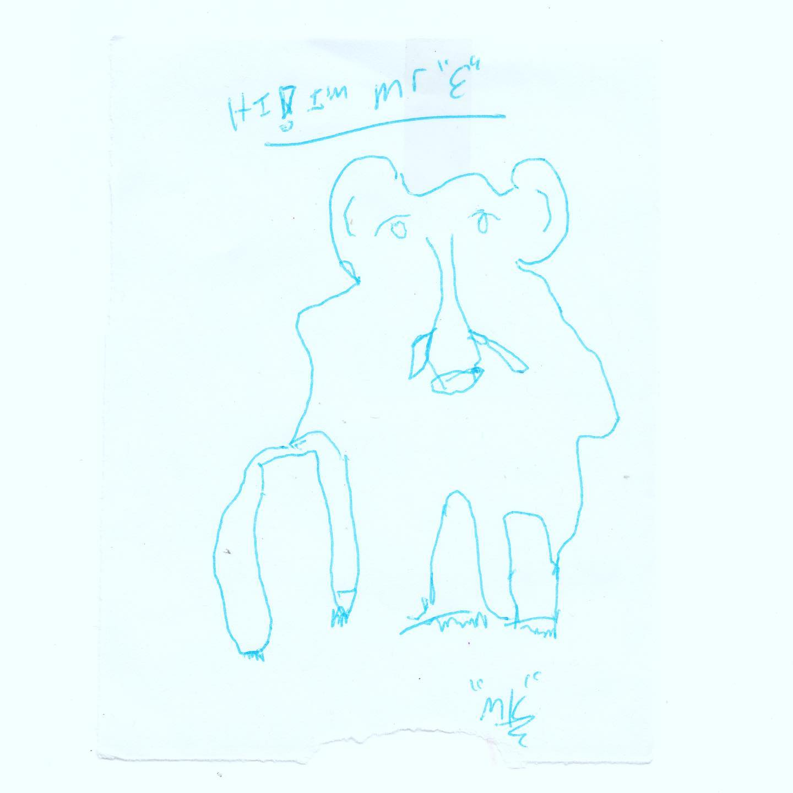
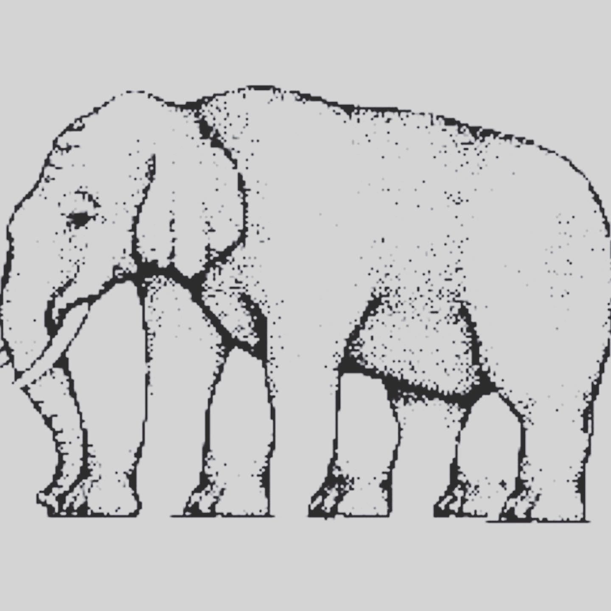

# Correspondence Part 12

> **Relationship:** Explicit satellite of [The Way Station](/breweries/the-way-station.html)
> **Source platform:** INSTAGRAM Export
> **Match Confidence:** 0.85 (via csv_hashtag)

### Caption / Correspondence Log:
```
This elephant reminds me of this optical illusion but regardless of your count it always comes up with not enough legs to where the elephant should be standing. Art by @thewaystation  #TheWayStationDayStation #hundredreposts #drawmeanelephant #shittyopticalillusions
```

### Artifact Scans & Drawings:





### Provenance & Audit:
* **Source Path:** `Unknown`
* **Original entity ID:** `instagram/post-318201842063043326`
