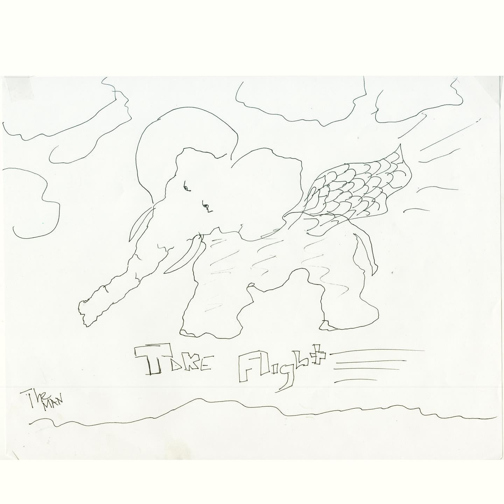
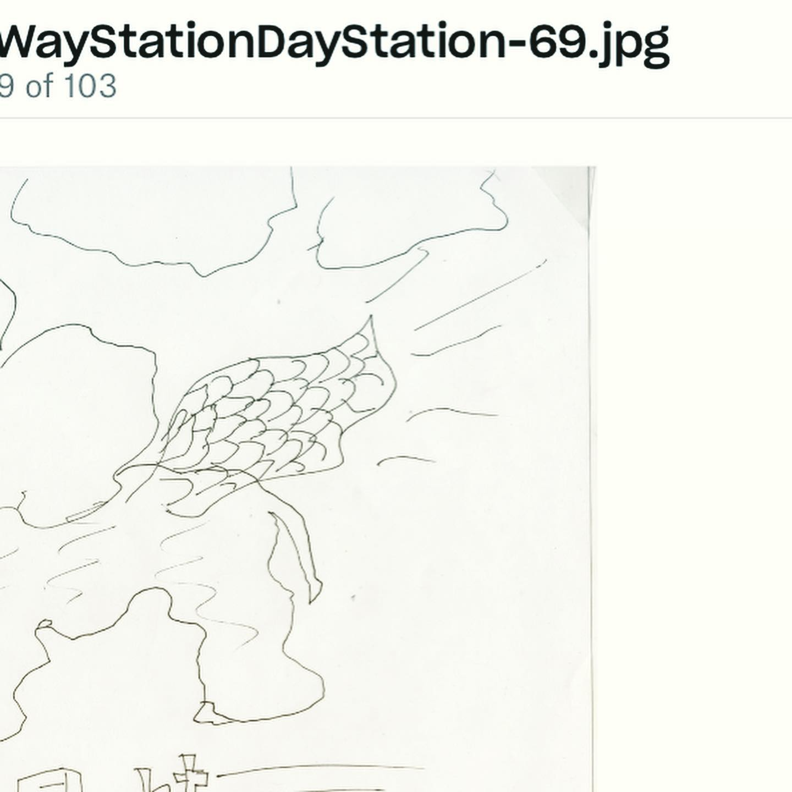

# Correspondence Part 16

> **Relationship:** Explicit satellite of [The Way Station](/breweries/the-way-station.html)
> **Source platform:** INSTAGRAM Export
> **Match Confidence:** 0.85 (via csv_hashtag)

### Caption / Correspondence Log:
```
#takeflight by #theman is an inspirational piece done on 50# bond notepad paper, 85 brightness. Looks to be done with a @pilotpenusa #precisev5 in black. I haven’t had it appraised. #TheWayStationDayStation #69 #drawmeanelephant #hundredreposts #nice. #nocluehowhashtagsworkandatthispointimtoaffraidtoask
```

### Artifact Scans & Drawings:





### Provenance & Audit:
* **Source Path:** `Unknown`
* **Original entity ID:** `instagram/post-3459421871135238156`
