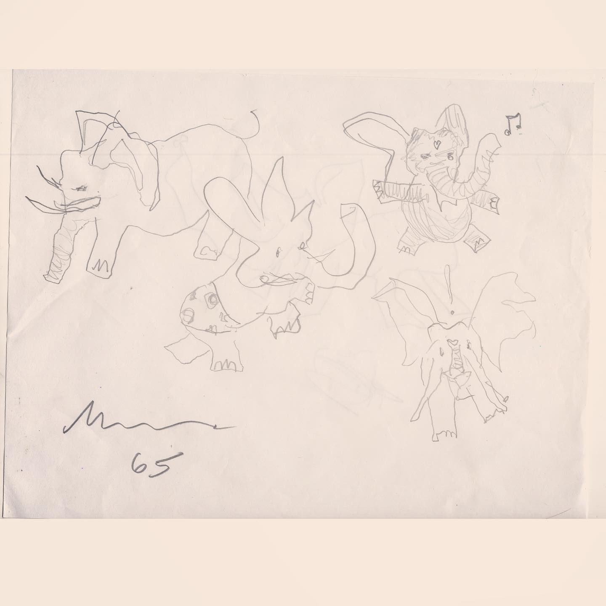
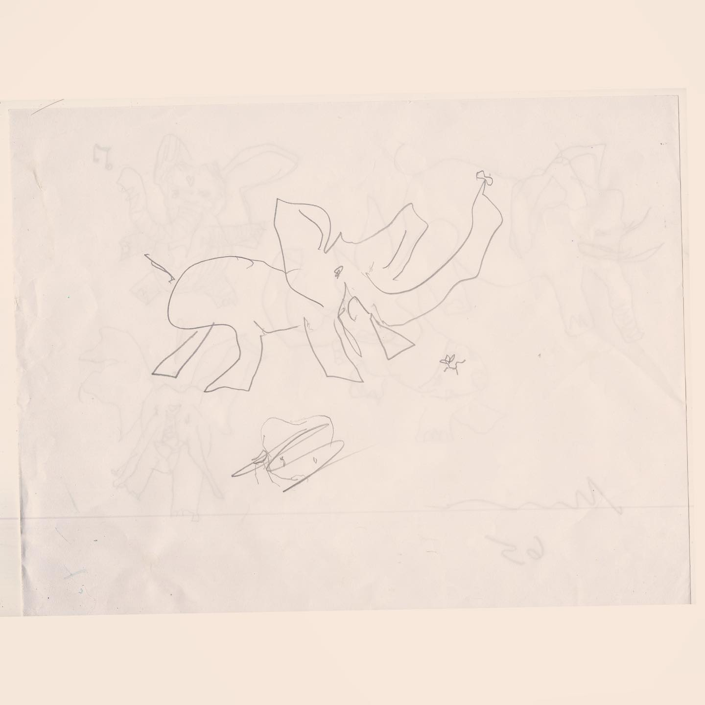

# Correspondence Part 24

> **Relationship:** Explicit satellite of [The Way Station](breweries/the-way-station.html)
> **Source platform:** INSTAGRAM Export
> **Match Confidence:** 0.85 (via csv_hashtag)

### Caption / Correspondence Log:
```
#TheWayStationDayStation 40 and 41 are a package deal. Putting age helps and at 65 and I think maybe a year ago when these all came in I had a special fondness for this elephant and named him Kevin. This artist I think does several including the #eleelvis which isn't nearly the complete shit show which is Kevin. Art by someone at @thewaystation #hundredreposts #drawmeanelephant
```

### Artifact Scans & Drawings:





### Provenance & Audit:
* **Source Path:** `Unknown`
* **Original entity ID:** `instagram/post-4328360308084121086`
