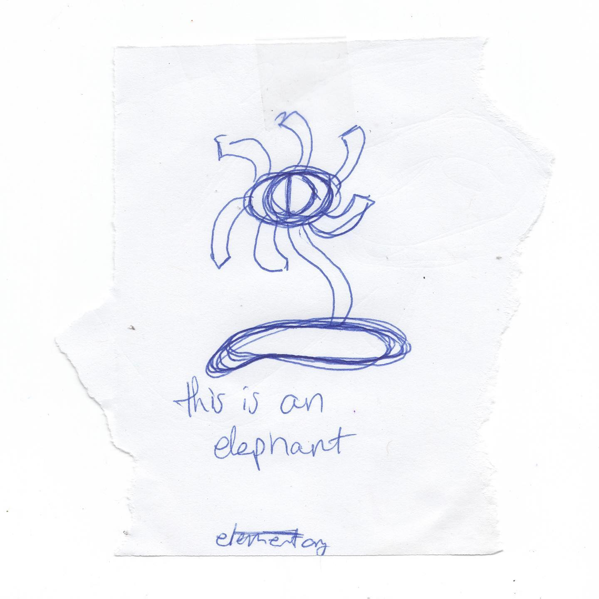
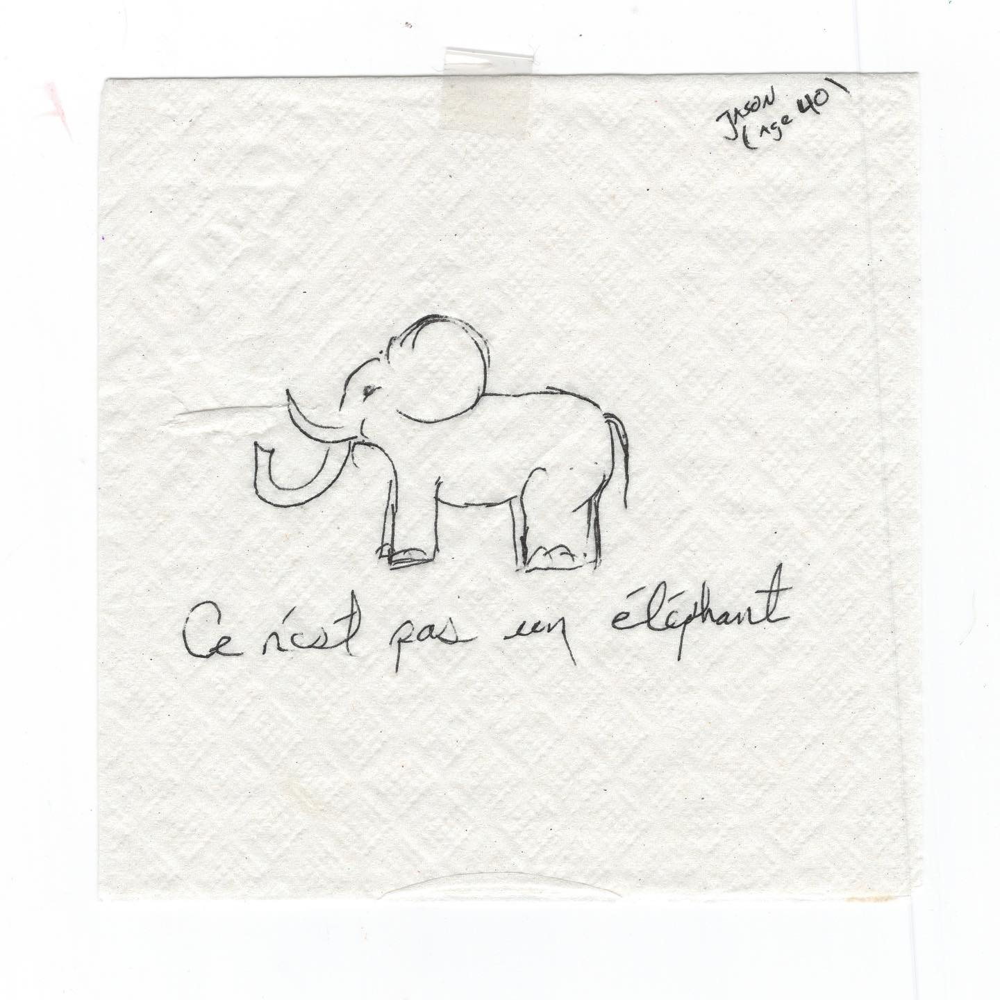

# Correspondence Part 32

> **Relationship:** Explicit satellite of [The Way Station](breweries/the-way-station.html)
> **Source platform:** INSTAGRAM Export
> **Match Confidence:** 0.85 (via csv_hashtag)

### Caption / Correspondence Log:
```
Okay as everyone who has followed me for awhile knows I'm not super big on sounding stupid so I assume drawings are good. I had the other drawing explained to me and it's got some Fench stuff going on which I don't understand nor did I really make an attempt to listen. I did note that it was special and #googletranslate said not an elephant but it really is a picture of an elephant. This one says is like the opposite but they wrote it in American so if you took this over to France it would also be high art. It's all a matter of perspective. #drawmeanelephant #TheWayStationDayStation 91 #hundredreposts #drawmeanelephant
```

### Artifact Scans & Drawings:





### Provenance & Audit:
* **Source Path:** `Unknown`
* **Original entity ID:** `instagram/post-5353556026148182126`
