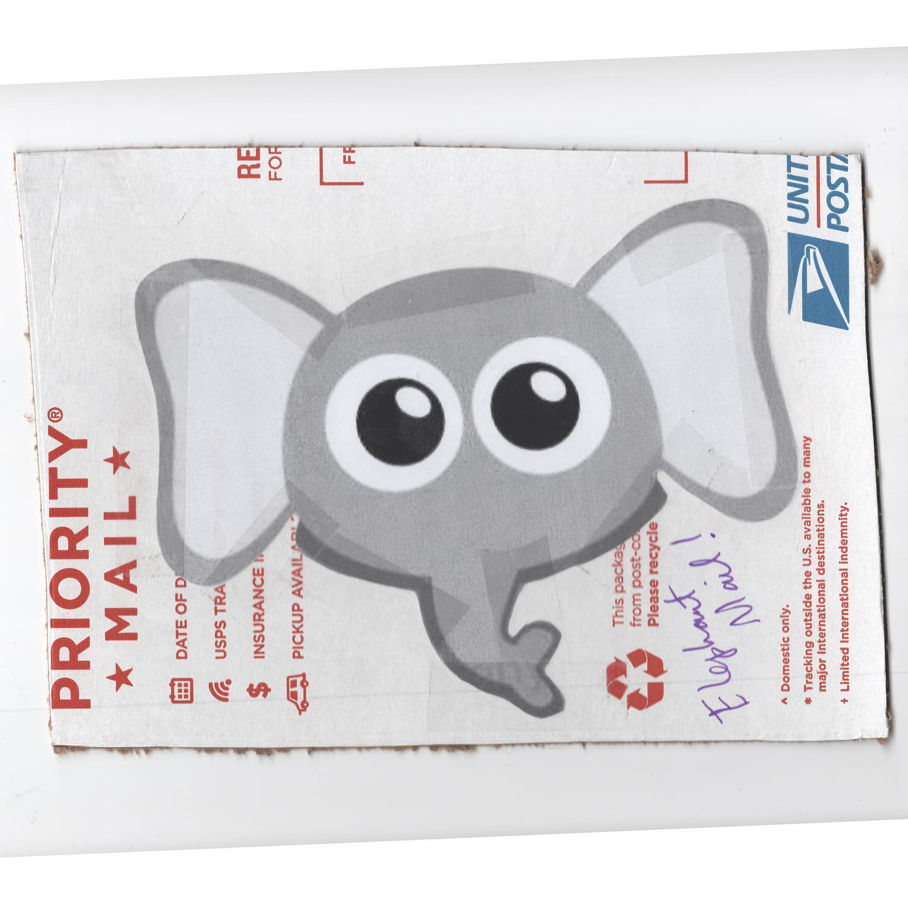
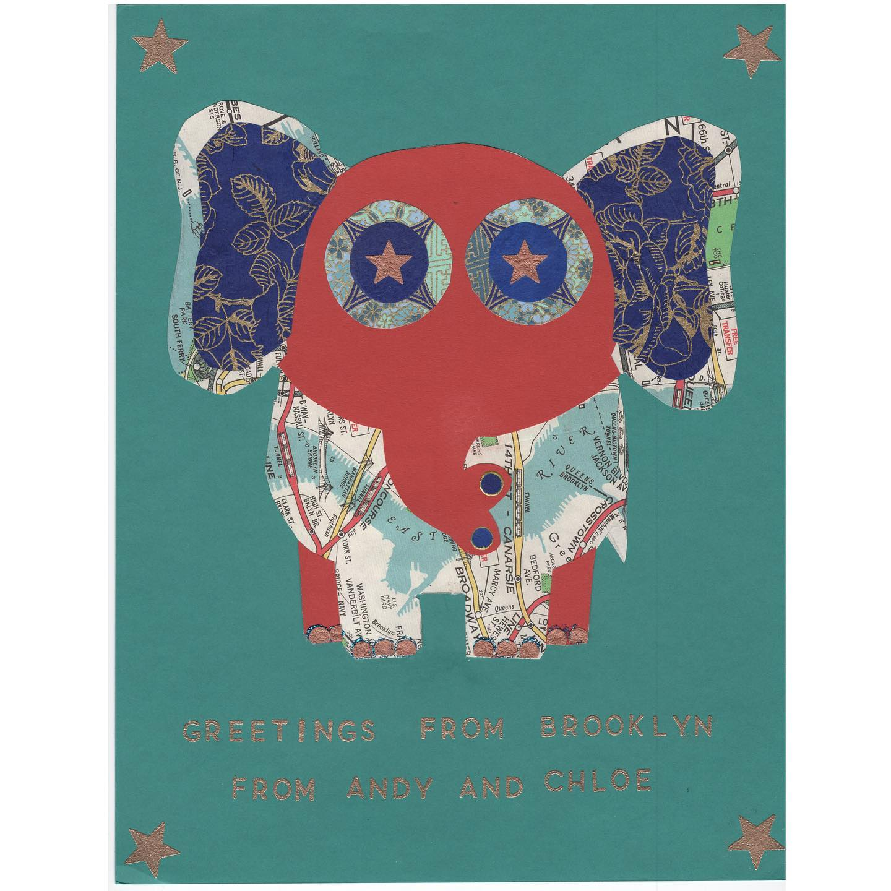
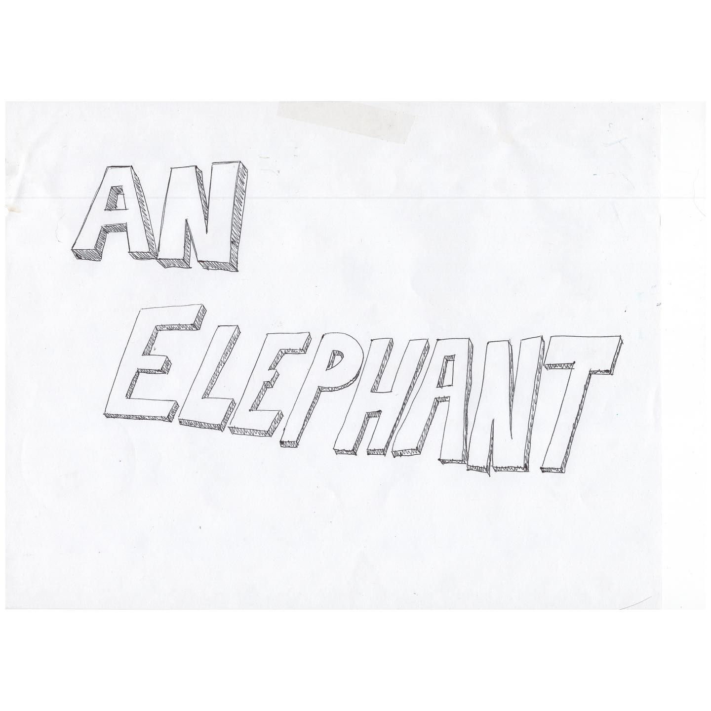
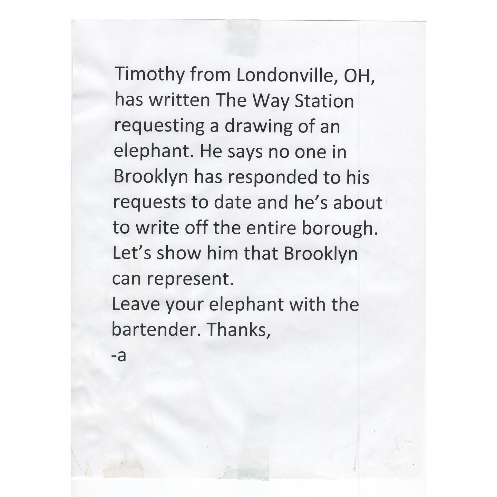
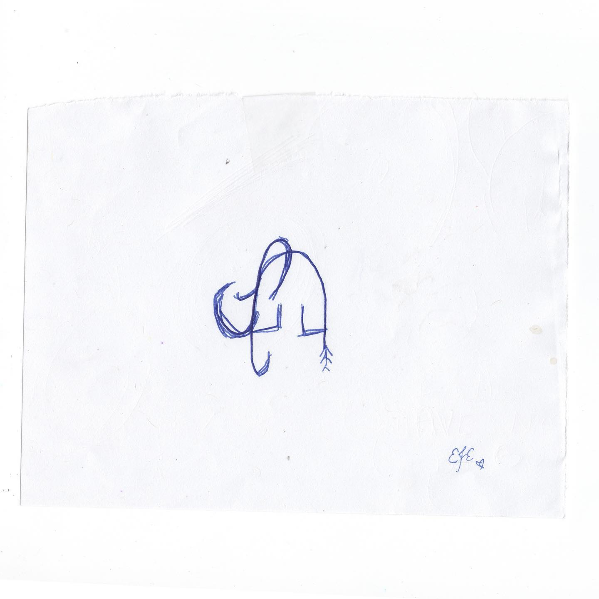

# Correspondence Part 46

> **Relationship:** Explicit satellite of [The Way Station](breweries/the-way-station.html)
> **Source platform:** INSTAGRAM Export
> **Match Confidence:** 0.85 (via csv_hashtag)

### Caption / Correspondence Log:
```
#TheWayStationDayStation lumps 71, 72, and 74 together. This was the box and the sheet that was up at @thewaystation encouraging everyone to #drawmeanelephant and submit it to their bartender. Also, I think they are still the only place out of #brooklyn that did and I spent a solid $150 on writing places there. #hundredreposts
```

### Artifact Scans & Drawings:











### Provenance & Audit:
* **Source Path:** `Unknown`
* **Original entity ID:** `instagram/post-742036951288781657`
