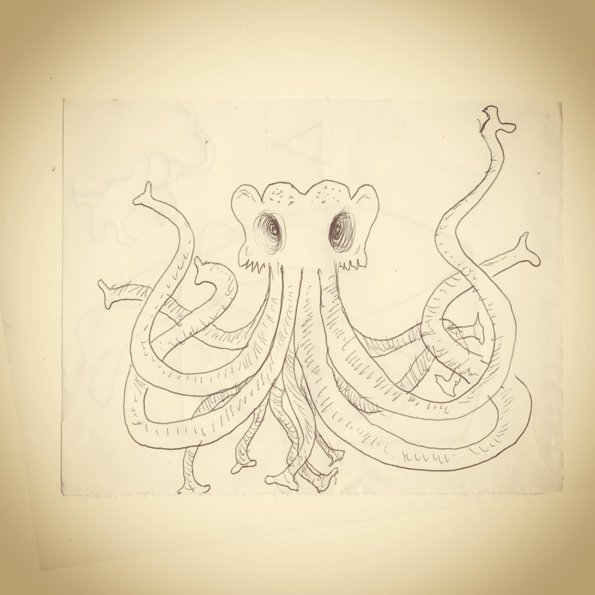
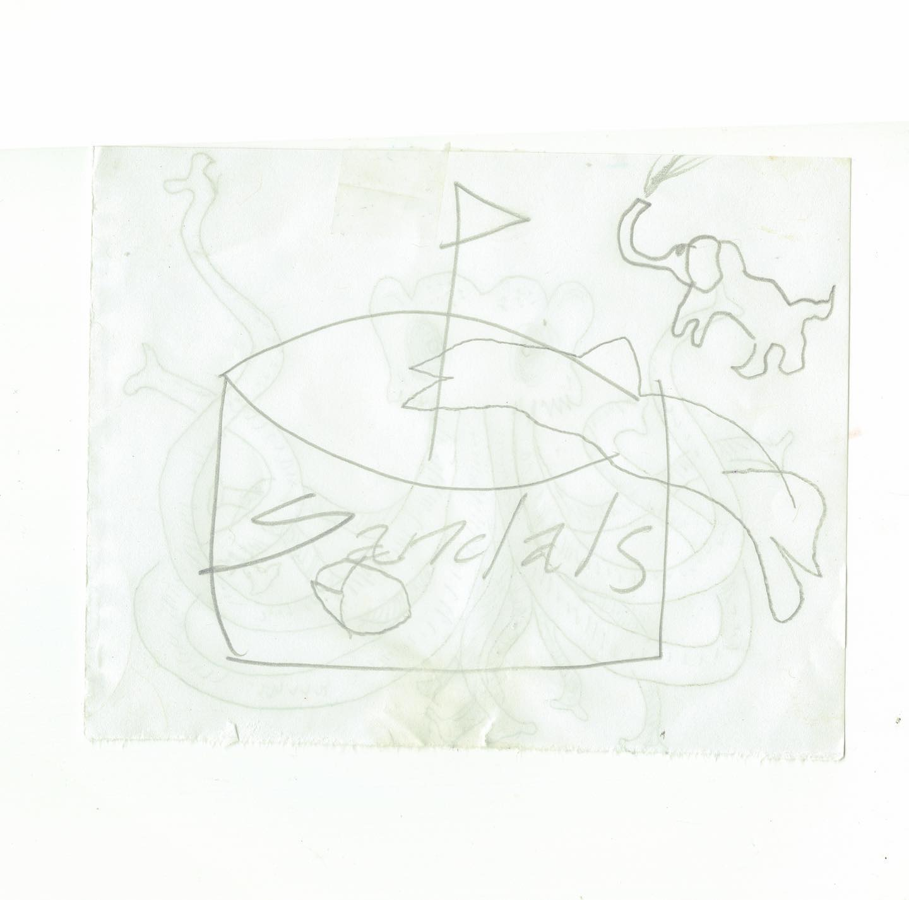
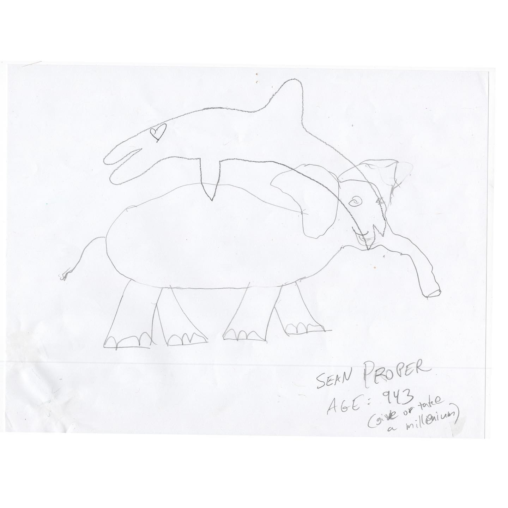

# Correspondence Part 60

> **Relationship:** Explicit satellite of [The Way Station](/breweries/the-way-station.html)
> **Source platform:** INSTAGRAM Export
> **Match Confidence:** 0.85 (via csv_hashtag)

### Caption / Correspondence Log:
```
#TheWayStationDayStation 60 and 62 are front and back of the same sheet and 61 relates to 62 so I'm lumping them. Two very different drawings. I think last time I posted these I pointed out the creepy Hentai Trunktacle Pleasure Party or something creepy, but the reverse side gets weirder. There is a dolphin and maybe a computer mouse which leads in to another drawing of an elephant who probably got rescued by a dolphin and had to service the dolphin orally for payment. There's no such thing as a free ride, learned that from @daveattell #drawmeanelephant #hundredreposts #skanksforthememories #nameandage
```

### Artifact Scans & Drawings:







### Provenance & Audit:
* **Source Path:** `Unknown`
* **Original entity ID:** `instagram/post-8604937550964901868`
