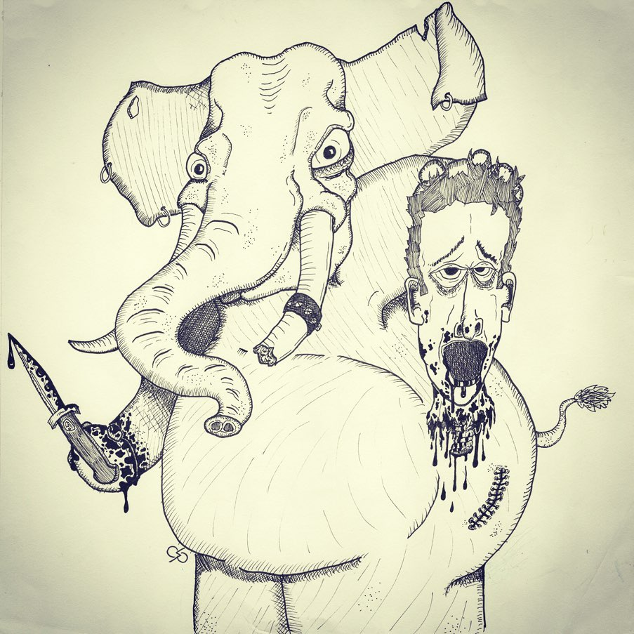
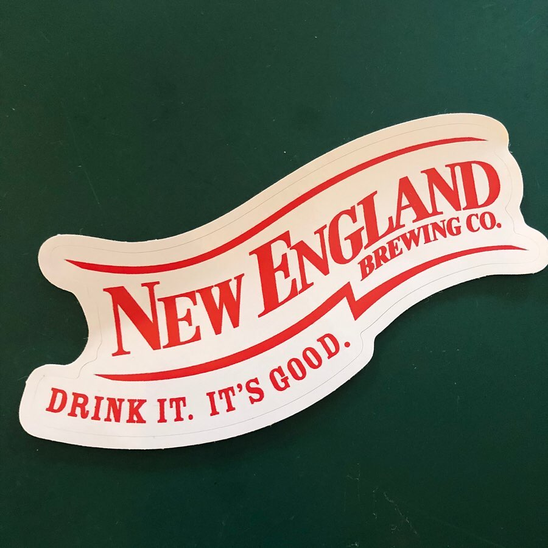
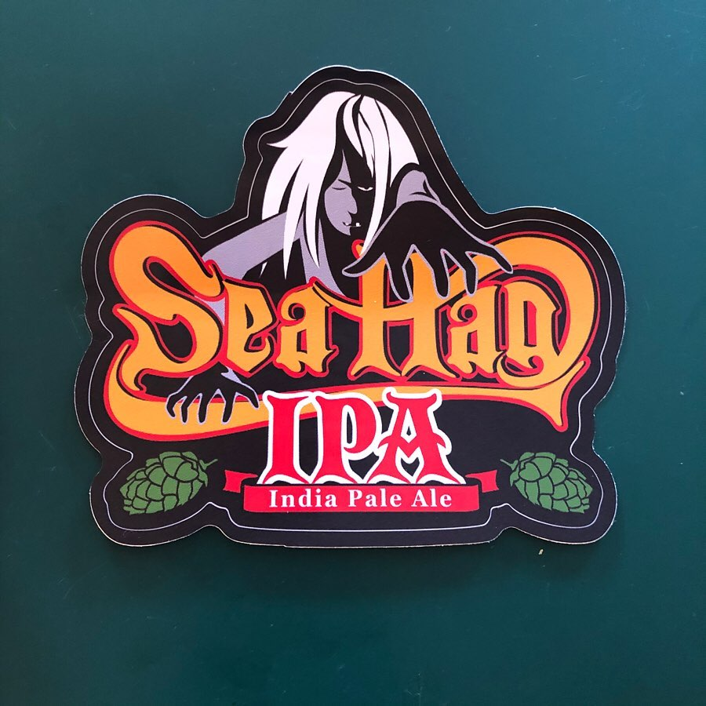
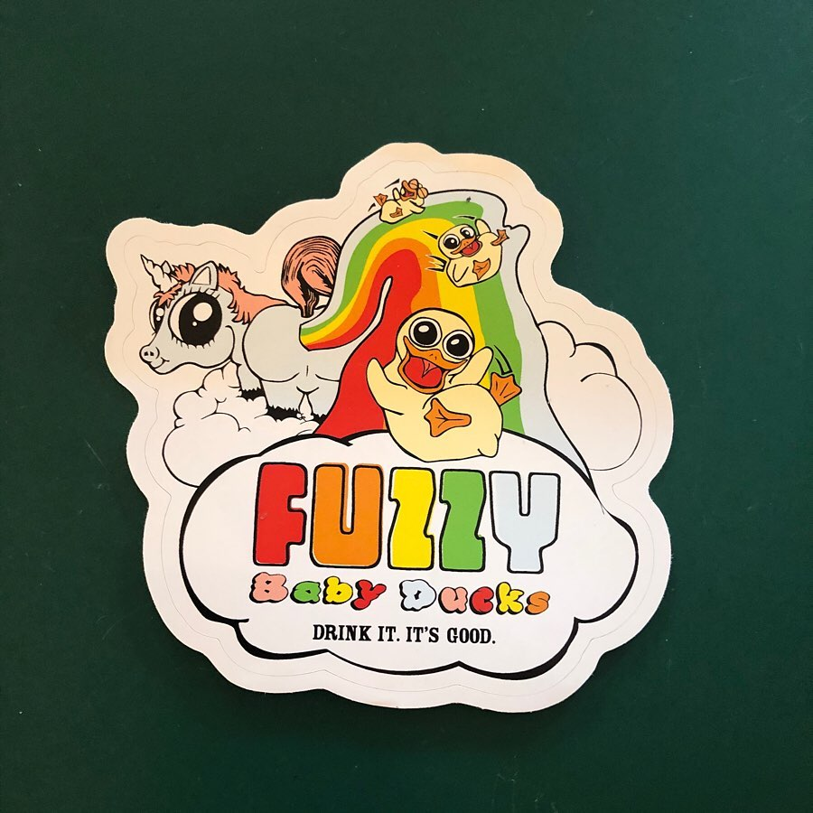
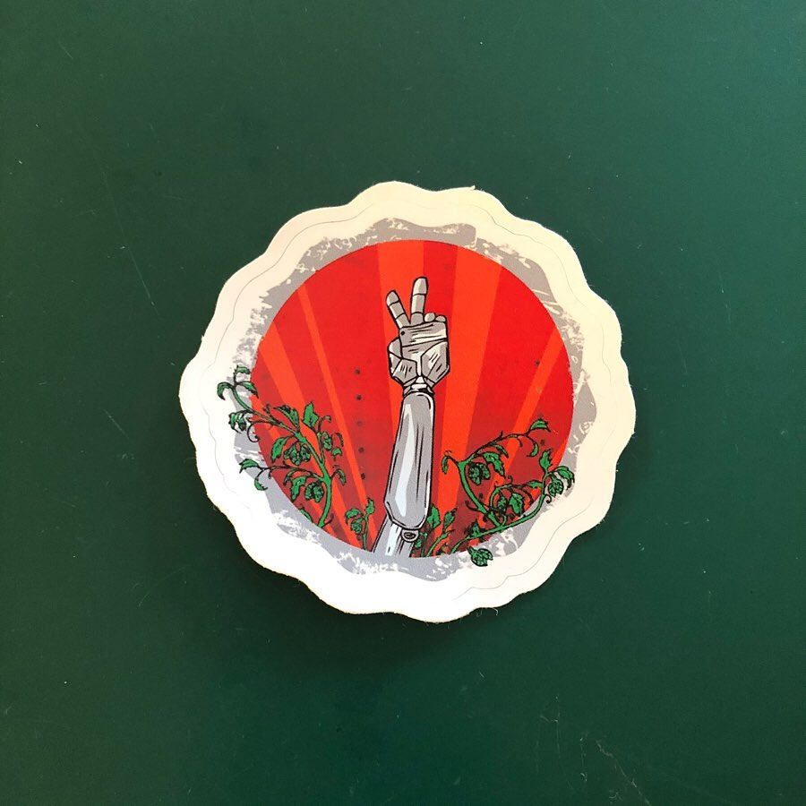
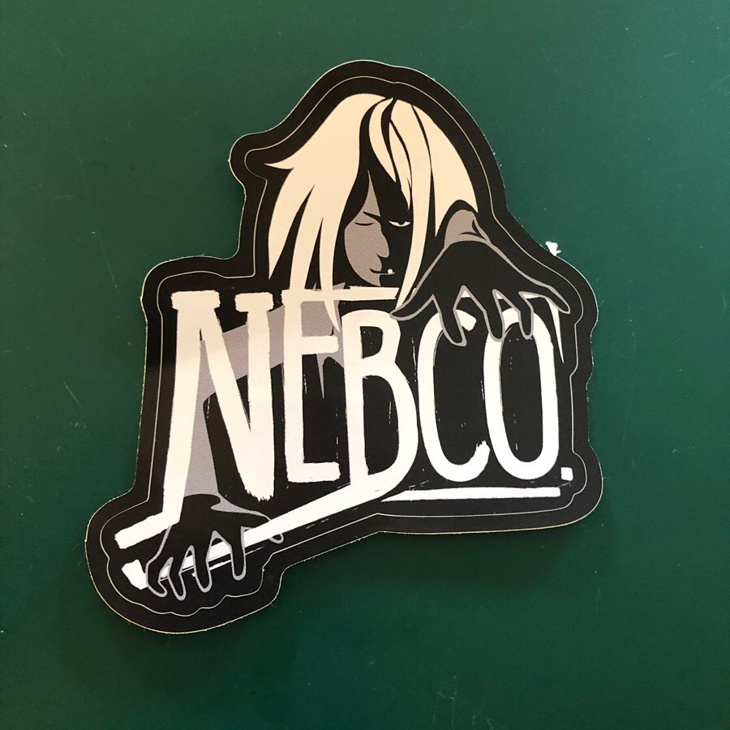
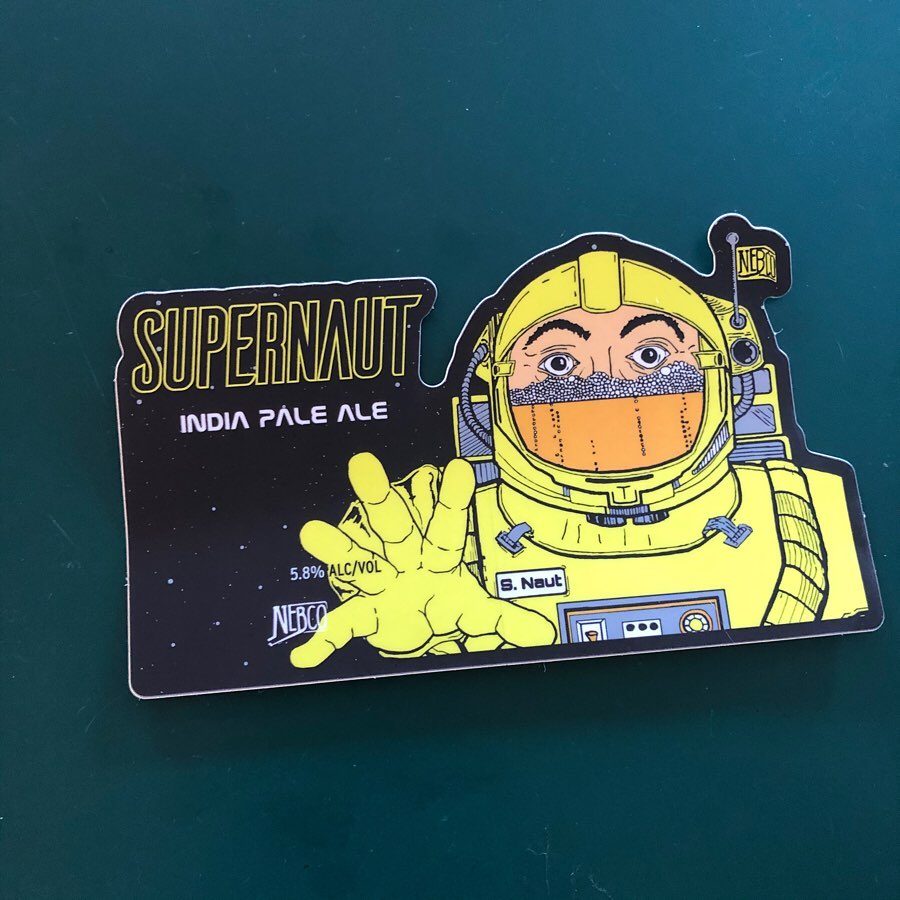
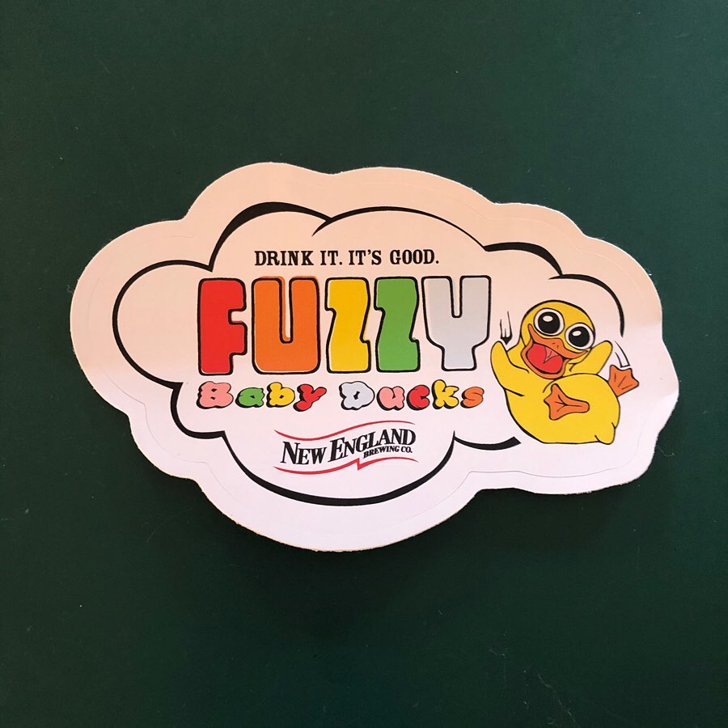
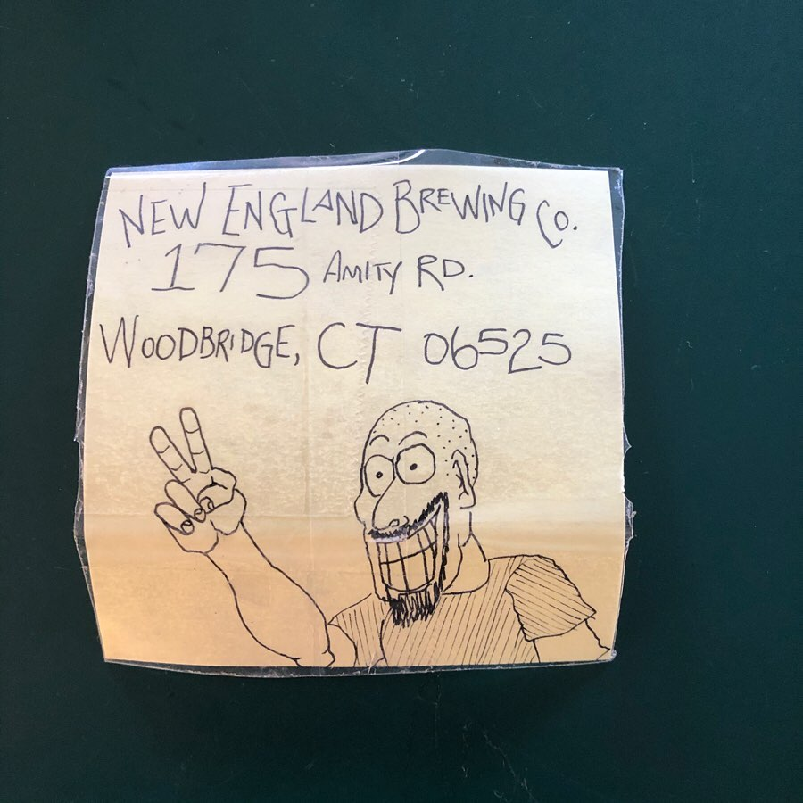

# Correspondence Part 1

> **Relationship:** Explicit satellite of [These Guys Brewing Company](/breweries/these-guys-brewing-company.html)
> **Source platform:** INSTAGRAM Export
> **Match Confidence:** 0.8 (via csv_name_inference)

### Caption / Correspondence Log:
```
I really don't know where to begin with @newenglandbrewing and their elephant. This has a nice dark #imsorryjon feel to it and it's painfully obvious that even if the artist doesn't know what they are doing they certainly know how, as the crosshatching shows this isn't anyone's first descent into madness and highly unlikely the last. That got proven pretty quickly when I got to the unicorn pooping out a rainbow that appears to have ducks tripping on LSD or maybe just gently rolling on some Molly. I'm not necessarily a huge fan of adult supervision and I don't think anyone there is either as even the Sea Hag #nebco sticker that looks like it's one driver from being ready for a golf shirt looks more like instead of going to the 19th hole after a round you may be more in the mood to try to summon the Dark Lord Shakka in the woods behind Roger's farm where they once found all that blood, which honestly I've probably done after some of the heroic drinking sessions I've completed, so no judgement there. 
I can't get over how tricked out this is. It was too big for my scanner so this is stitched and may look like hell. I'm lousy at Photoshop and it probably shows. I can't thank these guys enough, particularly @that_craig_guy_13 who did all the art. #drawmeanelephant
```

### Artifact Scans & Drawings:



















### Provenance & Audit:
* **Source Path:** `Unknown`
* **Original entity ID:** `instagram/post-1365465686944591742`
