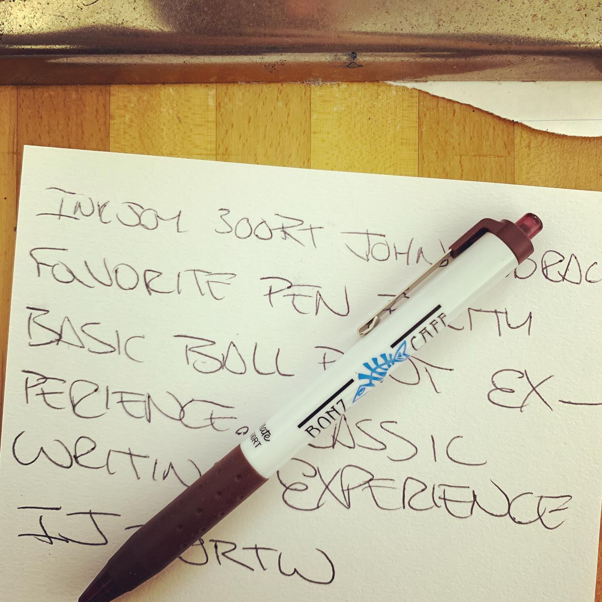
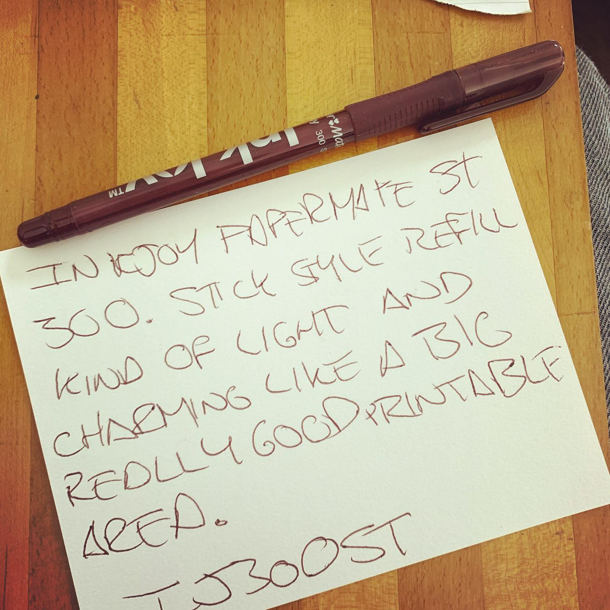
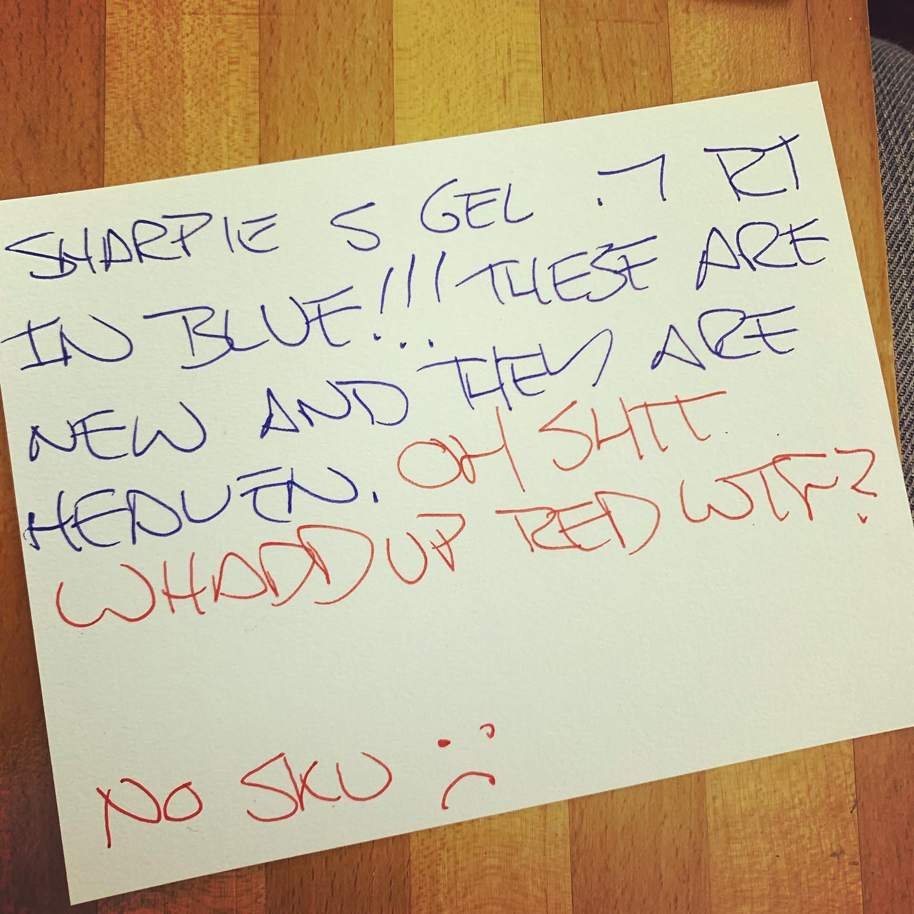
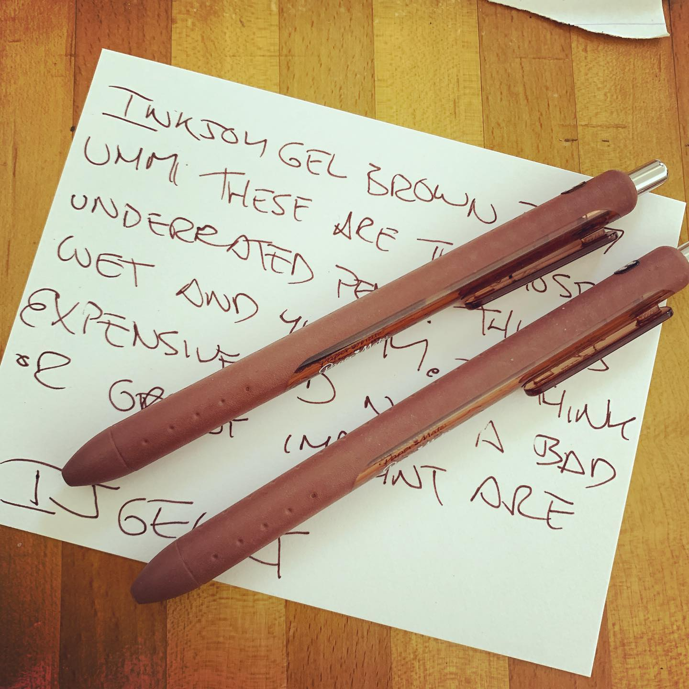
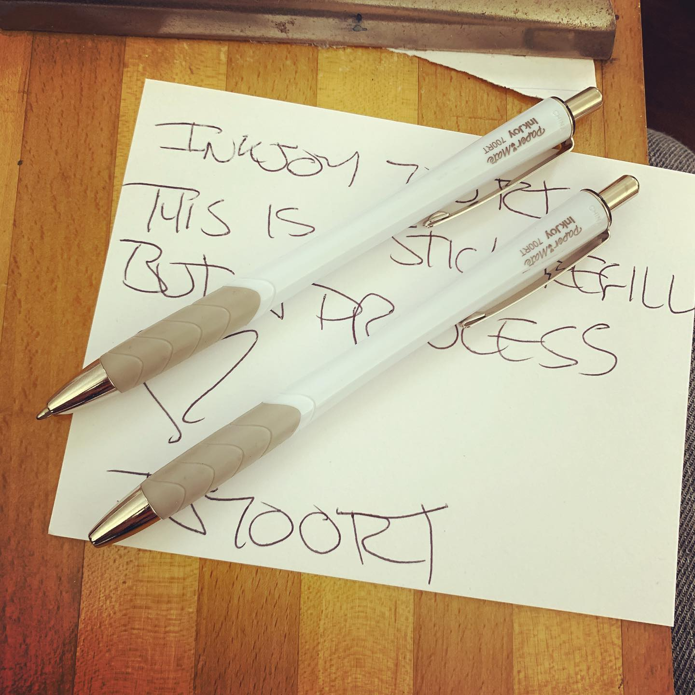
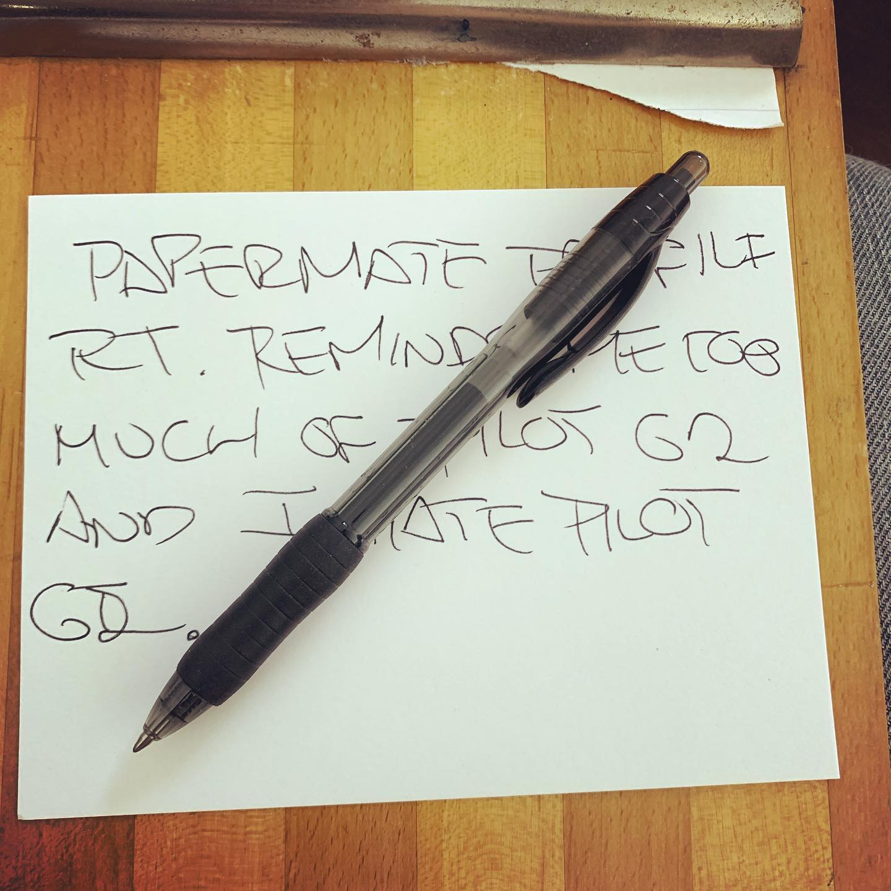
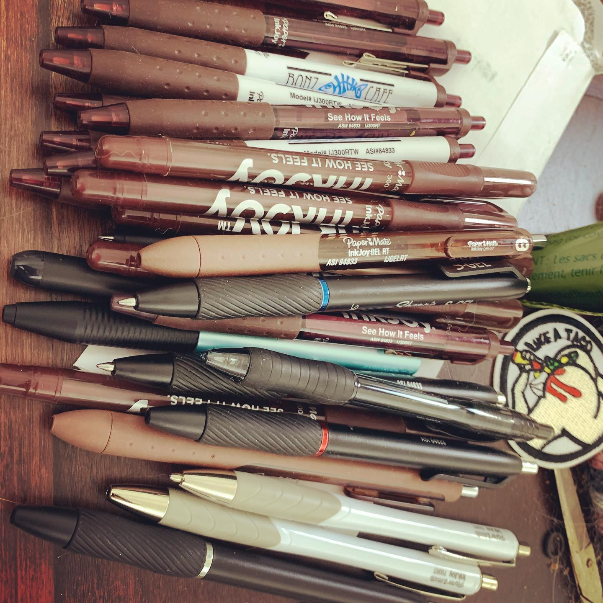

# Correspondence Part 2

> **Relationship:** Explicit satellite of [These Guys Brewing Company](/breweries/these-guys-brewing-company.html)
> **Source platform:** INSTAGRAM Export
> **Match Confidence:** 0.8 (via csv_name_inference)

### Caption / Correspondence Log:
```
Okay so I'm kicking around getting some pens printed and started the process with @paper_mate who is part of Newell, but I think the big entity as Sanford is mostly known for Sharpie and Sharpie sort of tries to be #itsownthang They sent me samples which came from Tennessee where a lot of #papermatepens are made including like the InkJoy Gel in .5, which is currently the best gel pen on the planet. These guys also are part of the same company that owns @parkerpen @sharpie @rotringofficial and a bunch of other stuff on the higher end I've got stuff from. Either way, they came up with a grey version somewhere and they are sort of available and not available kind of thing. You can get em in like one multipack and I've never tried one but I love their other stuff and elephants are grey. I'm ready to wife up some InkJoy gels if they let me, but they have other stuff I like and I'm not above getting more Pokka pens or another vendor.  They are potentially gonna print #drawmeanelephant grey #inkjoygelpens which is like a super exclusive for me as the only place outside of a multipack. It could be huge and @newellbrands sometimes is good with their branding but also have to make money so may not piss with it even if I can talk Runnermaid and Goody until any human being is completely sick of the conversation. So, probably leaning on this Sharpie S Gel if not as it's the new new thing. The refill isn't interchangeable with anything as far as I can tell, but it's an ultrapremium pen in the same class as the big dogs from Mitsubishi and Pentel with a lot of style. Not getting my hopes too far up as it may be too expensive to want to risk it as I'm already pretty deep in this idiocy. #penreview in photos and effort typing this post and doing the photo work about the same. Not much. So currently between these guys if they play ball, Pokka, or trying get ahold of Kaco or Caran d'Ache 888s. #300rt #700rt #300st #papermateprofile #seehowitfeels #penramble
```

### Artifact Scans & Drawings:















### Provenance & Audit:
* **Source Path:** `Unknown`
* **Original entity ID:** `instagram/post-1463922157134093328`
