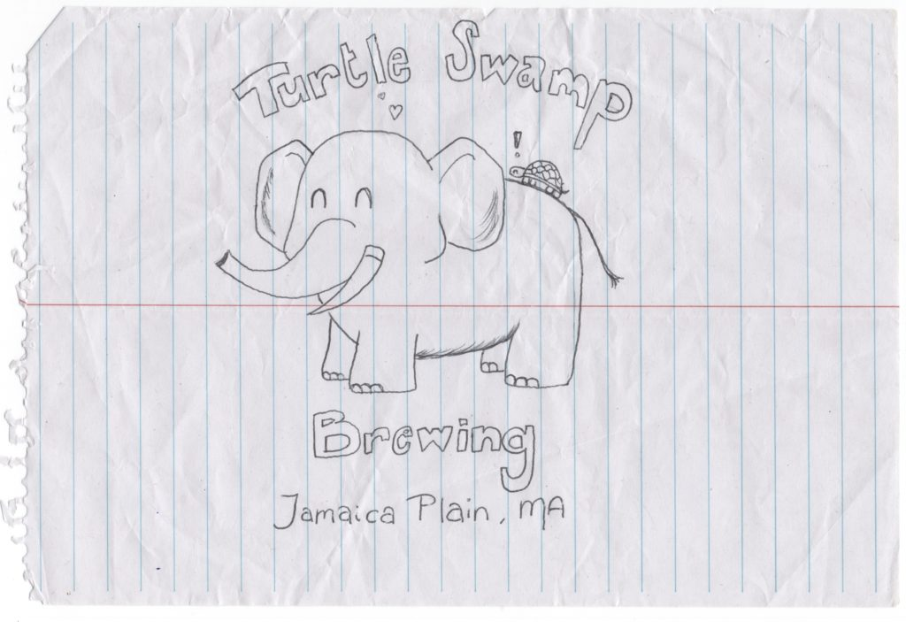
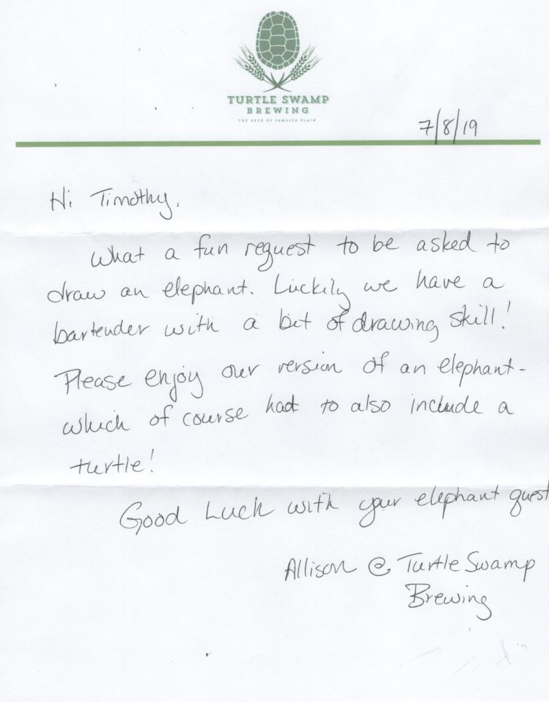

# Turtle Swamp Brewing

> [!NOTE]
> **Brewery Metadata**
> * **Location:** Jamaica Plain, MA 02130
> * **Address:** 3377 Washington St
> * **Type:** Taproom
> * **Correspondence Date:** 5/1/2019
> * **Response Received:** Yes

<!-- boris-migration-provenance
source_format: wordpress-wxr
source_export: DMAE/drawmeanelephant.WordPress.2026-07-20.xml
post_id: 129
post_type: page
guid: https://www.drawmeanelephant.com/?page_id=129
post_name: turtle-swamp-brewing
author: Timothy
post_date: 2019-07-16 18:59:09
link: https://www.drawmeanelephant.com/turtle-swamp-brewing/
conversion: human_review
-->

<figure class="wp-block-image"><figcaption>Elephant drawn by a Turtle Swamp Bartender</figcaption></figure>

Well t[hese guys](https://turtleswampbrewing.com/) knocked it absolutely out of the ballpark with a fantastic elephant. We've seen something similar several times, but good touches with the little things: toenails, shading on the ears, variation with the tusks, the tail fur. It is all around a really great elephant and these guys are the second brewery to check the box of having their own stationery in the correspondence. I'm absolutely sure [Dogfish Head](https://www.dogfish.com/) has their own stationery, but they did not invoke it on the letters so far. Tony at [Columbus Brewing Company](https://www.columbusbrewing.com/) got the distinction as the first and is probably among the top in the industry for correspondence game.

<figure class="wp-block-image"><figcaption>Letter from Turtle Swamp</figcaption></figure>

The letter from Allison really was nice. The stationery was a nice one color affair and I think it had a watermark. Didn't examine it closely as I'm trying to take the approach of put this stuff up immediately and perhaps reflect on it more later. I wrote a huge number of distilleries in the last two weeks and realized I'm still behind on getting the backlog of elephants. Though there is a lot to do in terms of playing catchup I'm feeling like I really need to continue getting the letters out first and foremost over posting to the site that maybe serves a dozen people, and poorly at that.

#### Enough bloviating about that, back to Turtle Swamp

Nice handwritten note and the stationery game was on point. I think I may have said this but haven't really put together a good FAQ section, so every article becomes the FAQ. This I can only imagine was one that I wrote from addresses from a friend who dumps them to me, so I have no idea what I'm writing to so this is really the first glimpse into the brewery in a lot of cases for me **after** getting the elephant when I look up the brewery to thank them, either via phone, contact form, or just write a letter back. The turtle with the two row barley is awesome and I'm thankful another brewery didn't just overuse hops in their logo. That's really old to me and typically not done that cleverly. It's also super easy to criticize other breweries logos when they aren't the ones drawing the elephants. I'd probably just bite my tongue on a played out hops logo, not gonna lie.

On closer examination it would appear the letterhead was printed off probably a not fantastical quality inkjet rather than a press job and what I thought was a watermark on the initial glance before scanning is a hearty amount of recycled content. Probably good for the environment but not my cup of tea writing. As with anything there is a point where your office supplies can get out of hand and I'm sure there isn't a ton of justification for having a 1 color commercially printed letterhead, though that would look sharp as hell in this case. Looking at it close you see some JPEG artifacting on what is printed, so kind of not the best place to start when you're printed letterheads, though I'd guess it was one of those cases where she printed the letterhead out of word and then hand wrote it. I got an elephant label from a Brooklyn brewery that did that but the guy typed out the letter in [Calibri](https://en.wikipedia.org/wiki/Calibri) and printed out. Allison went to the trouble of writing and had pretty good penmanship, so totally not knocking that she didn't have a proper vector PDF for the output of the letterhead. Shit happens and you have to work with what you have and she totally knocked it out of the ballpark as I said before by organizing the elephant drawing and actually bothering at all with the letter. I've discussed that most elephants come with little to no explanation, which is fine.

#### Something about their beers

I think I've covered fairly exhaustively how half assed my efforts are on actually looking at each brewery, which I totally feels make sense having written 300 of them. I probably should talk more about place's beers as I do know a bit about beer and that's vaguely related to what I'm doing with it being breweries I'm writing. These guys do a couple of New England Style IPAs, which is pretty much my favorite style of beer. [Here's](https://turtleswampbrewing.com/beers) their beer list. Not crazy long and I feel like a lot of the styles are that notion that you have to brew beers that people will drink or they won't buy your beer and then you can't brew beer anymore. It's pretty simple of a concept and I get it and have been to enough brewpubs to watch people "guzzle" down flights of tiny beers that I'd think is a bellyache or settle on an English Bitter after their friends explain that it's not really different to drink a real beer instead of a Coors, just put your mouth to the glass. Simple stuff. It works and though I've skipped a bunch of $6 English Bitters it is the best choice for many. Fortunately though, these guys are in New England and actually make New England Style IPA. That's a huge plus and I'm pretty sure if that's what they consider to be the flagship I'm happy that they agree with me both on drawing an elephant and beer.

## Satellites & Correspondence

### Correspondence Links

*   📁 [Turtle Swamp Brewing Correspondence Part 1](turtle-swamp-brewing/instagram-1.html)
*   📁 [Turtle Swamp Brewing Correspondence Part 2](turtle-swamp-brewing/instagram-2.html)
*   📁 [Turtle Swamp Brewing Correspondence Part 3](turtle-swamp-brewing/instagram-3.html)

