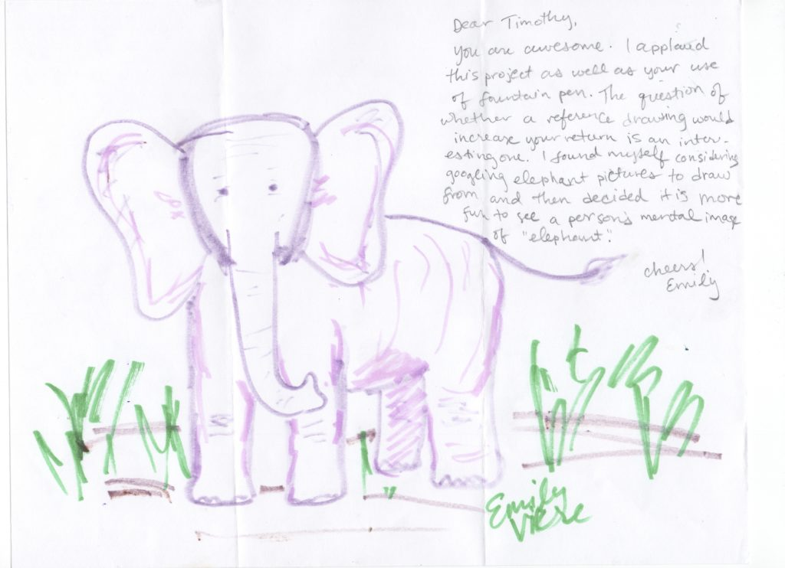
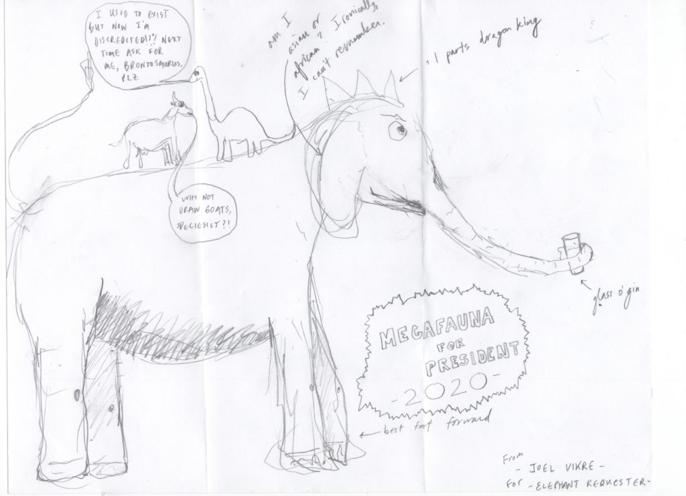
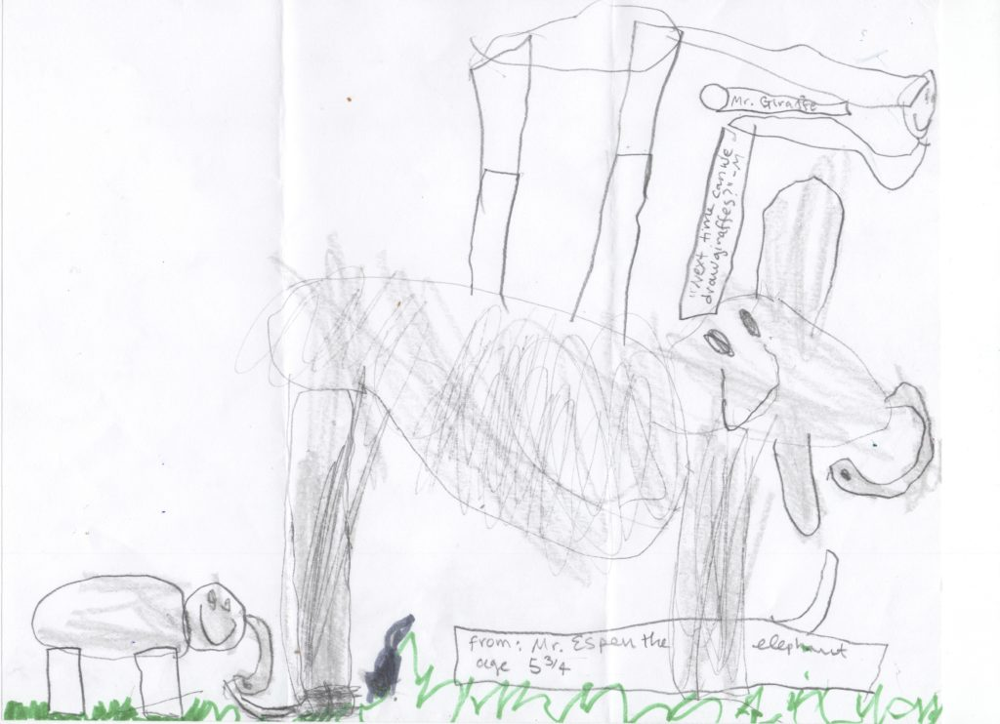
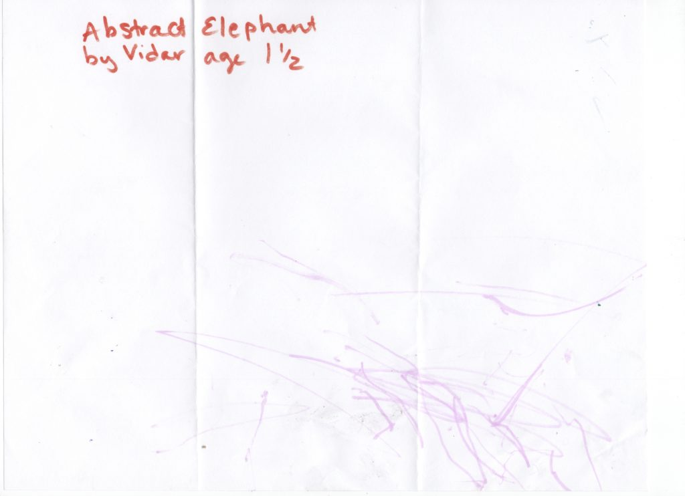
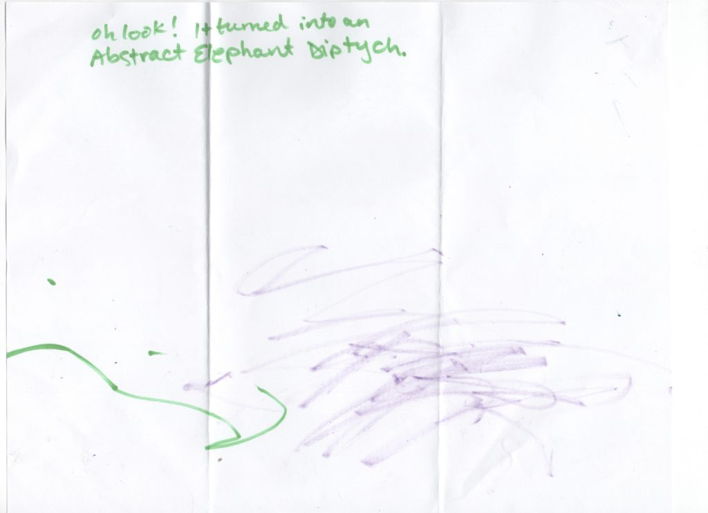

# Vikre Distillery

<!-- boris-migration-provenance
source_format: wordpress-wxr
source_export: DMAE/drawmeanelephant.WordPress.2026-07-20.xml
post_id: 121
post_type: page
guid: https://www.drawmeanelephant.com/?page_id=121
post_name: vikre-distillery
author: Timothy
post_date: 2019-07-03 15:27:45
link: https://www.drawmeanelephant.com/vikre-distillery/
conversion: human_review
-->

Okay so these guys were part of I think a request I had for my elephant picker to select some addresses from the boring area of the midwest as I had a fantastic set of strike outs for responses from Brooklyn and Seattle area, like 55 dud letters that produced 0 elephants. Total waste of time. So I got this address as well as a couple of other distilleries and the normal breweries and [Vikre Distillery](https://www.vikredistillery.com) absolutely delivered with some great elephants.

<figure class="wp-block-image"><figcaption>Elephant drawn by Emily Vikre of Vikre Distillery</figcaption></figure>

The first of the elephants came from Emily. I ended up checking their website after getting elephants back as per usual and apparently this is a husband and wife combo with several other people who work it and Emily is the wife end of it. I'm assuming a lot as they probably answer the questions in the text of their site, but not a big reader.

<figure class="wp-block-image"><figcaption>Elephant drawn by Joel Vikre of Vikre Distillery</figcaption></figure>

Joel came through with a pretty good elephant also and had some kind of questions about why elephants within his elephant drawing. I don't know if I have a good answer for that question but in many of my letters I leave it open to draw whatever the hell you want, but maybe not as much in recent letters. Overall Joel did pretty good with his elephant and it was definitely one of the better efforts for those who don't have significant drawing experience, which appeared to be the case here.

<figure class="wp-block-image"><figcaption>Elephant drawn by Espen Vikre of Vikre Distillery</figcaption></figure>

Espen came through pretty good but took a cue from his dad and was kind of enquiring why not giraffe. I didn't have the heart to explain to the kind that is because giraffe is loose and reference some obscure variant on the "you laugh, you lose" meme. That's partially because as much as I'm not a fan of children that would be a lot of effort to probably not have any gains. Either way, Espen came through with two pretty good elephants and took an angle of just slapping a smiley face on the side of them, which I guess is a way to approach it. I'm kind of concerned with the consistency between the two as the one has some ears that appear to be below the chin and in both cases the trunk placement is really just confusing and not close to anatomically correct. As much as I want to be supportive of this kid's artistic decisions I think they missed the mark for me.

<figure class="wp-block-image"><figcaption>Elephant drawn by Vidar of Vikre Distillery</figcaption></figure>

Vidar also did an elephant and I'm not sure who Vidar is. I really can't even qualify this as an elephant but they did send it and I'm putting it up as often the elephants that are my favorites do not coincide with the taste of others.

<figure class="wp-block-image"><figcaption>Vikre Distillery again. I'm really not sure what's going on this point.</figcaption></figure>

I'm not even sure what's going on here and I'm pretty sure Emily is one of these people who know what the word diptych means and isn't afraid to prove it. I'm not going to talk too much shit about Little Miss Magniloquent here with her fancy college words. I'm going to assume that she's using it correctly as she does have her doctorate. Then again, she also I assume wrote a lot of the copy for the website and said her husband got corned by the electrician and that her not even 6 year old has a PhD in cuteness, which I'm pretty sure isn't even a thing. Emily did ultimately spearhead the whole thing and wrote a great letter, so she's getting a pass for me.

## Satellites & Correspondence

### Correspondence Links

*   📁 [Vikre Distillery Correspondence Part 1](vikre-distillery/instagram-1.html)
*   📁 [Vikre Distillery Correspondence Part 2](vikre-distillery/instagram-2.html)
*   📁 [Vikre Distillery Correspondence Part 3](vikre-distillery/instagram-3.html)
*   📁 [Vikre Distillery Correspondence Part 4](vikre-distillery/instagram-4.html)
*   📁 [Vikre Distillery Correspondence Part 5](vikre-distillery/instagram-5.html)
*   📁 [Vikre Distillery Correspondence Part 6](vikre-distillery/instagram-6.html)

