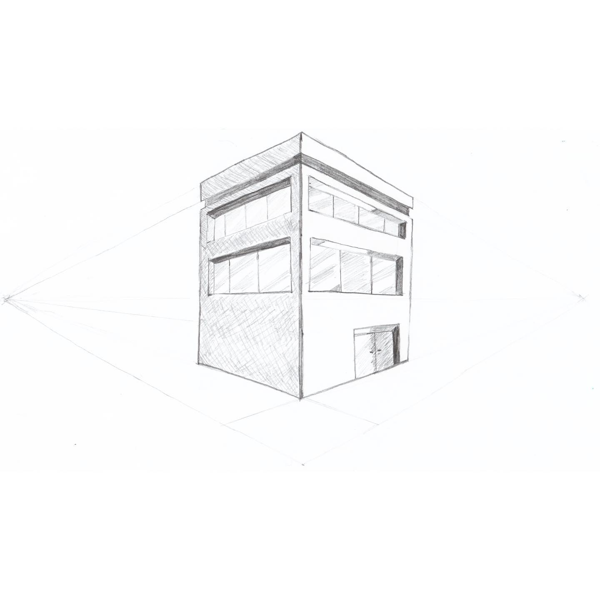
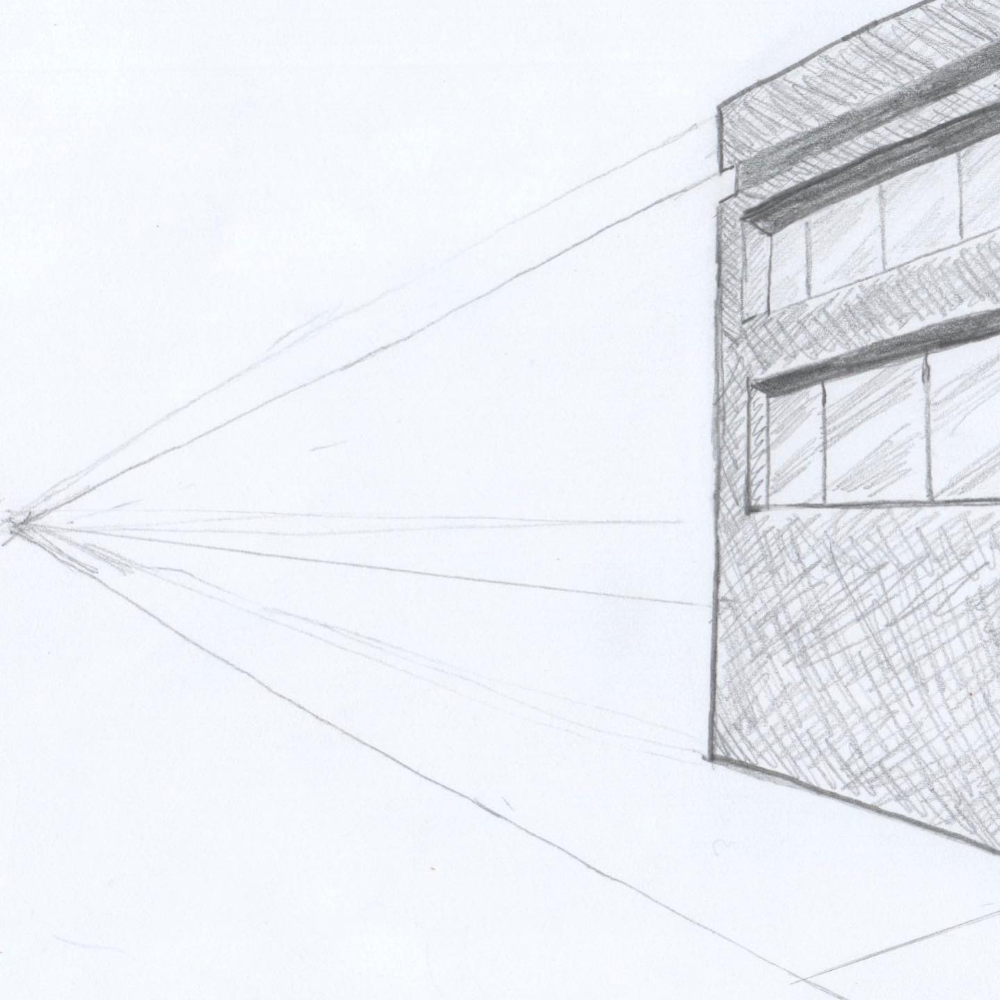

# Correspondence Part 3

> **Relationship:** Explicit satellite of [Vikre Distillery](/breweries/vikre-distillery.html)
> **Source platform:** INSTAGRAM Export
> **Match Confidence:** 1.0 (via curated_handle)

### Caption / Correspondence Log:
```
So this one from @nutsnboltsbeer apparently the guy got ahold of @vikredistillery and asked Joel and Espen if they could draw whatever the hell they wanted and despite Emily's strong suggestions to keep it elephant themed the ayes won and he drew me a building. Since they drew so many great elephants I'm gonna assume there is an elephant in the building ¯\_(ツ)_/¯ and I used a crappy Instagram filter to downplay the reliance on lines to draw it. Much like drawing circles it really helps to draw some lines, even posthumously. Probably a really good elephant in there, little heavy on the building for my tastes.  #drawmeanelephant
```

### Artifact Scans & Drawings:





### Provenance & Audit:
* **Source Path:** `Unknown`
* **Original entity ID:** `instagram/post-2360819585722638792`
