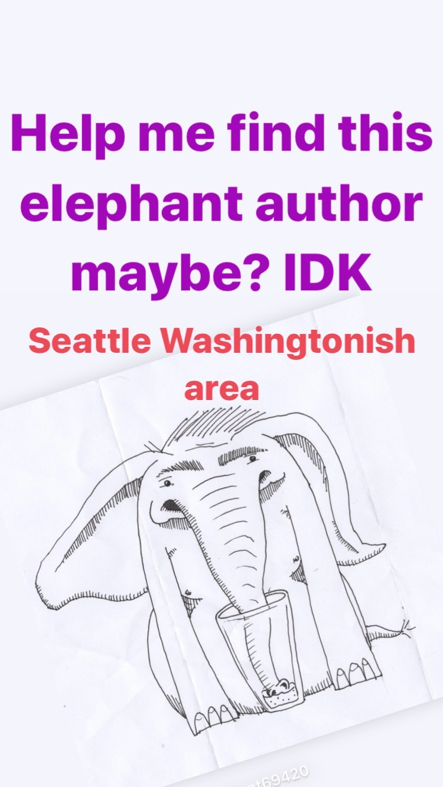

# Correspondence Part 1

> **Relationship:** Explicit satellite of [Washington Brewing Co](/breweries/washington-brewing-co.html)
> **Source platform:** INSTAGRAM Export
> **Match Confidence:** 0.8 (via csv_name_inference)

### Caption / Correspondence Log:
```
Help me find this elephant author maybe? IDK
 Seattle Washingtonish area
```

### Artifact Scans & Drawings:



### Provenance & Audit:
* **Source Path:** `Unknown`
* **Original entity ID:** `instagram/story-2500678567141088108`
