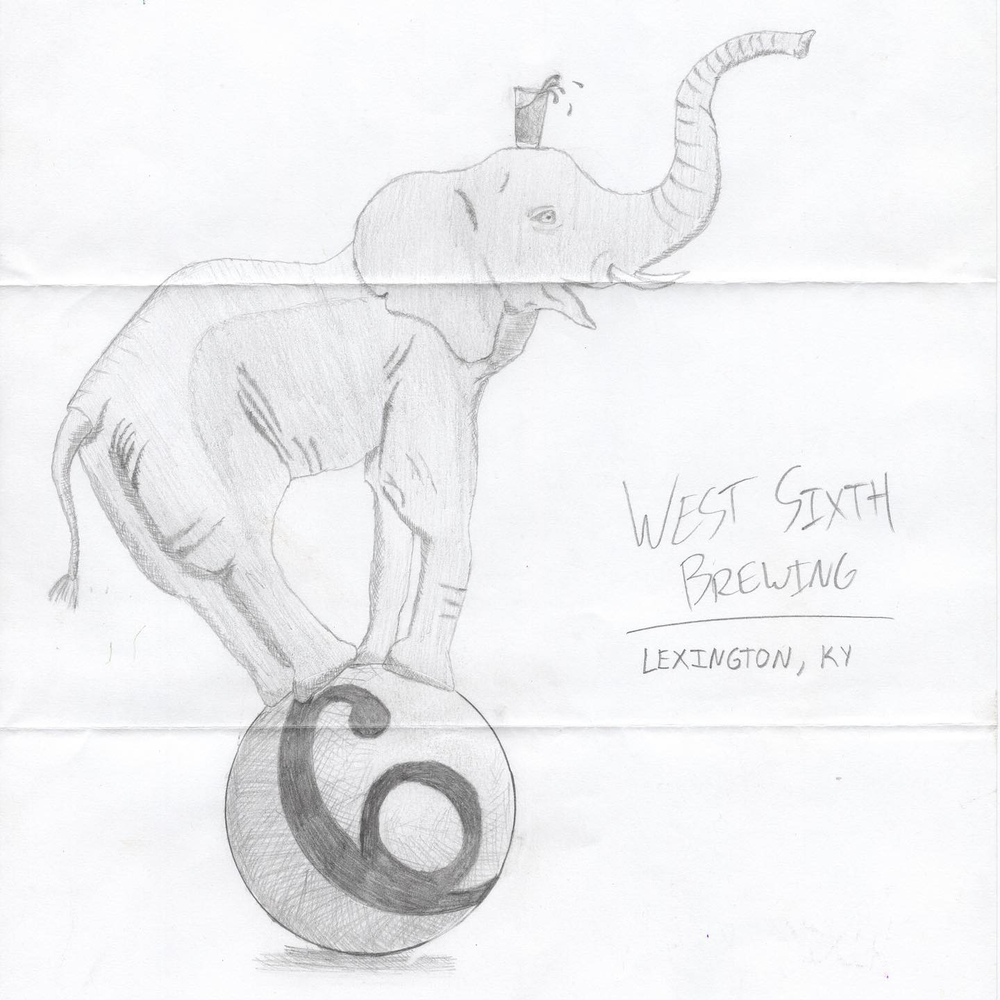
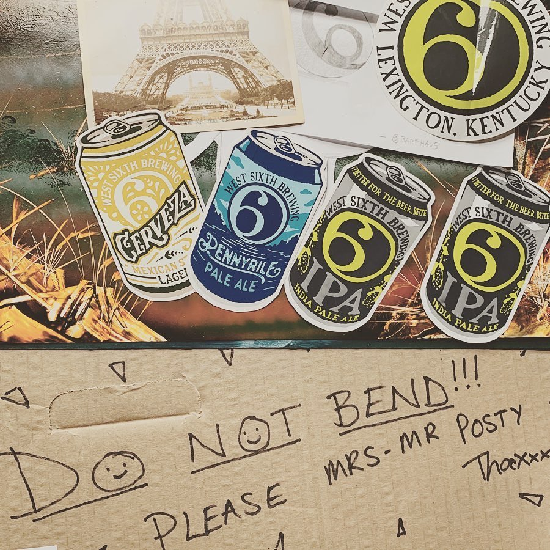

# Correspondence Part 1

> **Relationship:** Explicit satellite of [West Sixth Brewing Co](breweries/west-sixth-brewing-co.html)
> **Source platform:** INSTAGRAM Export
> **Match Confidence:** 0.8 (via csv_name_inference)

### Caption / Correspondence Log:
```
@westsixth had a problem with elephants coming in and mooching drinks so they require each elephant perform two tricks if they want a free beer. This #thorstyboi is not fiddlefarting around and is pulling both tricks at once. Thanks @barfhaus for illustrating how West Sixth handles it, sending the stickers, and knowing how to fold a letter. I almost cleaned this up a smidge in photoshop but kind of liked it this way as well and am admittedly lousy at it despite working in the print industry for a decade and a half. #drawmeanelephant #westsixthbrewing #indesign4lyfe #beermoochingelephants
```

### Artifact Scans & Drawings:





### Provenance & Audit:
* **Source Path:** `Unknown`
* **Original entity ID:** `instagram/post-2386309559909103354`
