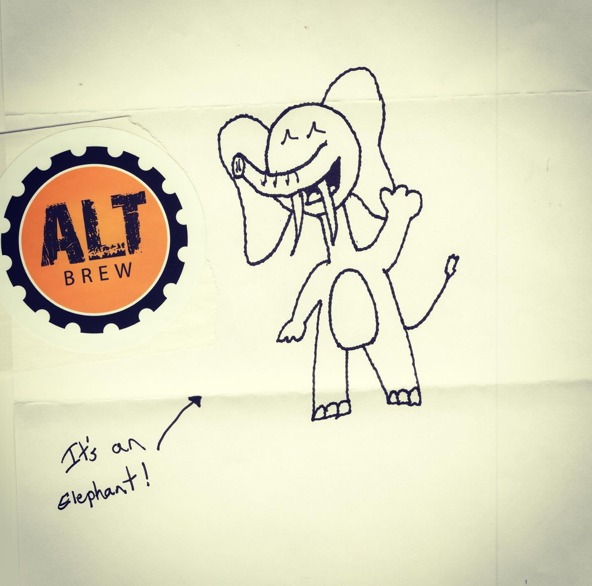
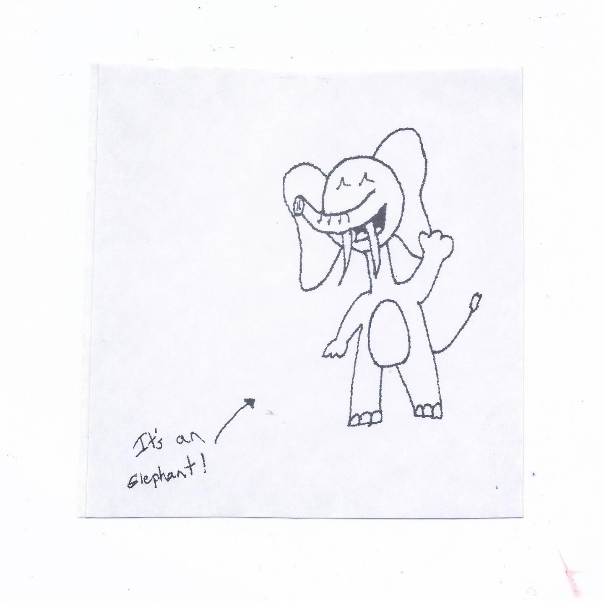

# Correspondence Part 1

> **Relationship:** Explicit satellite of [Wisconsin Brewing Co](/breweries/wisconsin-brewing-co.html)
> **Source platform:** INSTAGRAM Export
> **Match Confidence:** 0.8 (via csv_name_inference)

### Caption / Correspondence Log:
```
#madisonwisconsin is probably the single best town in the country for elephant drawings. It's probably a city but I'm not one to do my homework. @altbrew did do their homework here, however. They drew an elephant and made it #automagically3xbetter by indicating what it is with arrow and text. They also tossed in a sticker, which is good for my sticker book. Here's where it gets interesting, they sent in a frigging pocket size elephant sticker of the same elephant! #pocketelephants #drawmeanelephant
```

### Artifact Scans & Drawings:





### Provenance & Audit:
* **Source Path:** `Unknown`
* **Original entity ID:** `instagram/post-3011656038969767738`
