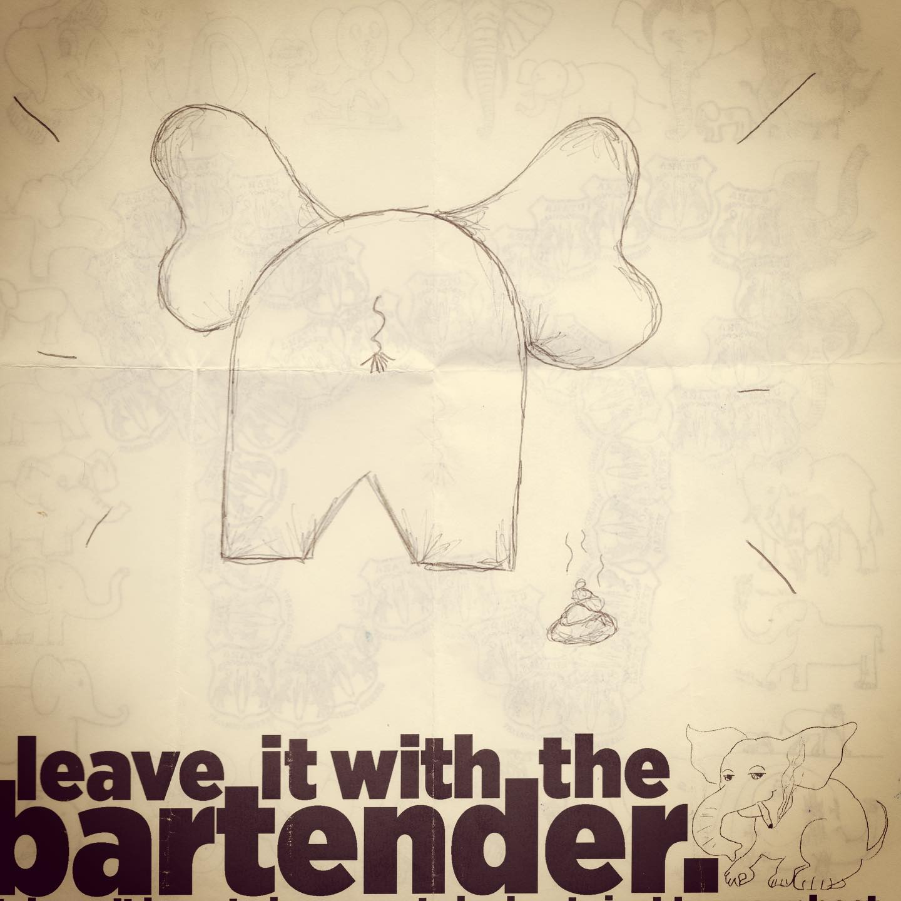
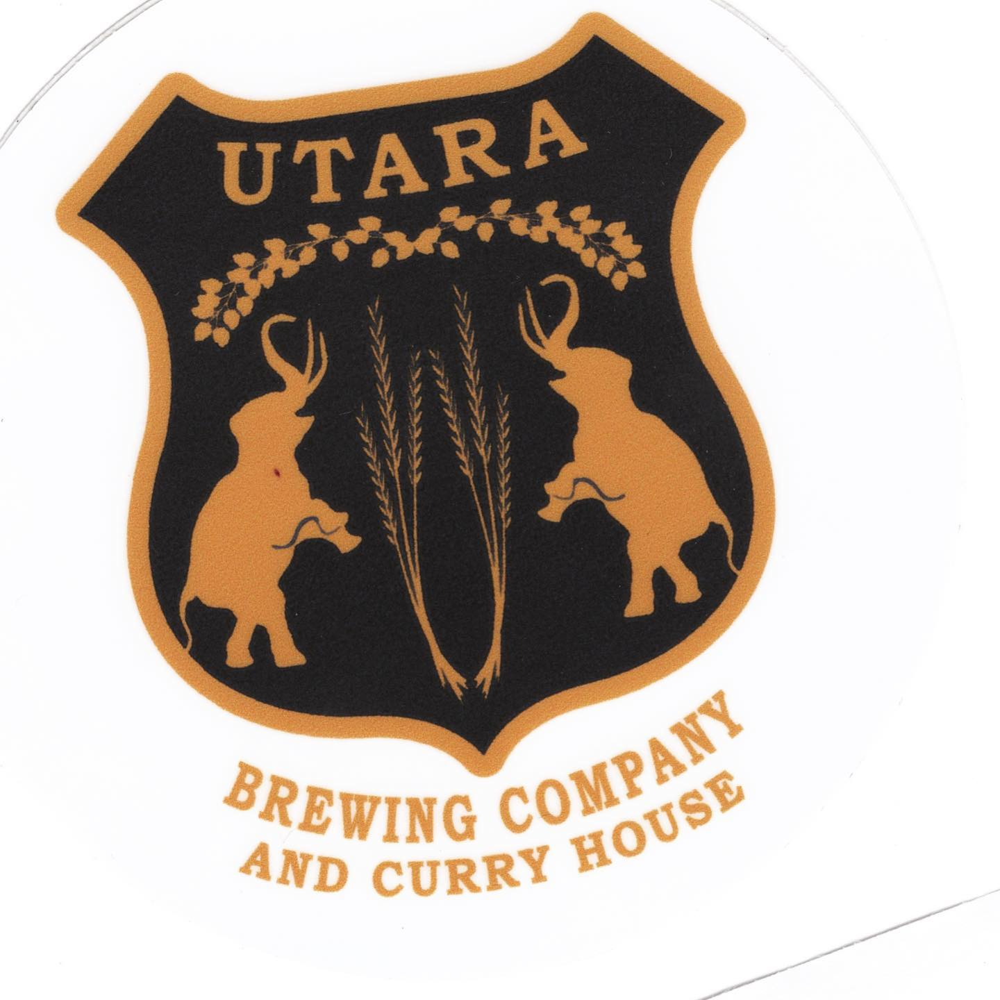
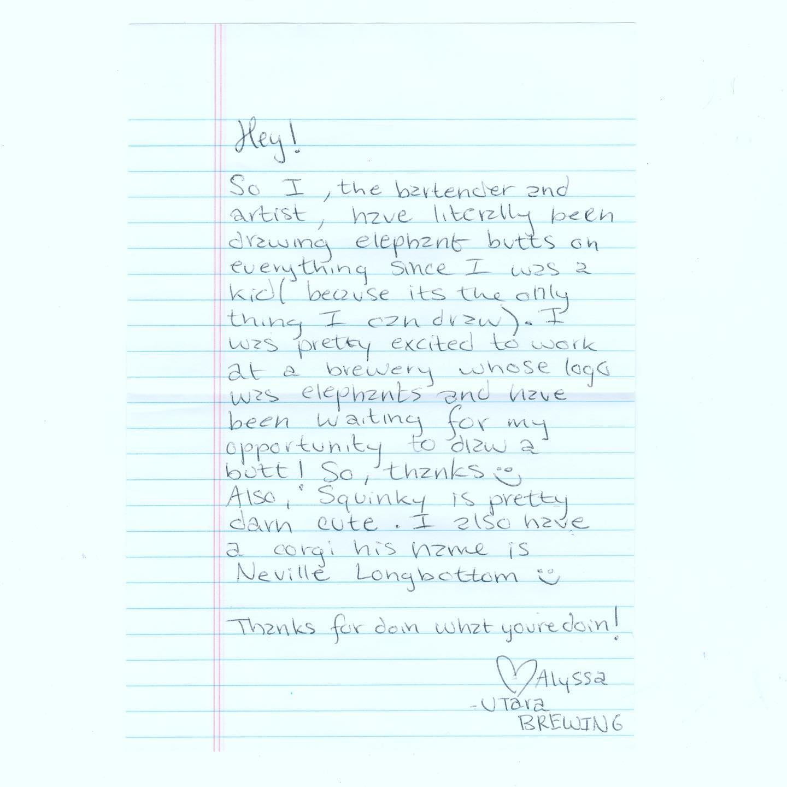

# Correspondence Part 5

> **Relationship:** Explicit satellite of [Worth Brewing Co](breweries/worth-brewing-co.html)
> **Source platform:** INSTAGRAM Export
> **Match Confidence:** 0.8 (via csv_name_inference)

### Caption / Correspondence Log:
```
Okay so @utaraidaho did like two elephants for one sheet. It was essentially the same elephant but apparently they are an elephant logoed bar, which makes this super uncommon. Also very rare is a note and apparently either we have common dog friends on Facebook or Neville Longbottom is just a good thing to name a corgi assuming Evee and Ein are too popular a media reference. I named my dog after #zapcomixaresquinkycomix for what that’s worth. #drawmeanelephant
```

### Artifact Scans & Drawings:







### Provenance & Audit:
* **Source Path:** `Unknown`
* **Original entity ID:** `instagram/post-5506847910370797692`
