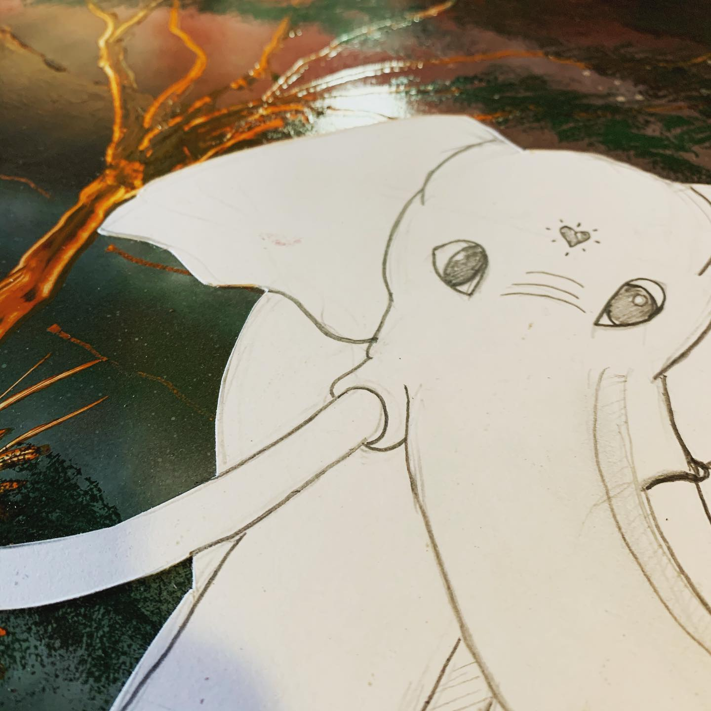
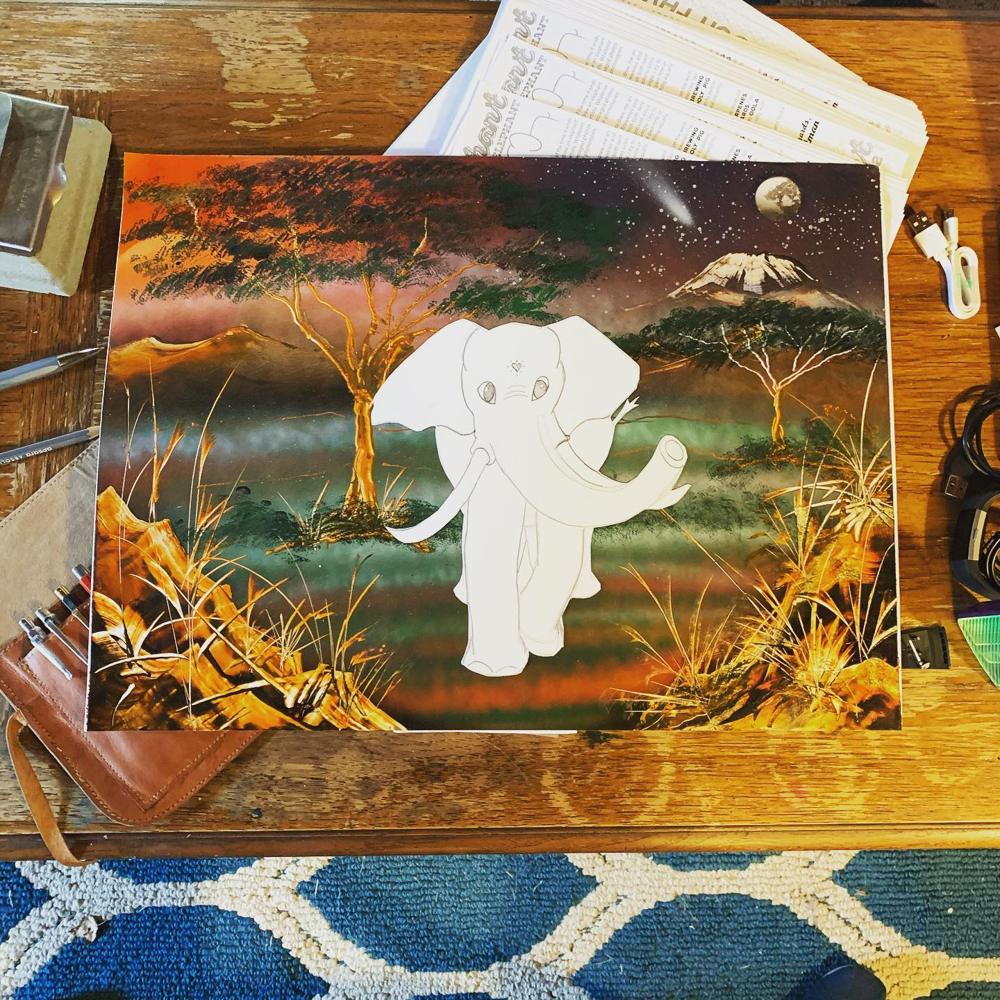
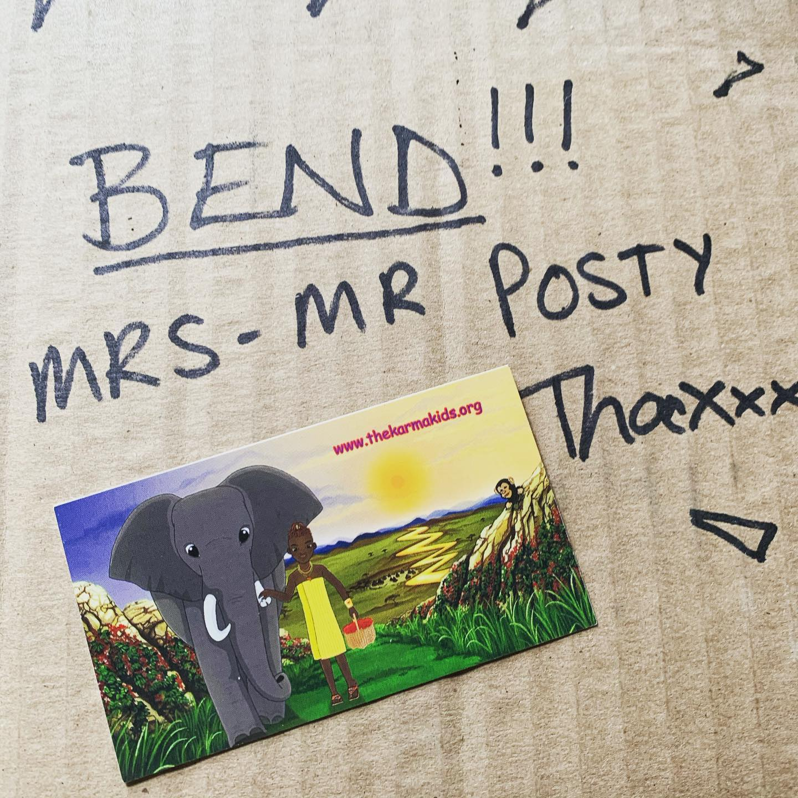
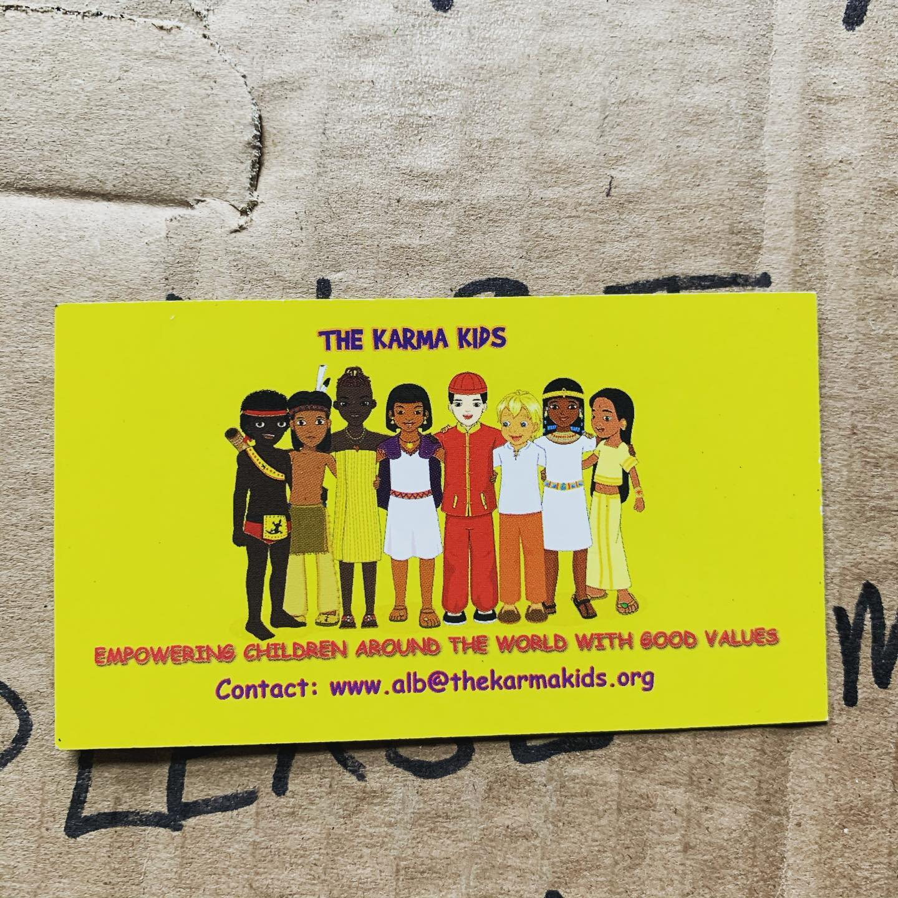
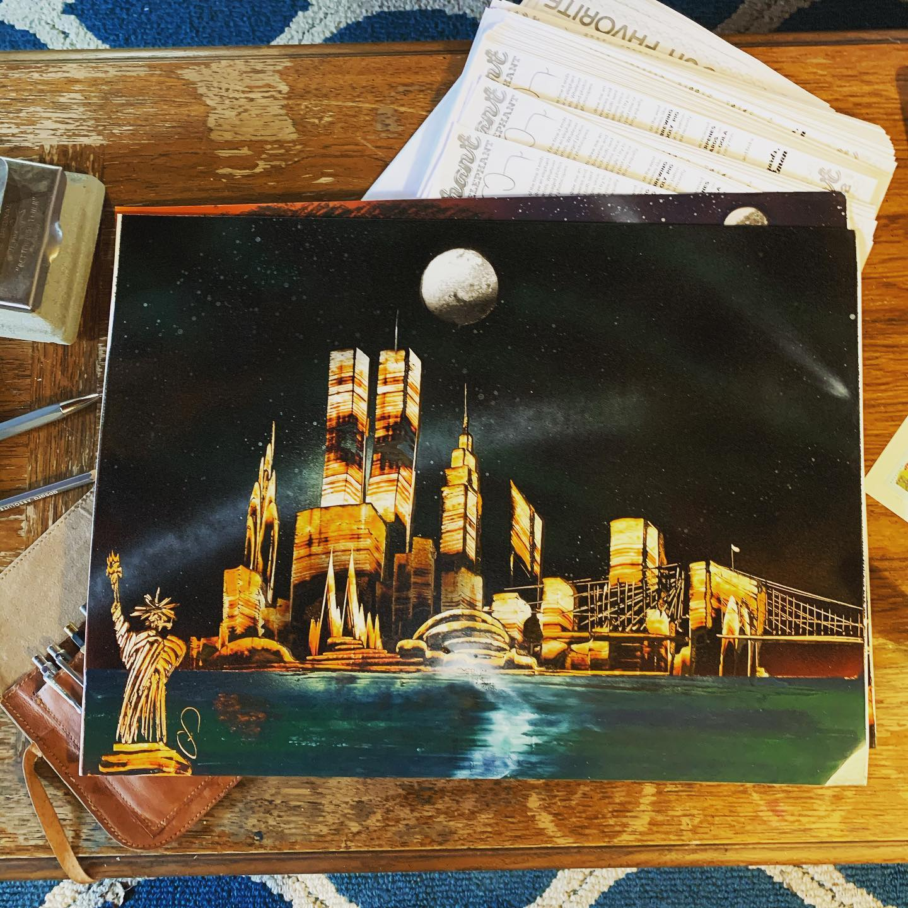

# Archive Post Part 122

### Caption:
```
I ran in @thekarmakids_childrensbooks in Vegas and asked them to draw me an elephant because they were doing a painting and I'm the worst kind of person who makes everything about me. I ended up getting his card and a few days ago these showed up. I think the one that isn't an elephant is like a collection of a bunch of stuff people would want on one of these backgrounds. I don't know as it's Vegas. My guess is like precanned choices that are asked for like the Mom tattoo with roses. Either way, he's got a bunch of stuff going on and did have previous elephant experience. Great job and sorry for not paying attention to your art when I was there. #drawmeanelephant #thekarmakids
```











