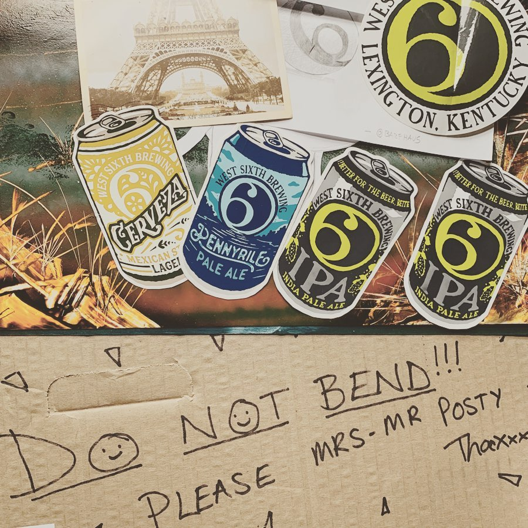
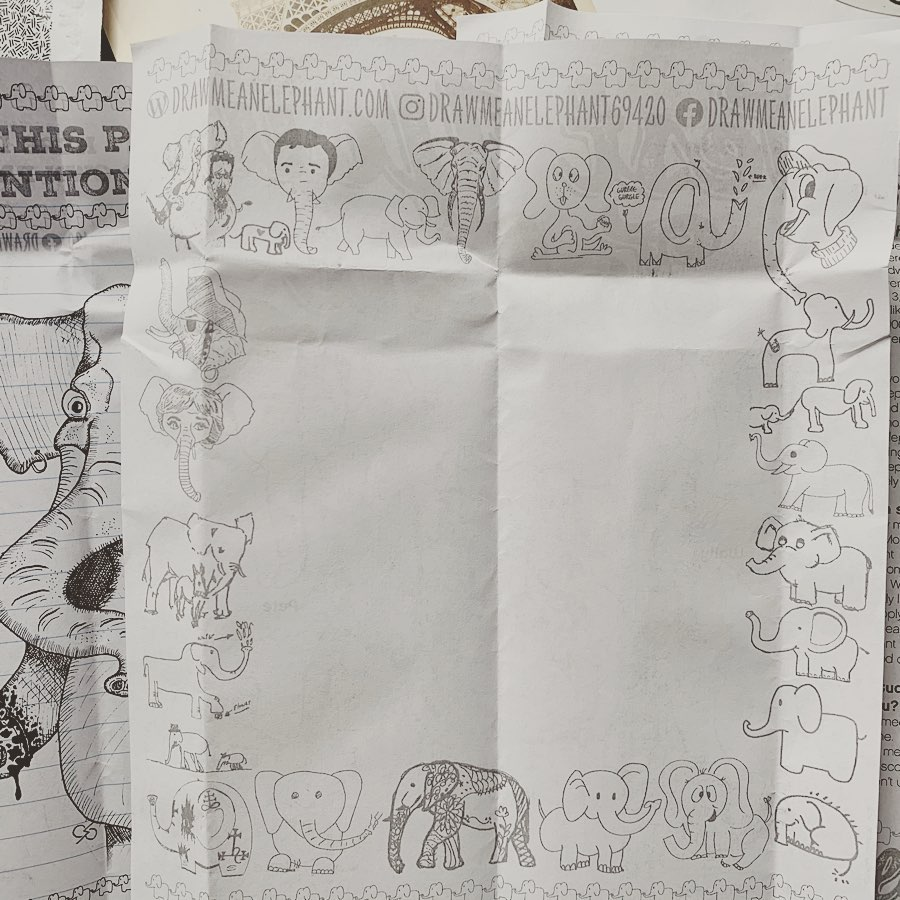

# Archive Post Part 179

### Caption:
```
Okay so I got other stuff but since I’m being unnecessarily petty about getting a blank letter I’ll wait until I’m in a better mood to write those up. @westsixth drew an elephant and @barfhaus knows that when you’re putting a letter sized piece of paper in the envelope you don’t just do some weird origami but rather a letter fold like normal letters come. Also @thekarmakids_childrensbooks draw an elephant and wrote a cute little message to the mail person and a cute card from @r.randomactsofcards to brighten the day. Good thing because if it was just the blank elephant I’d probably come unglued. #drawmeanelephant
```





