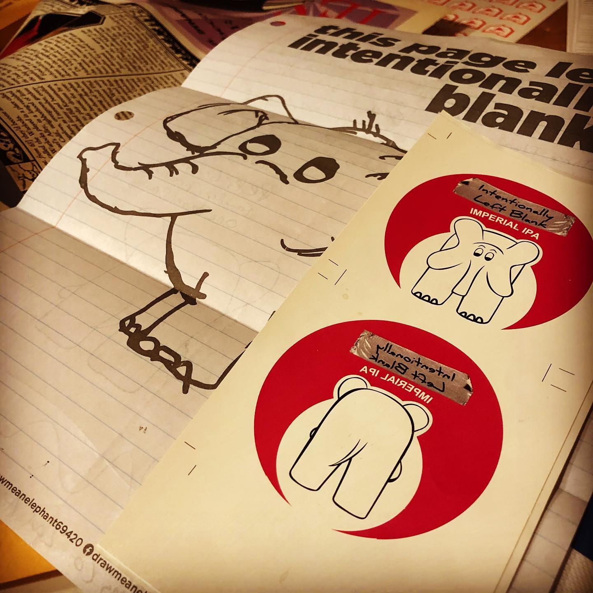
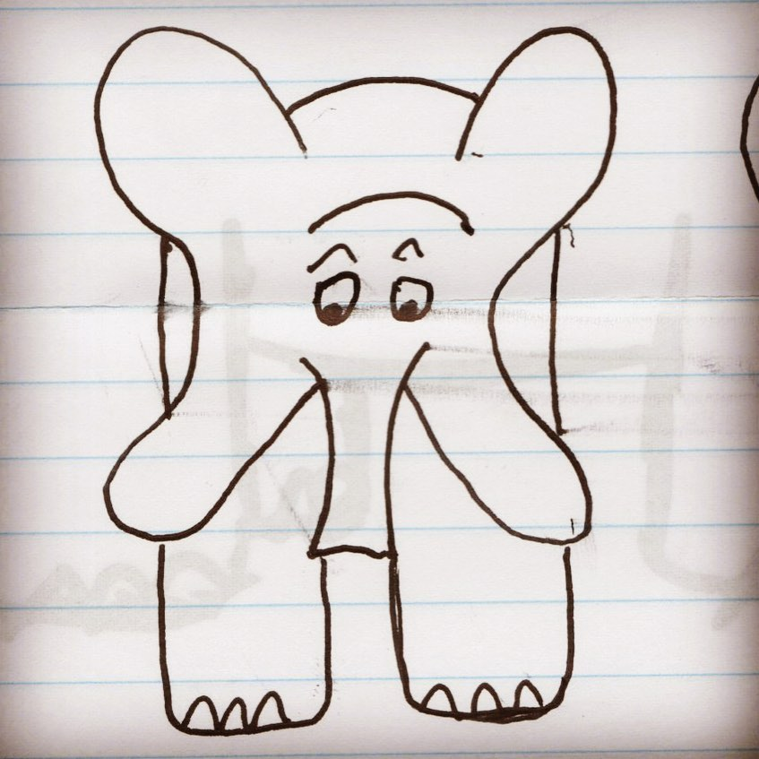
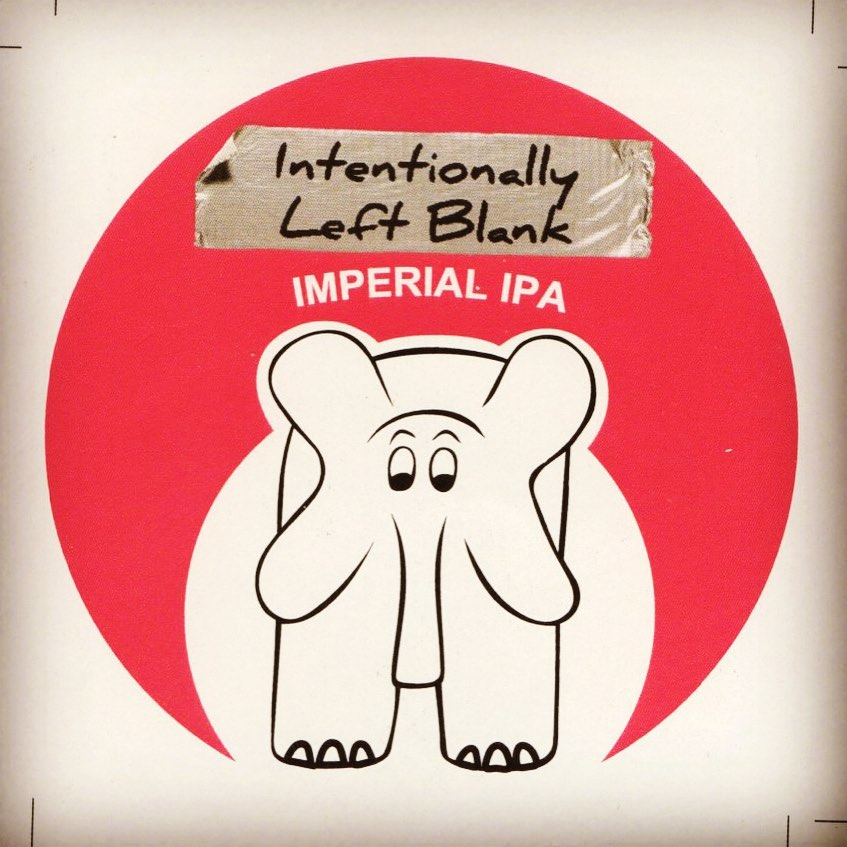
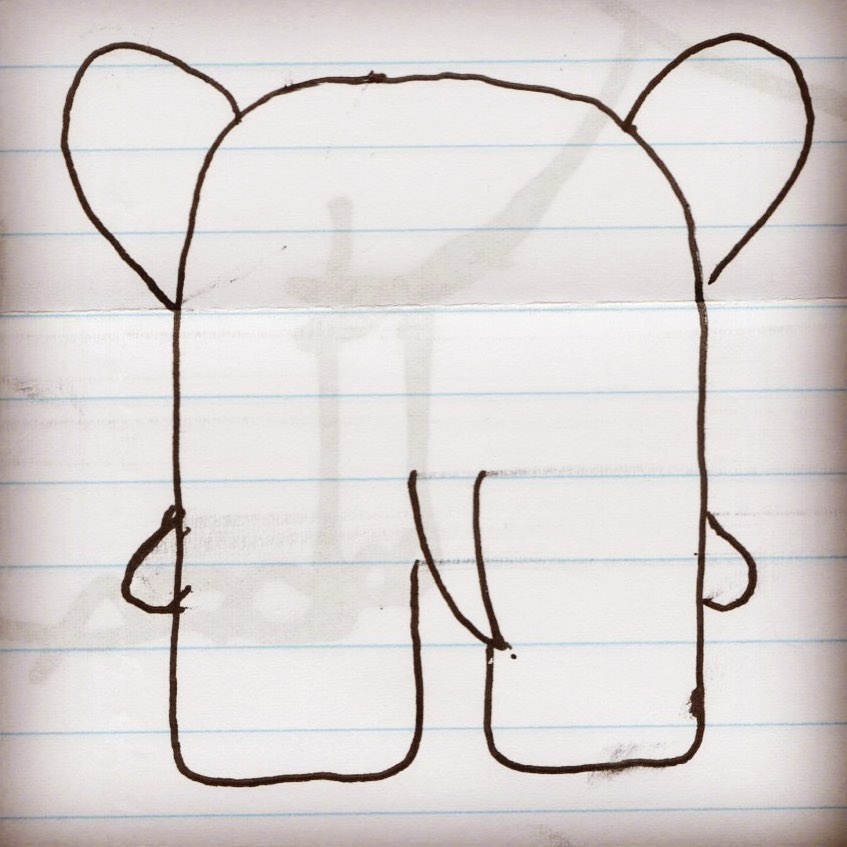
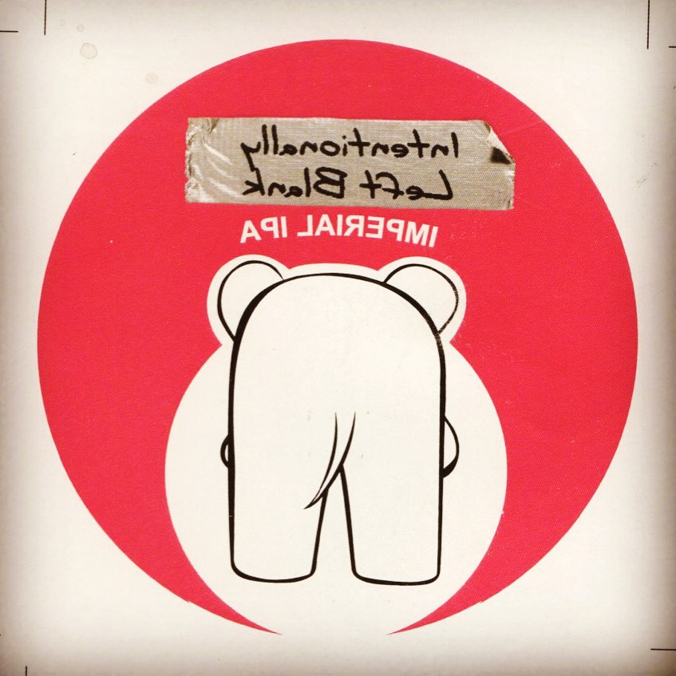

# Archive Post Part 207

### Caption:
```
@onebarrelbrewco redrew an existing elephant (totally valid move) on an existing intentionally left blank page that I included in my letter (very environmentally friendly move) with the elephant used on their Intentionally Left Blank Imperial IPA that they already had around (what I call in the graphic design world as leveraging graphical equity), and included the stickers from the draft pulls (again, pretty thrifty). #drawmeanelephant
```











