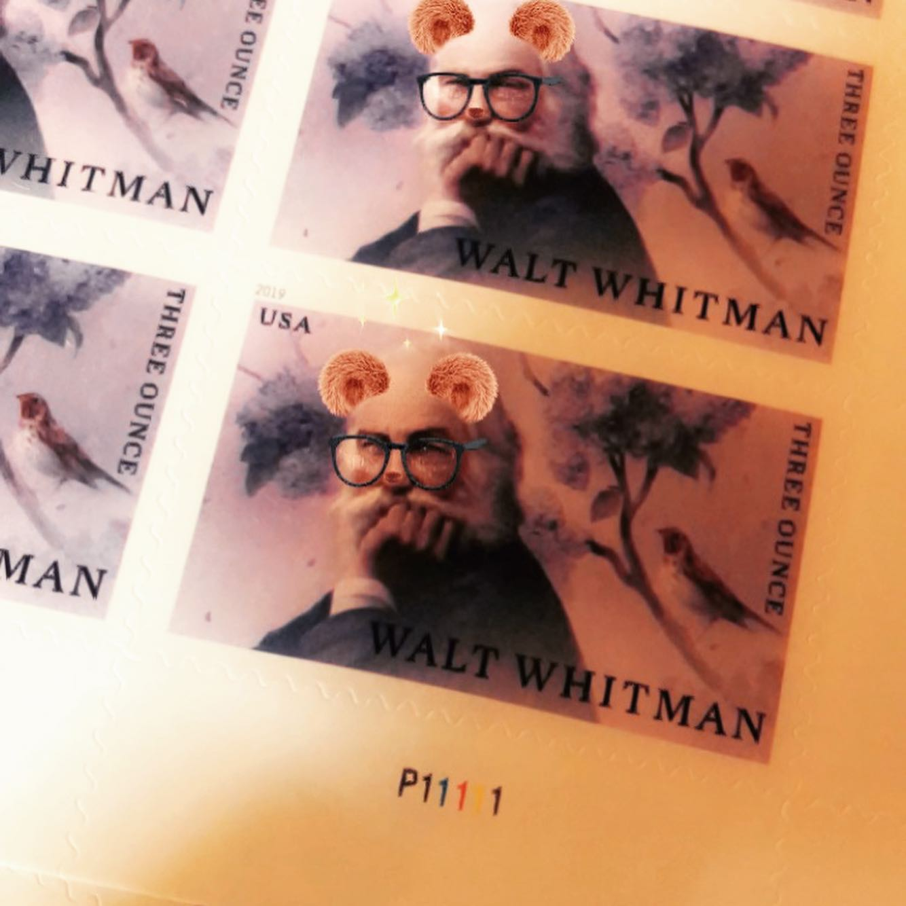
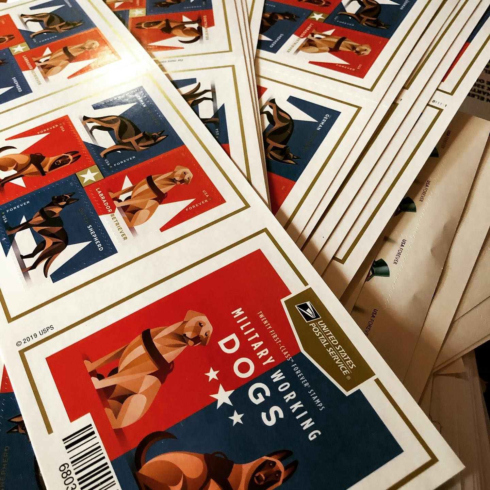
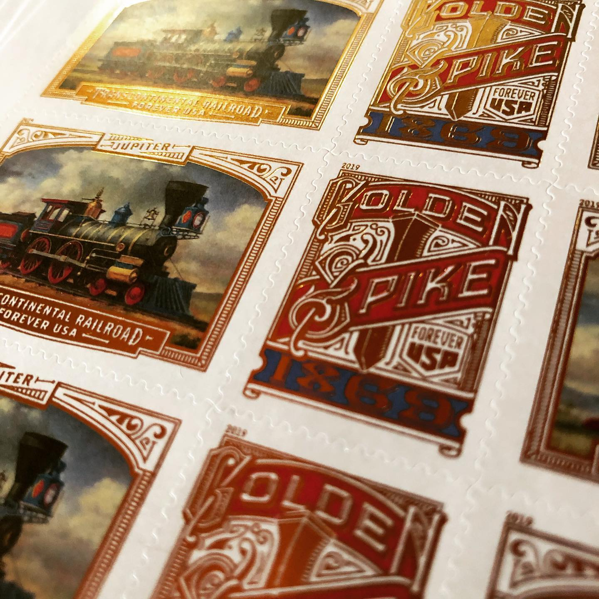
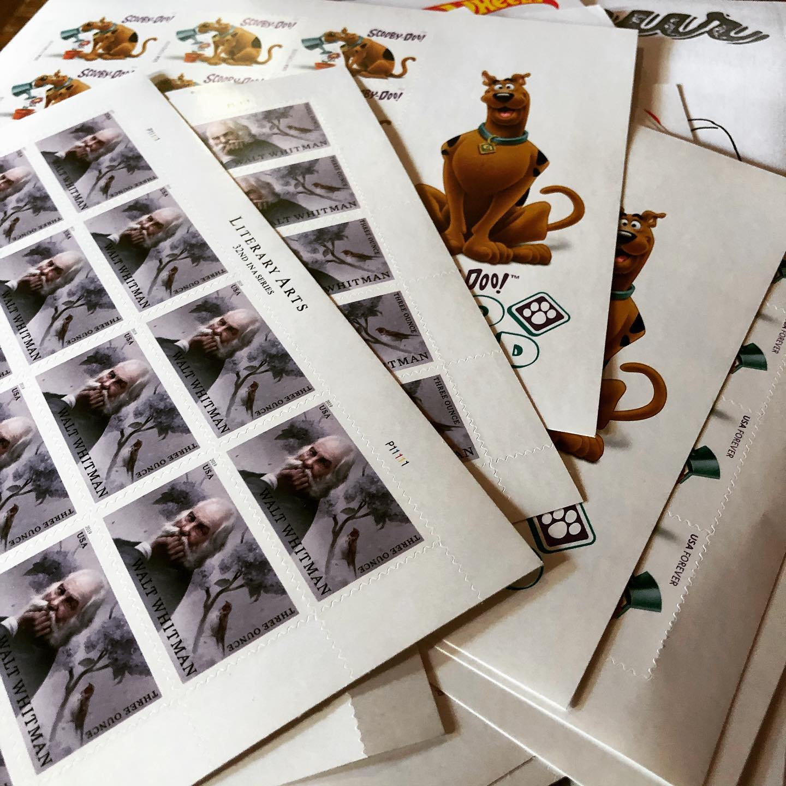
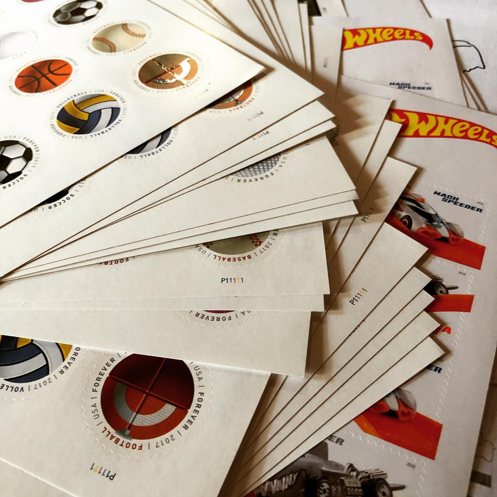
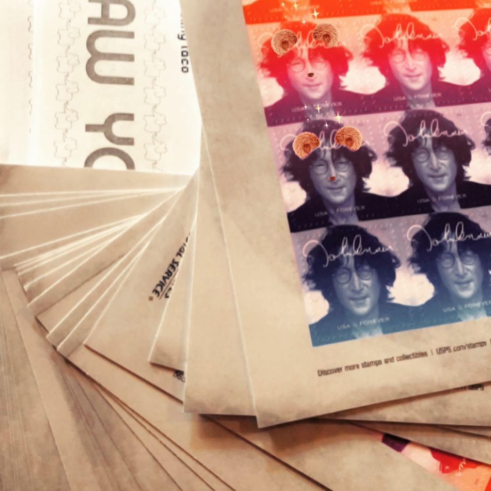

# Archive Post Part 255

### Caption:
```
Okay so you may remember me saying that February was going to be so big for this that it’s going to feel like a leap year. It turns out February was a leap year, which really goes to show I should look more at a calendar. I’ll for sure remember leap year next time, I promise. March is going to be similarly big and If I were to guess the best word to describe its relationship to the chain I would say “off” would be my wager. 
I don’t know if anyone remembers #TheState on MTV with @michaelianblack and the pudding, but $730 in stamps feels the same way minus the velvet and Lieutenant Dangle helping whisper sweet nothings into that pudding. #stamps #postagestamps
```













