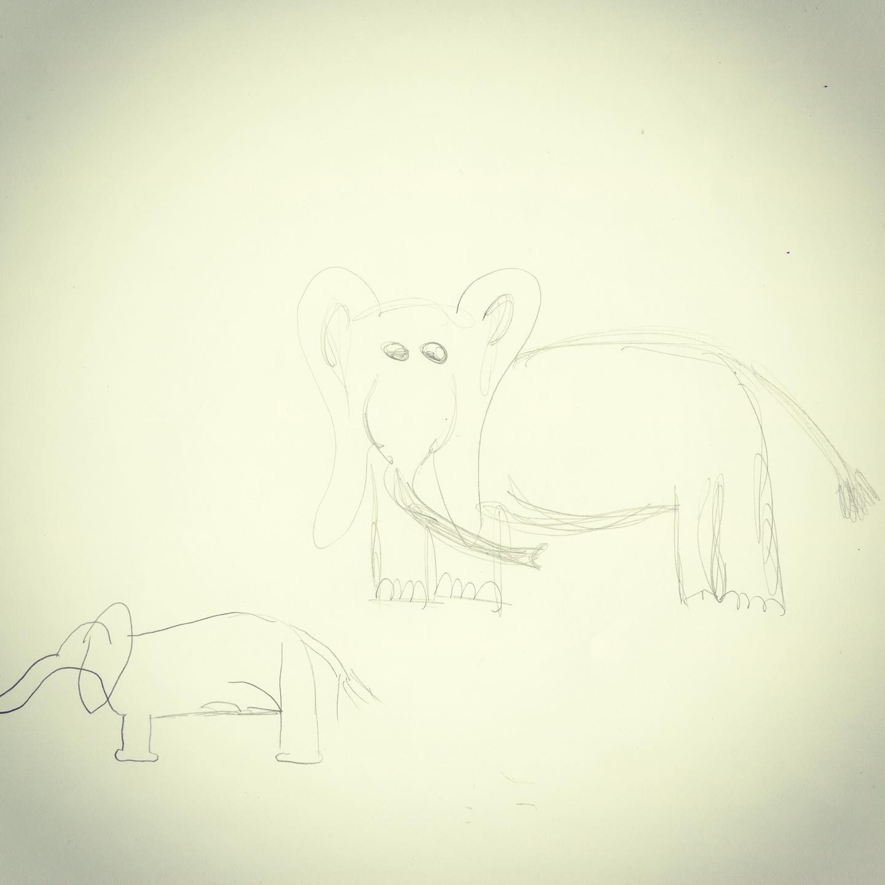
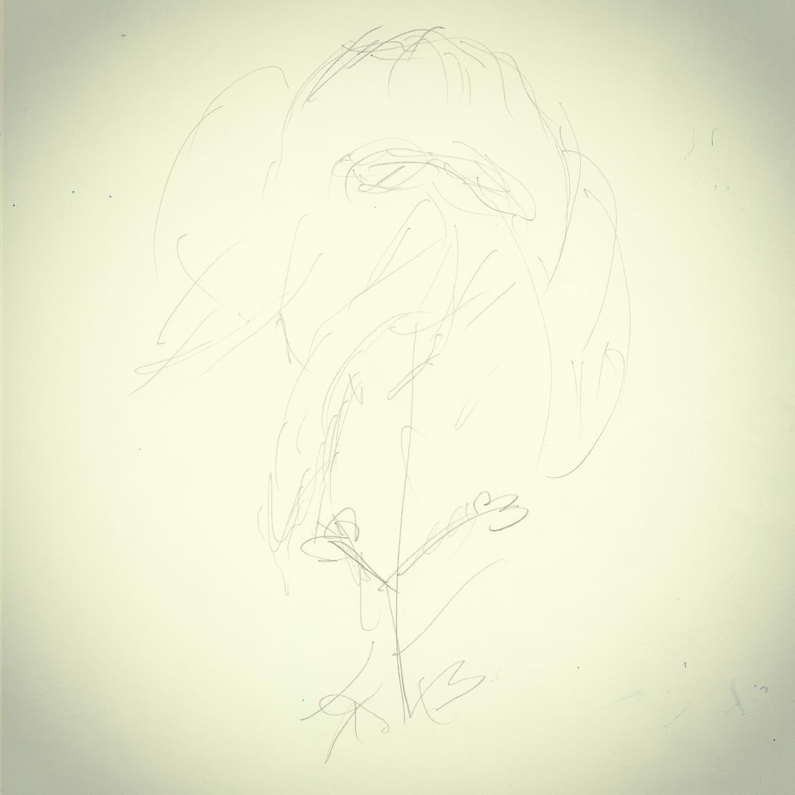
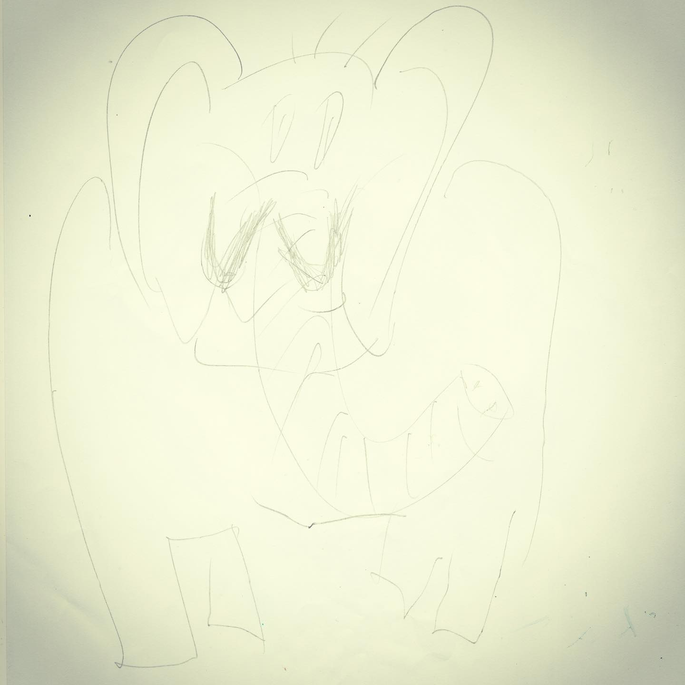

# Archive Post Part 312

### Caption:
```
Everyone has different tastes when they go to breweries and part of what is great about many breweries is they have something for everyone's tastes. I'd best describe these as being like the session beers that the bartender is recommending like alcoholic @tinder and they know if I don't see above 6% I'm swiping left (assuming left is the pass option in Tinder and I'm 99% sure of that because my dog has a Tinder). These were all also from @nutsnboltsbeer and there are about 5 more that I haven't posted and I don't like to reveal too many spoilers, but not one is like the time I went to @cambrewingco and ended up with a barleywine that was off the menu and where the server sort of apologizes that it may be no good and let her know and it's yes good and you want to let her know that you've found love but there isn't any more love so you have to spend the next almost decade thinking about how good it was and how the barleywine at @brattletheatre wasn't the same the year after. I suppose it is better to have loved and lost. NGL glass at Brattle was a lot bit smaller too. #drawmeanelephant
```







