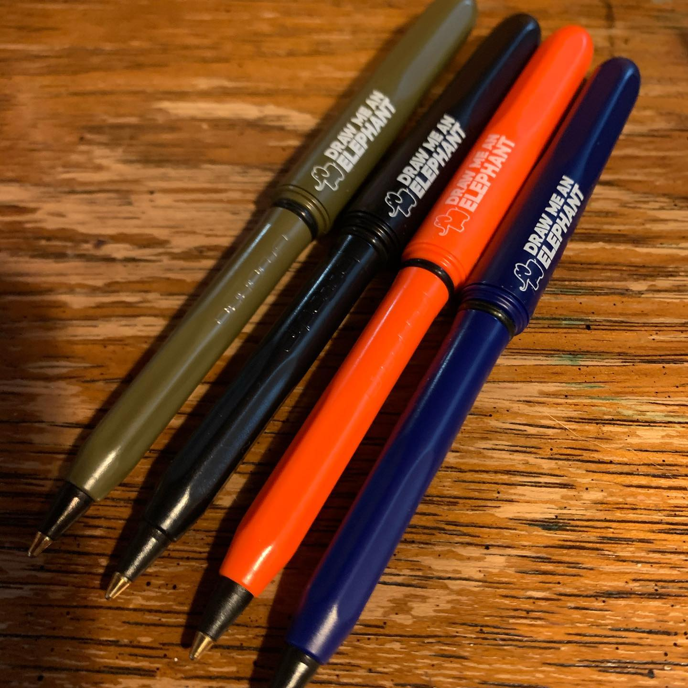
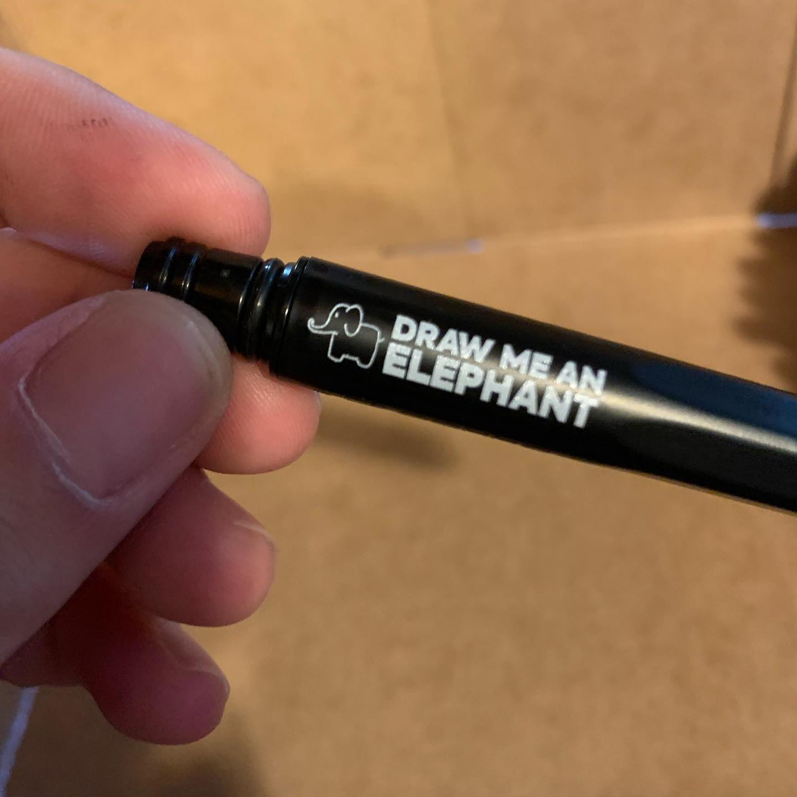
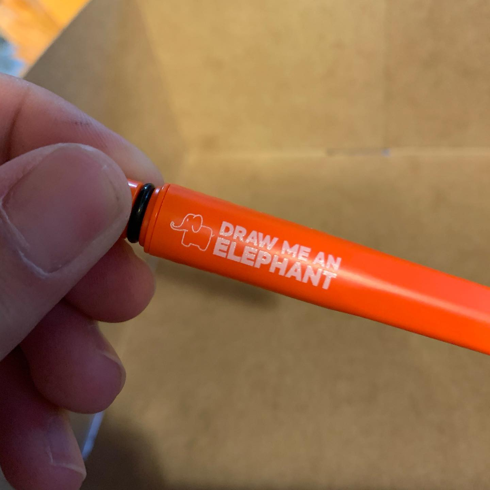
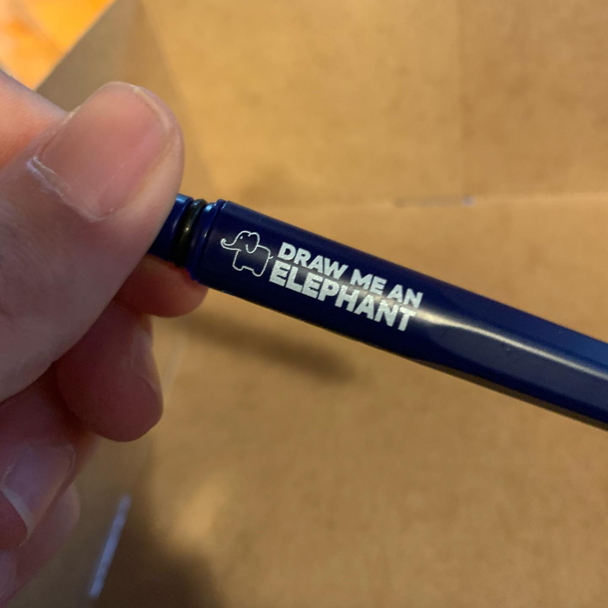
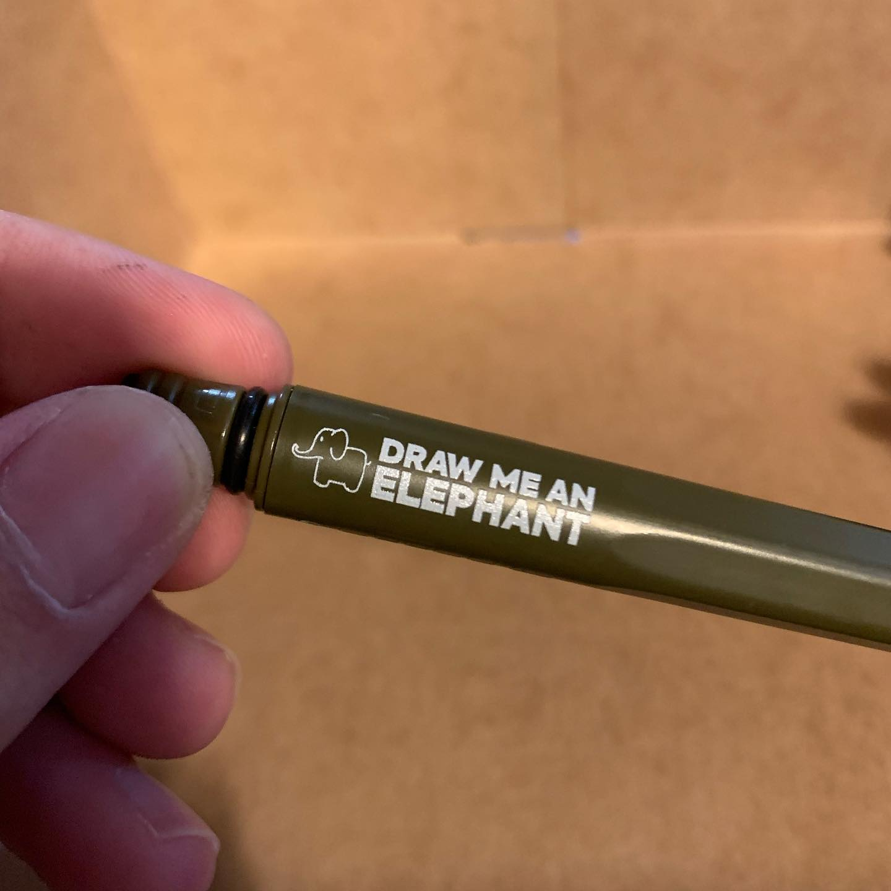
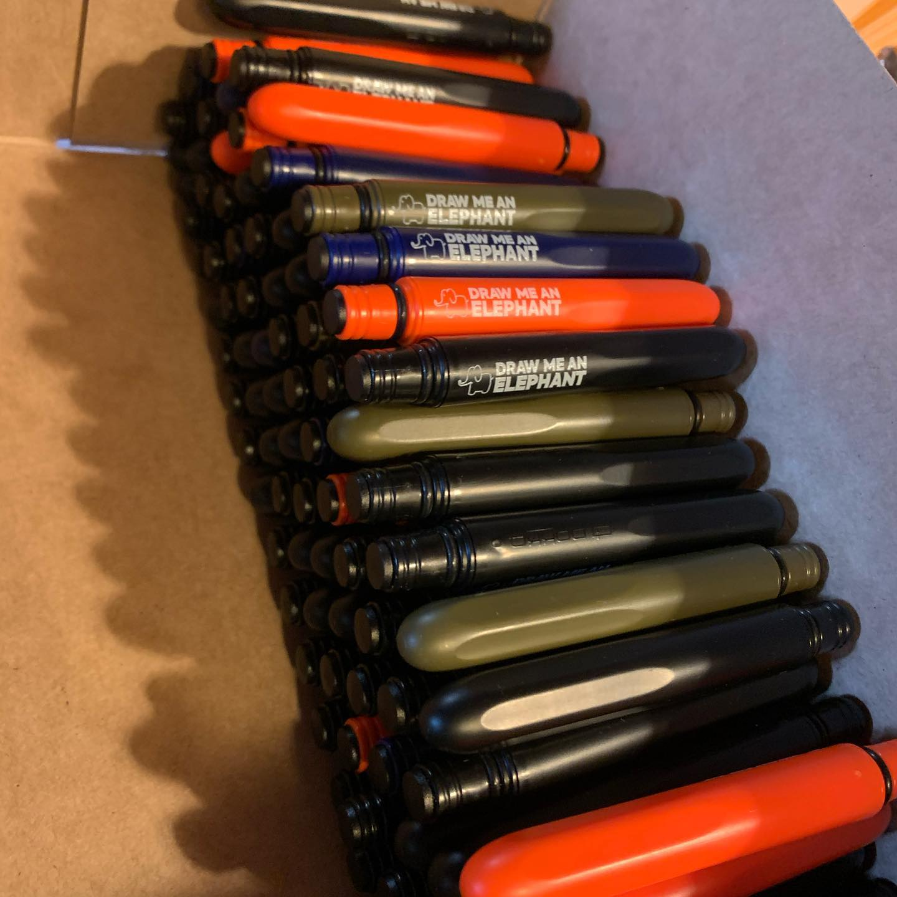
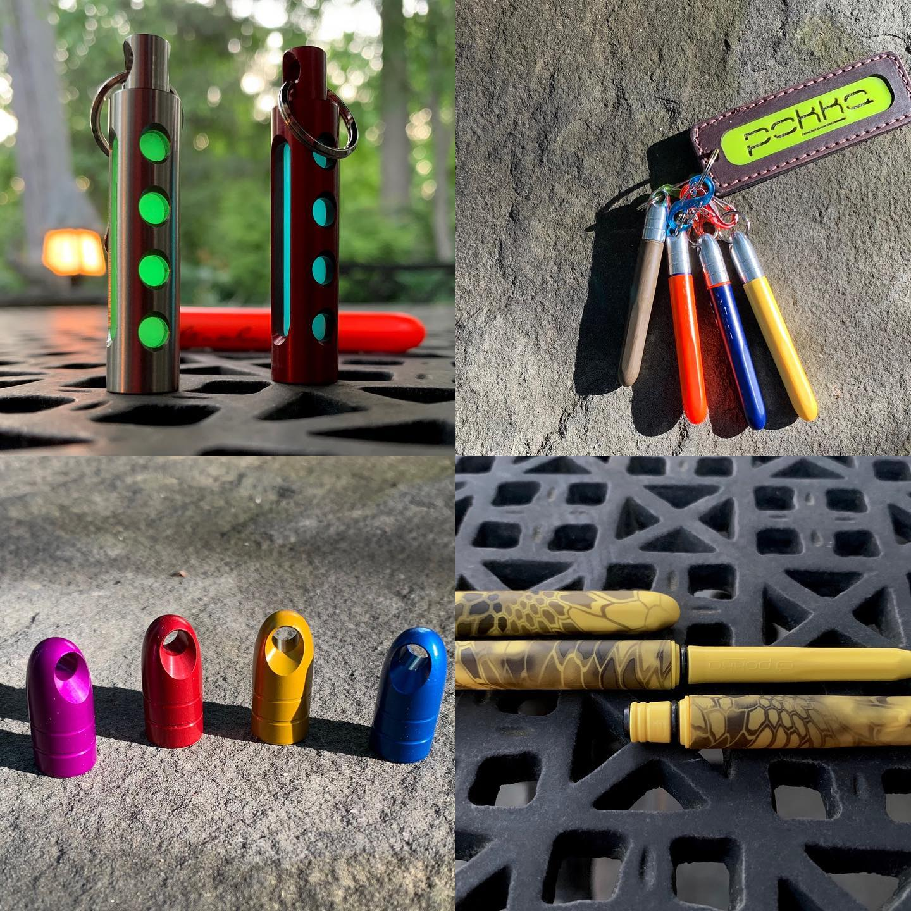

# Archive Post Part 325

### Caption:
```
So I won the @pokkapens contest for their 25,000th order through some creative use of store mechanics. Some would call it an exploit but either way I committed myself to winning before the prize was even announced. The prize turned out to not be any of the stuff I wanted and instead was 100 custom pens. Since I didn’t have any use for the pens I had three ideas and ended up going with #drawmeanelephant instead of some other ideas I won’t share as they are not related to draw me an elephant. 

The pens turned out really good and the custom ones are better positioned than the @riteintherain ones that have the logo all over the place and too close to the #PokkaPens logo. I had a long paragraph about the only thing I saw as a huge mistake and I’m pretty sure no one will notice as it’s practically impossible to see if you don’t have experience in the printing industry. #pickinggnatshitoutofpepper #metashitposting #contest #winner #custompens #nocluehowhashtagsworkandatthispointimtoaffraidtoask
```















