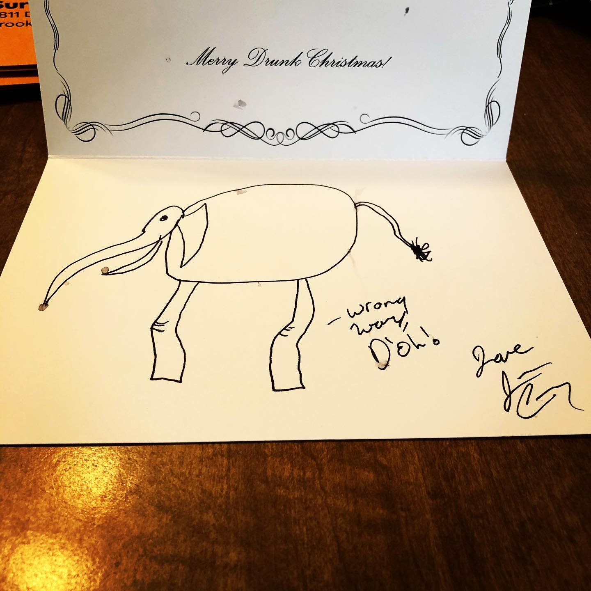
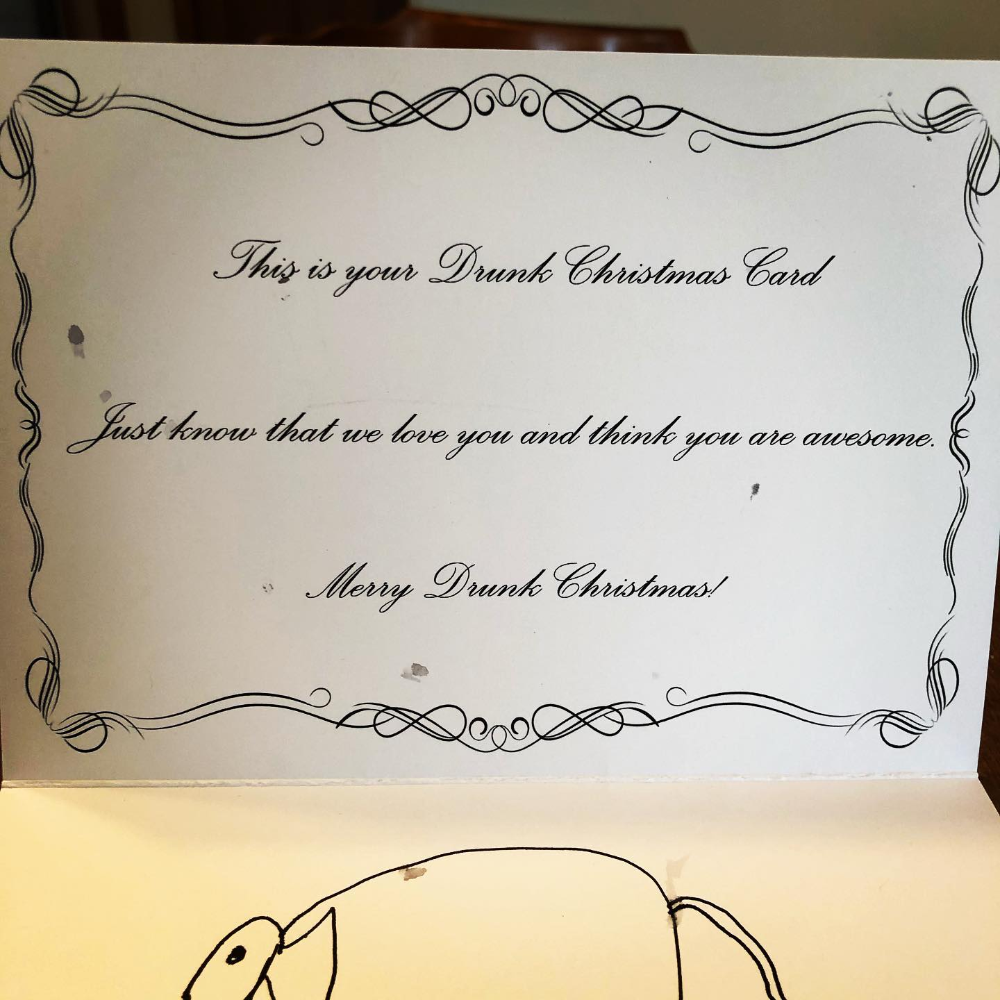
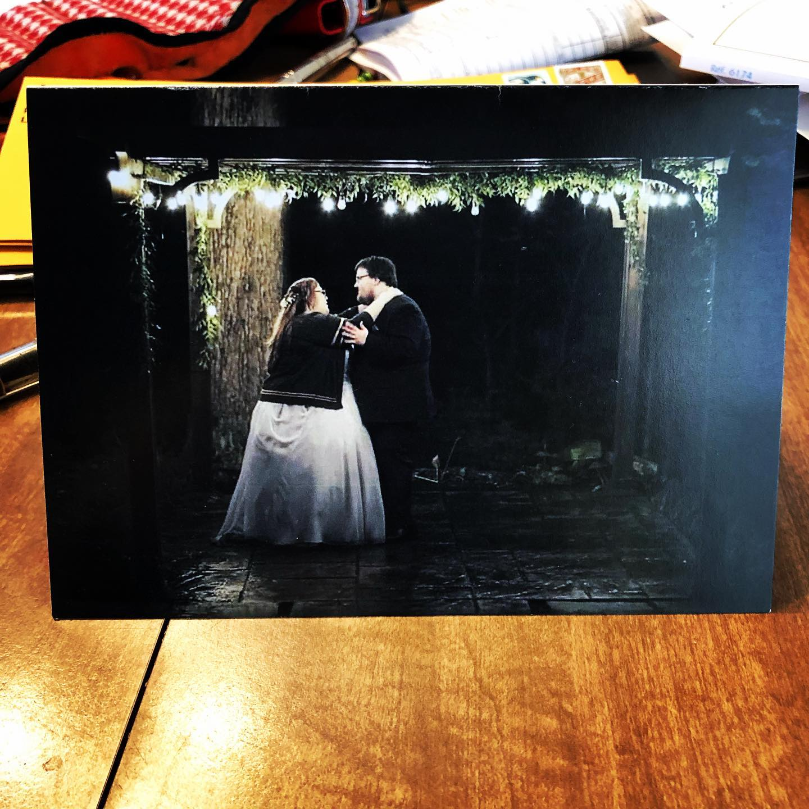

# Archive Post Part 92

### Caption:
```
When I saw someone offering drunken Christmas cards I jumped at the opportunity and asked them to draw me an elephant. I thought this would be more drunk and less like a really fulfilling relationship that reminds me that my inability to open up emotionally is going to preclude me from ever finding that kind of happiness. Still a pretty great elephant even with the issue with the knee that I wouldn't have noticed had it not been pointed out. via @r.randomactsofcards rather than me writing a brewery. #drawmeanelephant
```







