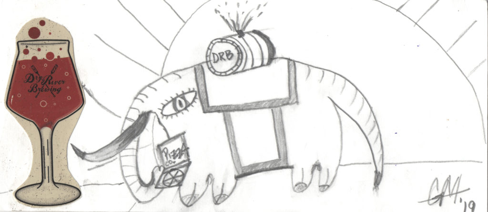
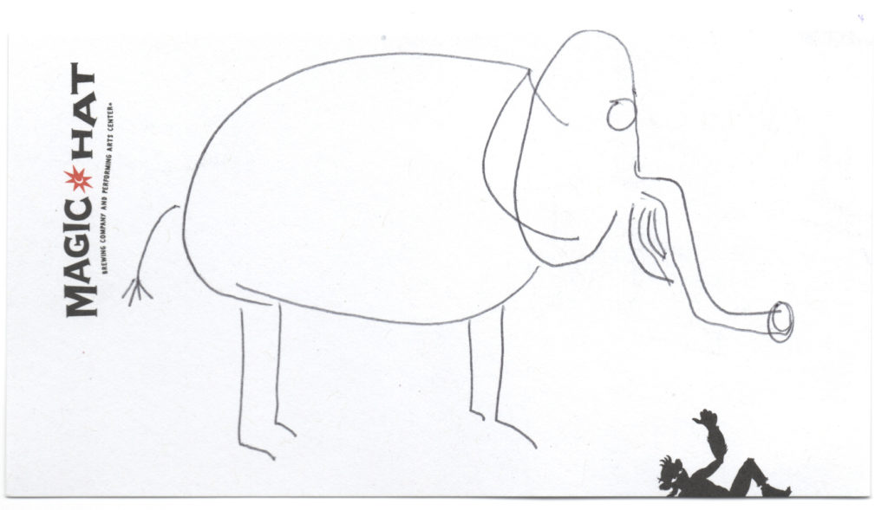
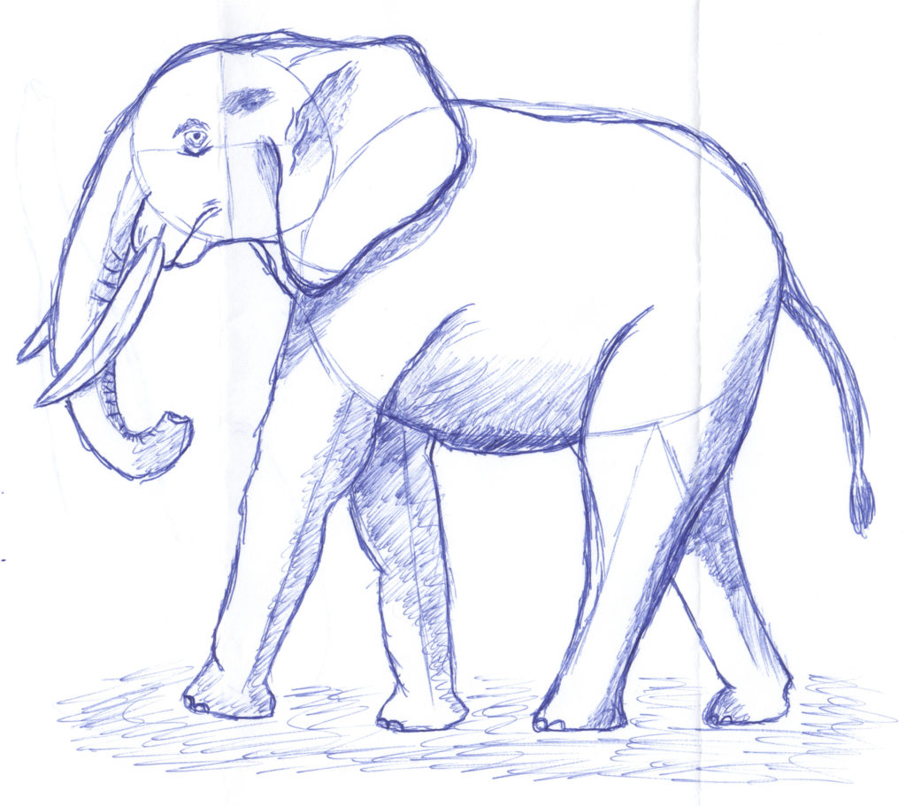
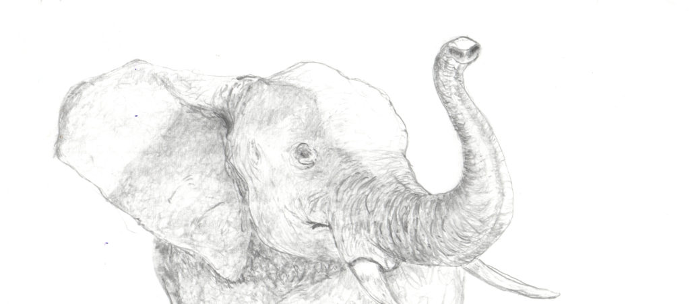
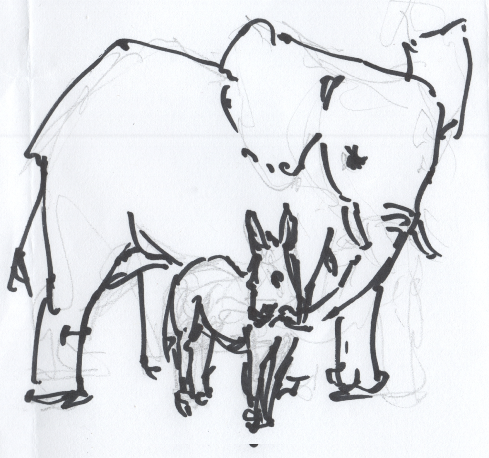
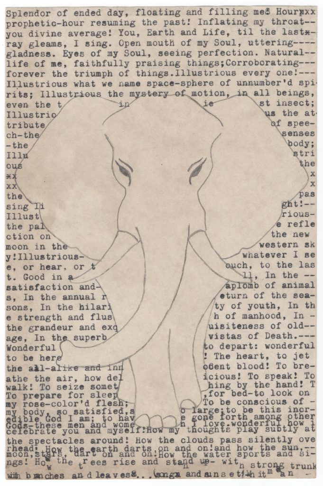
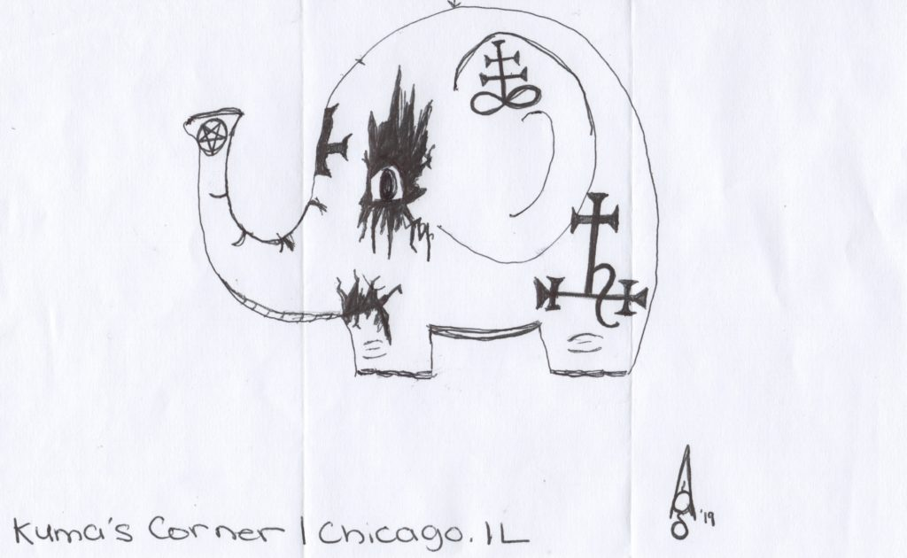
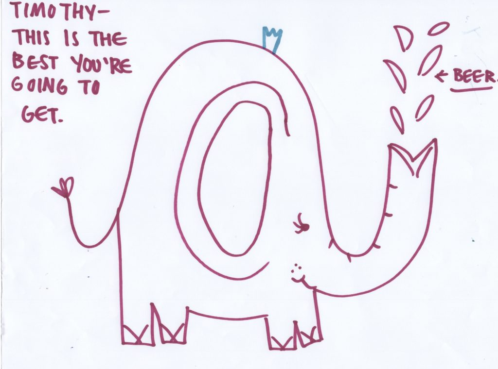
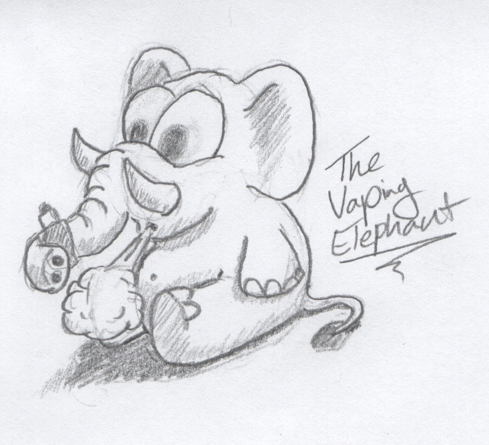
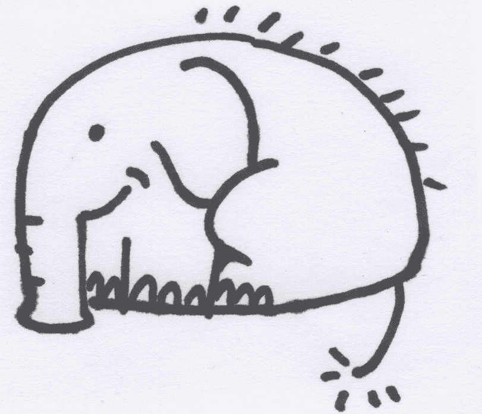

<!-- boris-migration-provenance
source_format: wordpress-wxr
source_export: DMAE/drawmeanelephant.WordPress.2026-07-20.xml
post_id: 263
post_type: page
guid: https://www.drawmeanelephant.com/?page_id=263
post_name: portfolio
author: Timothy
post_date: 2019-07-25 22:05:59
link: https://www.drawmeanelephant.com/portfolio/
conversion: human_review
-->

#### This theme came with a bunch of things and I have no idea what I'm doing.

I mentioned that I don't know much about Wordpress and in the spirit of embracing that I'm going to try to populate this theme's various areas with garbage and see what of it I like.

I was told that I should get an idea of what looks good first and then work around that with some simple entries and make the site visually pleasing for quick visits and not lose interest of the viewer. I was honestly pretty tired even imagining what all that entails and moments after this I got a new elephant, so my brain went squirrel and here we are in the portfolio page, which undoubtedly will not serve as a proper portfolio.

#### How about a gallery of elephants for no apparent reason then?

- <figure><figcaption>Elephant drawn by Garrett at or for Dry River Brewing</figcaption></figure>
- <figure><figcaption>Another elephant drawn by Magic Hat. He's doing his best okay, not all elephants are Kim Kardashian.</figcaption></figure>
- <figure><figcaption>Elephant from Magic Hat drawn in what looks like maybe a Bic type of pen. Nice shading.</figcaption></figure>
- <figure><figcaption>Elephant Drawn by Aaron at or for Dry River Brewing</figcaption></figure>
- <figure><figcaption>Elephant Drawn by OM Vapors</figcaption></figure>
- <figure><figcaption>Elephant drawn by a Turtle Swamp Bartender</figcaption></figure>
- <figure><figcaption>Stella</figcaption></figure>
- <figure><figcaption>New Glarus</figcaption></figure>
- <figure><figcaption>Dogfish Head Main Facility Elephant.</figcaption></figure>
- <figure><figcaption>Elephant drawn by Kuma's Corner Chicago location</figcaption></figure>
- <figure><figcaption>Outer Light</figcaption></figure>
- <figure><figcaption>Outer Light</figcaption></figure>
- <figure><figcaption>Cloud Alchemist</figcaption></figure>
- <figure><figcaption>The very first elephant from Bell's</figcaption></figure>
- <figure><figcaption>Night Shift Brewing</figcaption></figure>

#### There is no reason for me to use this section. 

I'm sure there is going to be some utility that comes to me on this one, but I'm a total egg when it comes to Wordpress and really need to get my bearings as well as clear the backlog of crap that I have. My motivation to do much anything on the web is generally pretty light and I think this already is going worlds better than using imgur to pass around links.
