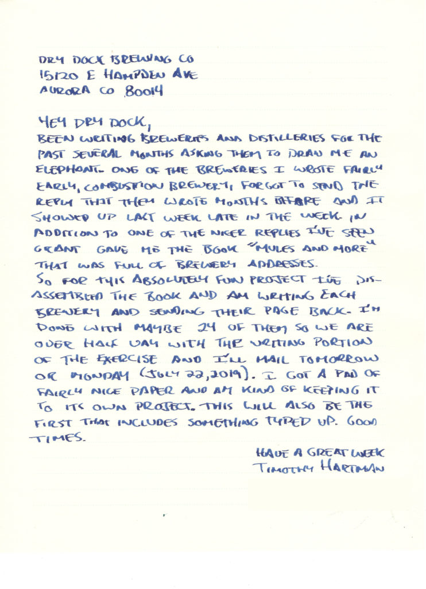
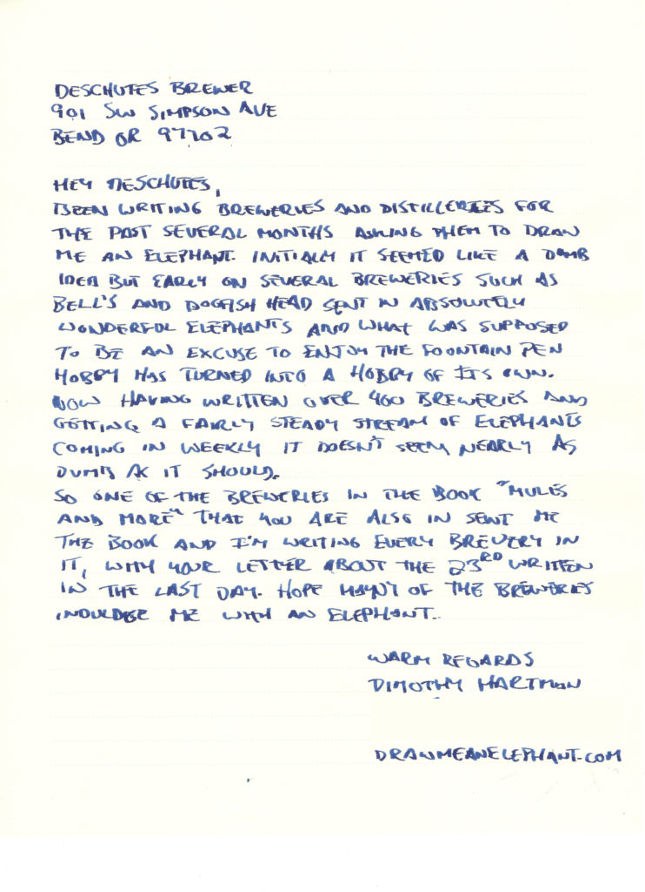
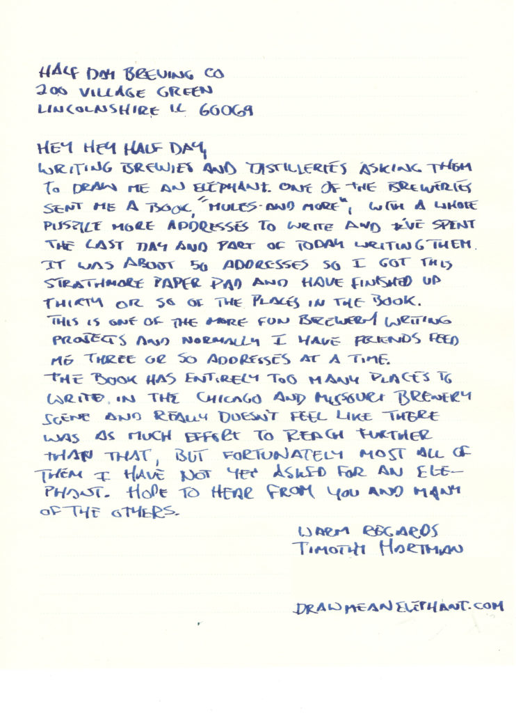
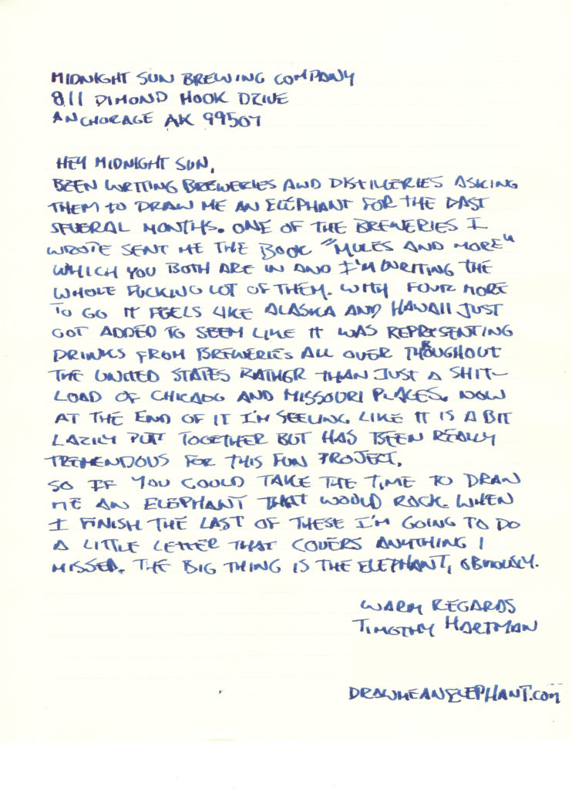
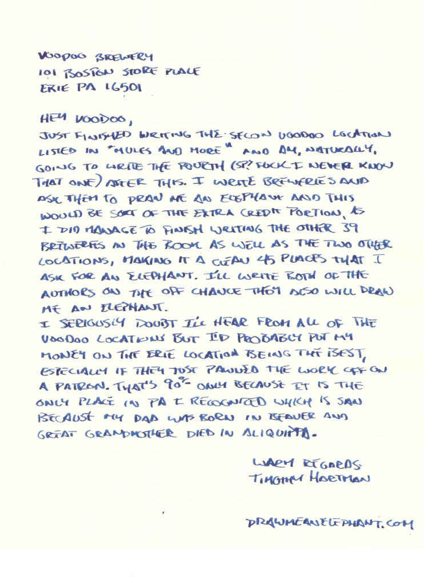
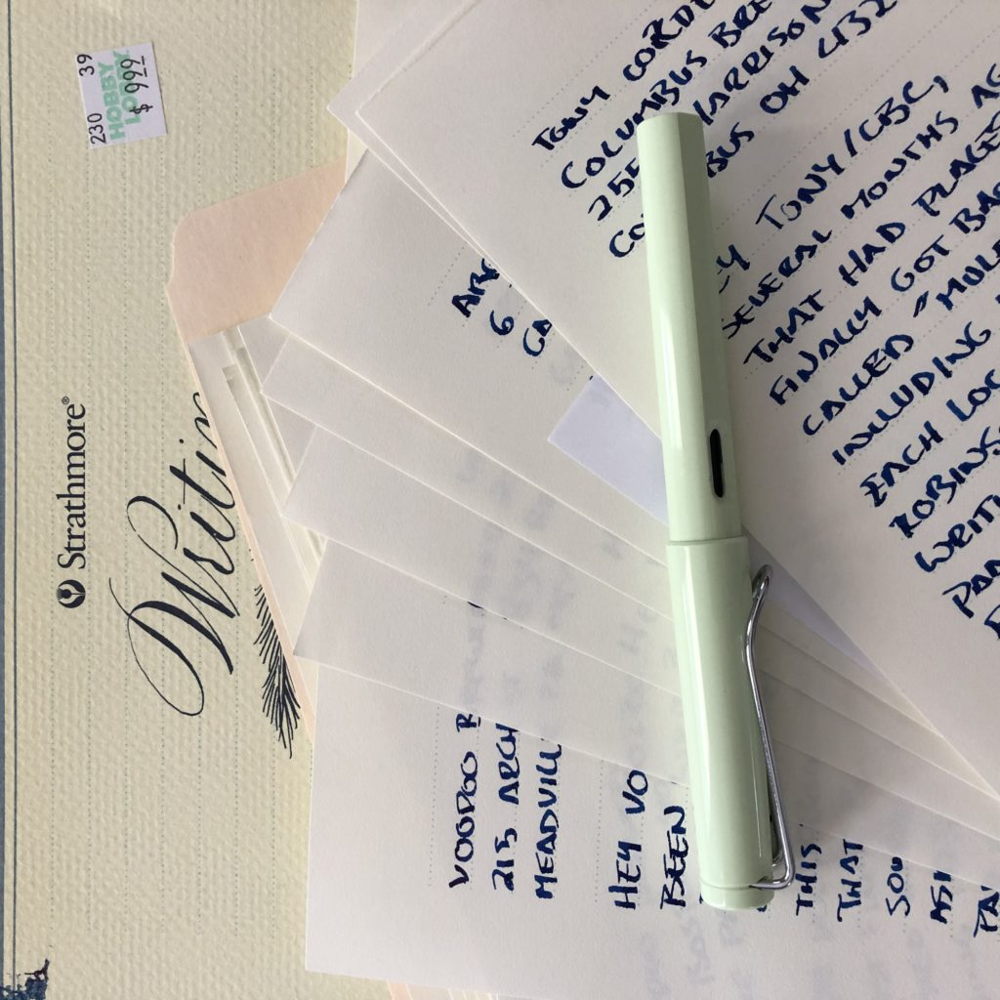
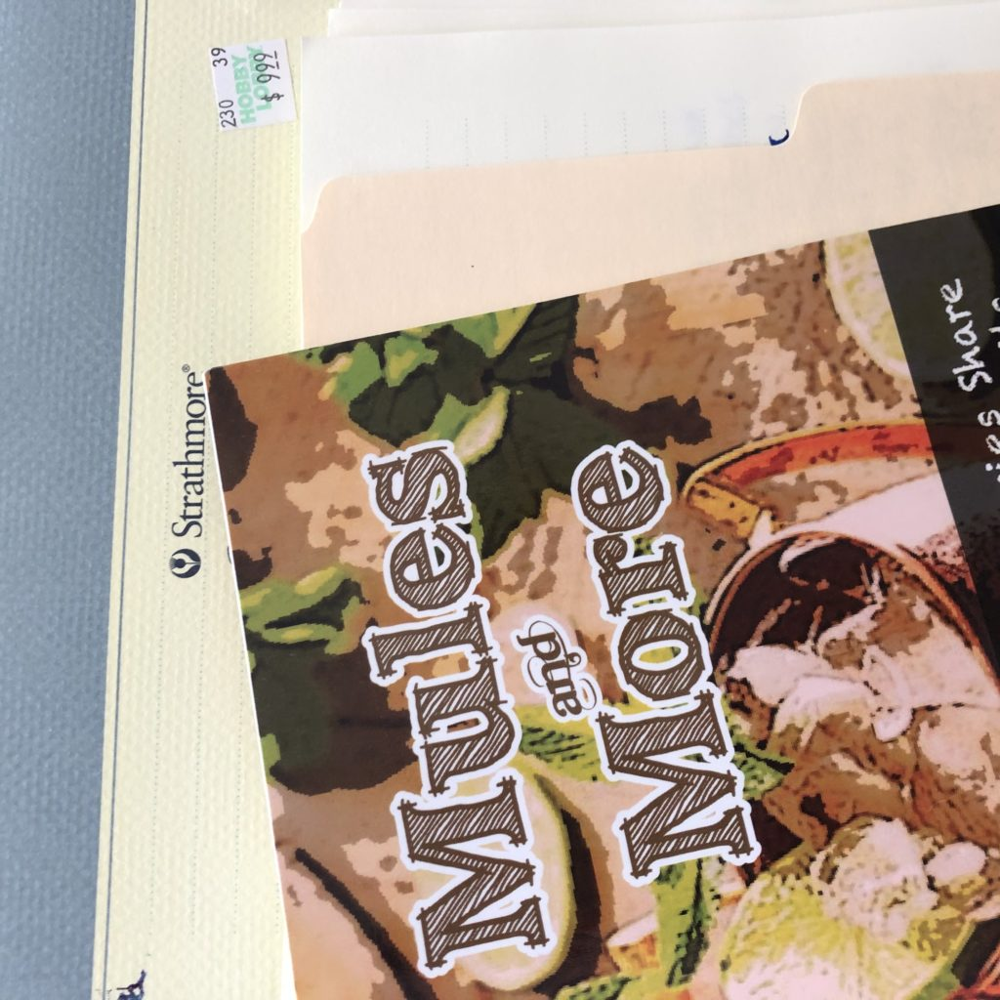

<!-- boris-migration-provenance
source_format: wordpress-wxr
source_export: DMAE/drawmeanelephant.WordPress.2026-07-20.xml
post_id: 190
post_type: post
guid: https://www.drawmeanelephant.com/?p=190
post_name: semiepic-series-of-letters
author: Timothy
post_date: 2019-08-13 17:48:00
link: https://www.drawmeanelephant.com/2019/08/13/semiepic-series-of-letters/
conversion: human_review
-->

Working on sending out my biggest single set of letters to breweries. [Combustion Brewing](https://www.combustionbrewing.com/) sent me a book of drink recipes that had forty breweries addresses, so I wrote every damned one of them asking them to draw me an elephant. Little preview of some of the letters below. Still quite a bit of work to do addressing, postage applying, etc. but was pretty excited about it. Gallery of some of them below.

- <figure></figure>
- <figure></figure>
- <figure></figure>
- <figure></figure>
- <figure></figure>

#### Used some fancy paper this time around

<figure class="wp-block-image"><figcaption>Lamy Safari used that I got from Endless Pens and fan of letters</figcaption></figure>

#### Hobby Lobby had paper and a friend picked it up for me

I haven't been in a Hobby Lobby in ages.

<figure class="wp-block-image"><figcaption>Mules and More along with the Strathmore paper used</figcaption></figure>

#### Little Update

Six of these places were out of business and returned. Two elephants back so far. I've modified my letters to now all include a backer similar to the cover letter I sent these places. Really disappointing round of letters for returns. So far this was far worse than just randomly picking breweries from Google or Instagram, both in rate of return and quality of elephants back. Both of the two elephants were on the back of my really crappy paper I printed the cover letter out on. I resisted the urge to ball up the one that showed up and throw it in the trash. Enormous amount of effort for two not even half ass replies. The lesson to take away from this is don't put in too much effort. It's not worth it.
