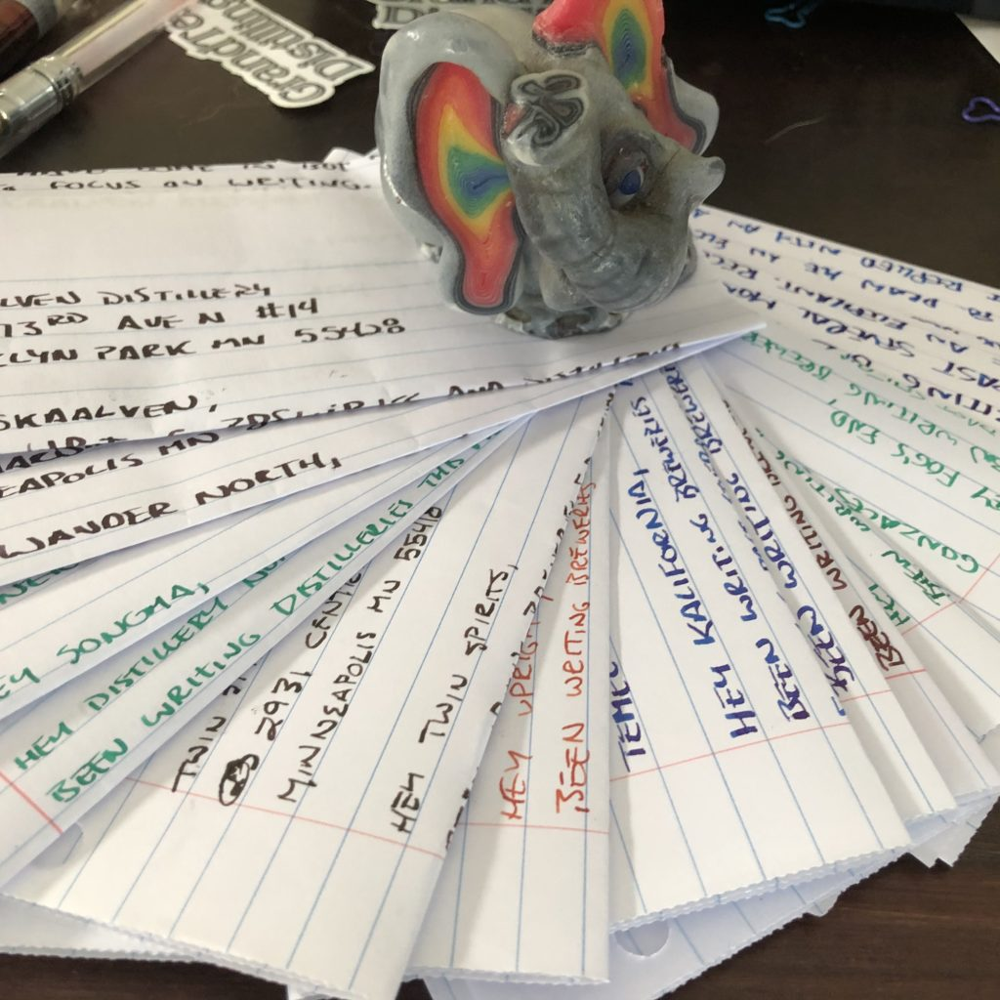
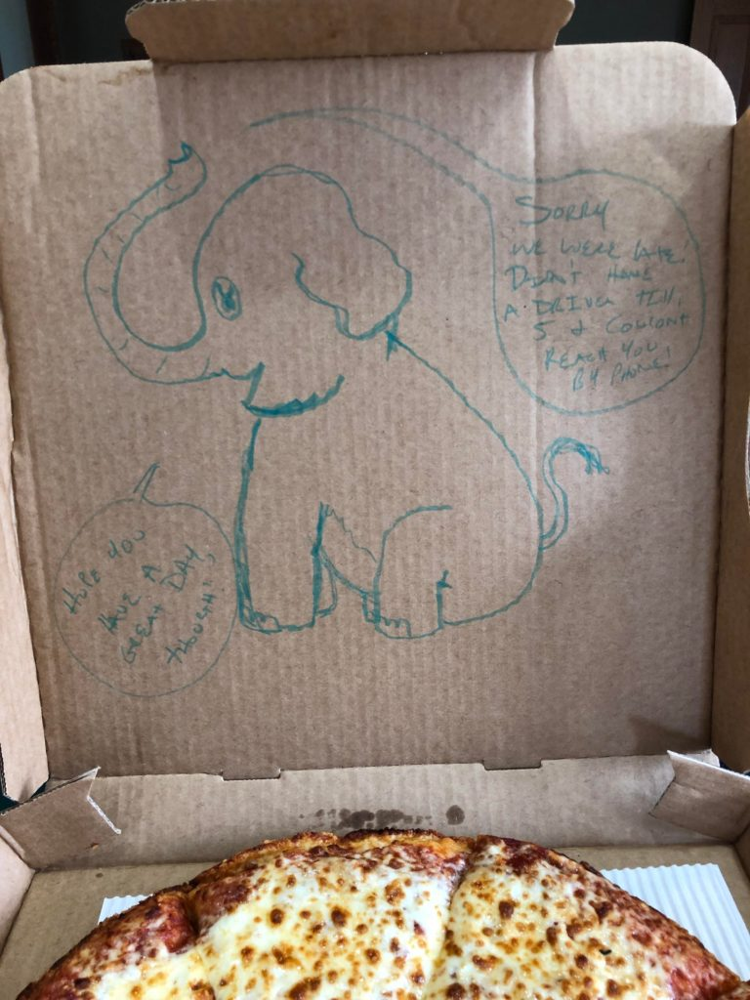

<!-- boris-migration-provenance
source_format: wordpress-wxr
source_export: DMAE/drawmeanelephant.WordPress.2026-07-20.xml
post_id: 244
post_type: post
guid: https://www.drawmeanelephant.com/?p=244
post_name: variety-of-loose-letters-out-today
author: Timothy
post_date: 2019-07-24 22:35:11
link: https://www.drawmeanelephant.com/2019/07/24/variety-of-loose-letters-out-today/
conversion: human_review
-->

<figure class="wp-block-image"><figcaption>Letters I hadn't got around to sending, new and old.</figcaption></figure>

Friend gave me a dozen stamps and I finished out sending those today. I've got all the letters I've sent scanned in but keep thinking it's gonna be a lot of work doing anything with them, so I gathered what was loose and did the scan, address, postage, and mail bit. Monday I sent out fiddy letters dang near and only maybe wrote a few so far this week. I have a write up for those but I'm kind of on the fence leaning against posting anything I've sent out before it's been plenty of time out.

So that wiped out this round of postage aside from a dozen loose stamps around the house and I'm thinking maybe try to pick blocks of places to write for the sheets of stamps. It's hard getting motivated and the brewery address picker that fed me probably 120 of my addresses seems to have gone dark on me, so it's not unlike the Star Trek thing in the newish one where the space debris hits his visor and Kirk's talent along with Khan's instruction get him through the airlock for me to have to Google my own addresses. I've been pretty low tech about this and somewhere need to dump a contact form and an uploader and I really don't see there being a Scottie on the other side of the metaphorical airlock to sort out my brewery finding workflow.

<figure class="wp-block-image"><figcaption>Elephant is trying his best okay?</figcaption></figure>

Probably will post the more epic writing thing when the first letters come in. Got a couple of Triomphe pads and looking for a theme for them. Finished sending the distilleries from a couple weeks back out and may peck away at more.

Making some site changes and updates also. Added a useless warning toast where my cookies policy should go and trying to figure things out. Probably should watch a video but most likely going to get fed up and write some more distilleries.
